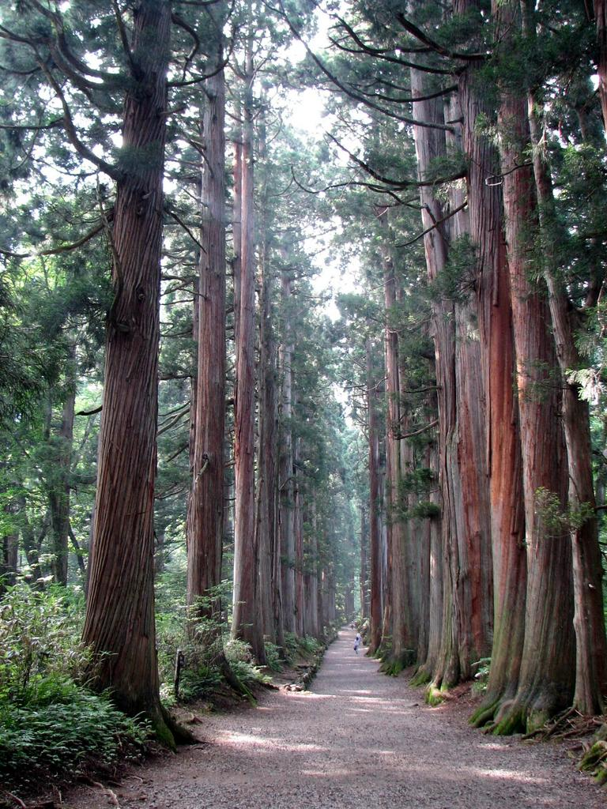
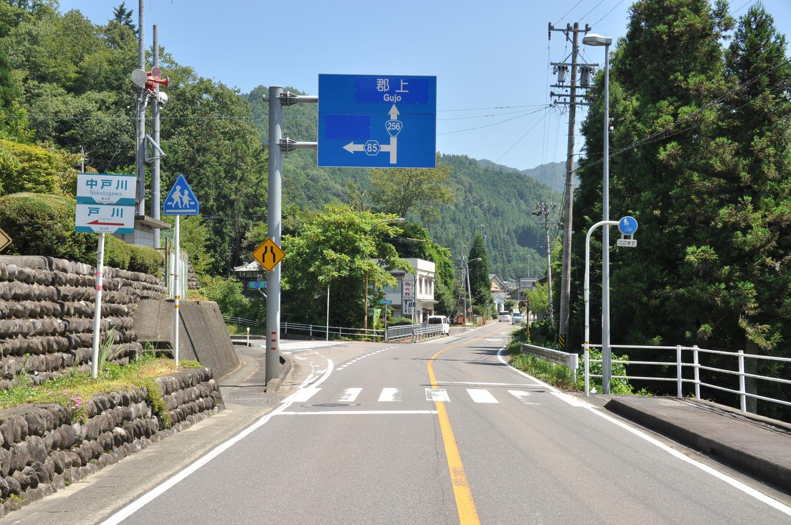
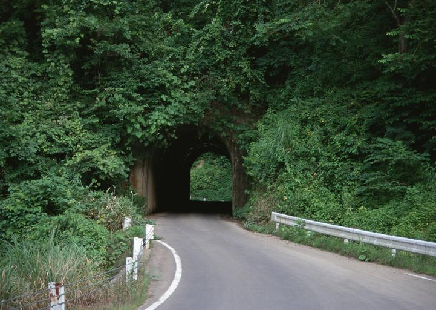

    <h2 class="section-title">{}</h2>
    <ul class="rule-list">
        <li>Bahasa yang digunakan adalah Bahasa Jepang</li>
        <li>Domainnya adalah .jp</li>
    </ul>
    {}

{}
{}
{}
Tiang listrik di Jepang sering memiliki pola garis vertikal {}. Selain itu, Jepang sering kali langsung dikenali sebagai Jepang, karena semua daerah memiliki infrastruktur jalan dan listrik yang baik. Namun, sangat sulit untuk membedakan antar wilayah.
{}

{}
Pohon cedar Jepang (sugi) hampir tidak pernah ditemukan di luar Jepang kecuali ditanam secara sengaja.
{}

{}
Jika ditemukan di luar Jepang, kemungkinan besar berada di wilayah seperti {}, tempat pohon tersebut dibudidayakan untuk kayu {}.
{}

{}
Kamera di Jepang lebih rendah dibandingkan dengan negara lain untuk melindungi privasi {}. Anda juga dapat menemukan tanda dan papan nama dalam bahasa Jepang {}.
{}

{}
Jangan salah membedakan kamera rendah Jepang dengan kamera rendah di {} (contoh: {}) atau {}.
{}

{}
Terdapat delineator berwarna oranye di sisi jalan {}.
{}

{}
Terdapat guardrail berwarna putih di tepi jalan.
{}

{}
{}

    <h2 class="section-title">{}</h2>
    <ul class="rule-list">
        <li>Area dapat diperkirakan dari kode area telepon</li>
        <li><a href="./hokkaido/" class="area-link">Hokkaido</a>
            <ul>
                <li>Terdapat konbini Seicomart</li>
                <li>Di jalan terdapat snow pole</li>
                <li>Banyak rumah khas wilayah dingin:
                    <ul>
                        <li>Atap datar</li>
                        <li>Garasi tipe cascade</li>
                        <li>Rumah dengan tangki minyak tanah</li>
                    </ul>
                </li>
            </ul>
        </li>
        <li><a href="./okinawa/" class="area-link">Okinawa</a>
            <ul>
                <li>Banyak bangunan satu lantai</li>
                <li>Bangunan bercat putih dengan desain sederhana</li>
                <li>Atap dengan tangki air</li>
            </ul>
        </li>
    </ul>

{}
{}
{}
Kode area mulai dari Sapporo (`011`), Tokyo (`03`), Osaka (`06`), hingga Kagoshima (`099`) membentuk gradasi yang dapat membantu memperkirakan lokasi.
{}

<a href="https://commons.wikimedia.org/w/index.php?curid=55479620">Pekachu - CC0</a>

{}
{}

    <h4>Tiang Listrik dan Rambu</h4>
    <ul class="rule-list">
        <li>Perusahaan listrik atau operator jaringan berbeda di setiap wilayah, sehingga logo perusahaan listrik, plat tiang listrik, dan kawat penopang memiliki ciri khas regional 
            ({}).</li>
        <li>Wilayah dingin seperti Hokkaido dan Tohoku memiliki ciri khas tertentu:
            <ul>
                <li>Untuk menghadapi salju, lampu lalu lintas terkadang dipasang secara vertikal.</li>
                <li>Atap bilik telepon umum tidak rata sebagai langkah antisipasi salju.</li>
                <li class="no-evidence">Tanda garis berhenti ("停止線") dapat ditemukan.</li>
                <li class="no-evidence">Kawat distribusi mungkin dilengkapi damper anti-twist {}.</li>
            </ul>
        </li>
        <li>Plat pada tiang listrik dan bentuk ujung atas tiang listrik berbeda berdasarkan wilayah 
            ({} 
            {}).
            <ul>
                <li class="no-evidence">Di wilayah dingin seperti Hokuriku dan Tohoku, plat yang dipasang horizontal mungkin ditemukan.</li>
            </ul>
        </li>
        <li>Kawat penopang (Guy-wire) pada tiang listrik juga berbeda di setiap wilayah 
            ({}).</li>
    </ul>

{}
{}
{}
Lihat {} untuk informasi lebih lanjut.
{}

<iframe width="560" height="315" src="https://www.youtube.com/embed/i14tTl6BF7Y?si=BA13VVj9LPKhjIjG" title="YouTube video player" frameborder="0" allow="accelerometer; autoplay; clipboard-write; encrypted-media; gyroscope; picture-in-picture; web-share" referrerpolicy="strict-origin-when-cross-origin" allowfullscreen></iframe>

{}
{}

<blockquote class="twitter-tweet">
Peta operator distribusi listrik yang baru saja diunggah telah diperbaiki dan diunggah ulang. <a href="https://t.co/W3z6MLmD8l">pic.twitter.com/W3z6MLmD8l</a>
&mdash; 松尾 豪 Go Matsuo (@gomatsuo) <a href="https://twitter.com/gomatsuo/status/1122825684504547329?ref_src=twsrc%5Etfw">29 April 2019</a></blockquote> 

{}
{}

<iframe width="560" height="315" src="https://www.youtube.com/embed/p9HGPr9-s9E?si=mUC5fcYbf2qEhTC0" title="YouTube video player" frameborder="0" allow="accelerometer; autoplay; clipboard-write; encrypted-media; gyroscope; picture-in-picture; web-share" referrerpolicy="strict-origin-when-cross-origin" allowfullscreen></iframe>

{}
{}
