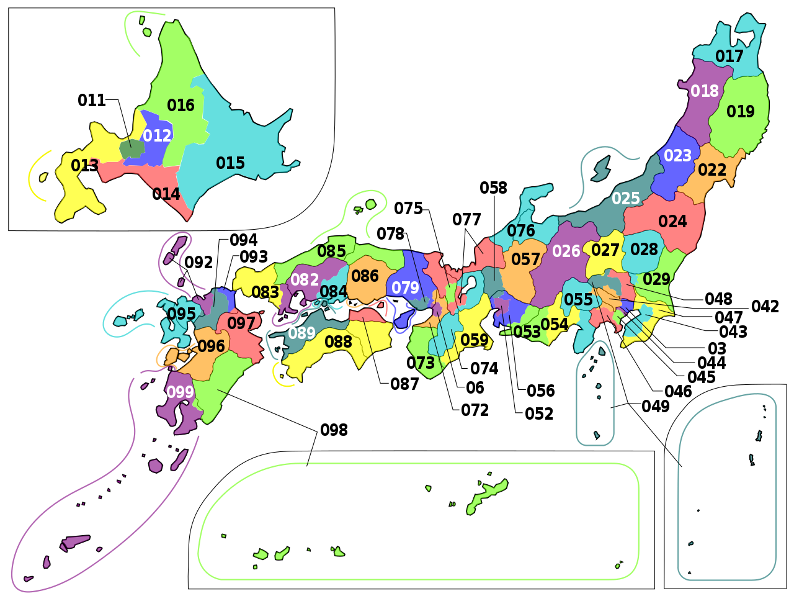
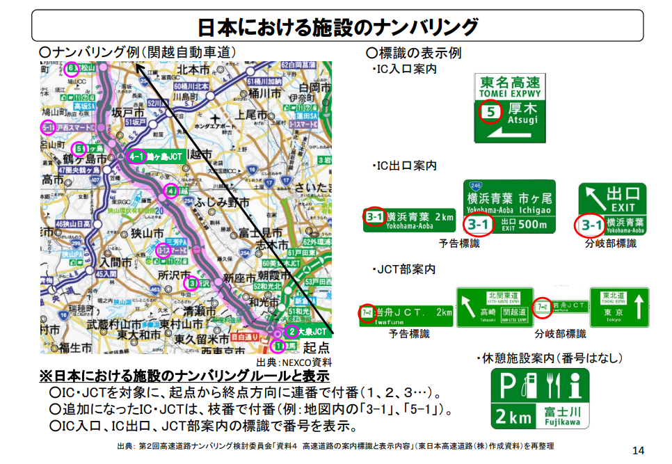

    <h2 class="section-title">{}</h2>
    <ul class="rule-list">
        <li>言語は日本語</li>
        <li>ドメインは.jp</li>
    </ul>

{}
日本マップで「コンビニ」のようなたくさんある施設名を検索すると、IPアドレスをもとに家に近い地域が表示されることがあるので配信する時は注意する。Google検索の結果画面の一番下にもIPに基づいた都市名が表示されることがあるので注意する。（参考：<a href="../../../web/">Home > 役立つページ）</a>
{}

{}
{}
{}
市外局番が札幌(`011`)～東京(`03`)～大阪(`06`)～鹿児島(`099`)でなんとなくグラデーションとなっているので大体の位置がわかる(<a href="https://commons.wikimedia.org/w/index.php?curid=55479620">Pekachuによる著作物, CC0</a>)。
{}

{}
{}

{}
IC・JCTを対象に、起点から終点方向に連番で付番（１、２、３…）。追加になったIC・JCTは、枝番で付番（例：地図内の「3-1」、「5-1」）。画像出典：{}
{}

{}
作成者不明
{}

<iframe src="https://widgets.scribblemaps.com/sm/?d=true&z=true&l=true&id=3cptmvLxxV&s" allow="geolocation" allowfullscreen width="720" height="550" frameborder="0" title="Japan Prefecture Tips" loading="lazy" webkitallowfullscreen mozallowfullscreen allowfullscreen></iframe>

{}
{}

{}
千葉県長生郡長柄町
{}

<iframe width="590" height="315" src="https://www.youtube.com/embed/u1ZB_rGFyeU" title="YouTube video player" frameborder="0" allow="accelerometer; autoplay; clipboard-write; encrypted-media; gyroscope; picture-in-picture; web-share" allowfullscreen></iframe>

{}
{}

    <h2 class="section-title">州・地域の絞り込み</h2>
    <ul class="rule-list">
        <li><a href="./hokkaido/" class="area-link">北海道</a>
            <ul>
                <li>コンビニにセイコーマートがある</li>
                <li>道路にスノーポール・視線誘導標がある</li>
                <li>屋根が平ら・カスケード型のガレージ・ホームタンクのある家が目立つ</li>
            </ul>
        <li><a href="./tyugoku//" class="area-link">中国地方</a>
            <ul>
                <li>ガードレールが夏みかんの色なら山口県</li>
            </ul>
        </li>
    </ul>

