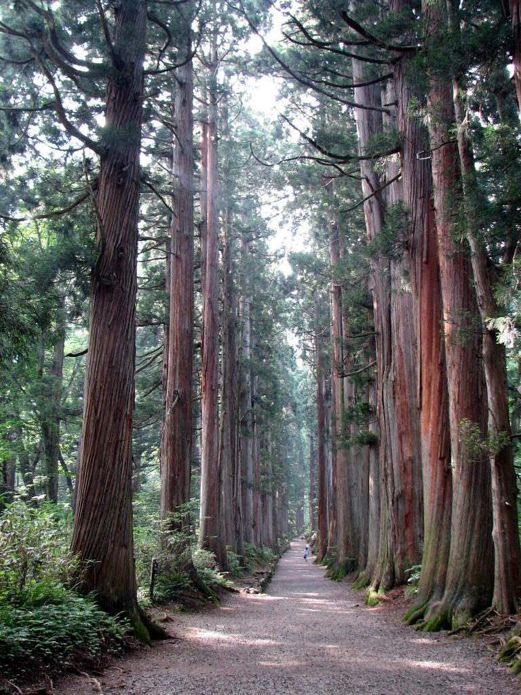

    <h2 class="section-title">{}</h2>
    <ul class="rule-list">
        <li>言語は日本語</li>
        <li>ドメインは.jp</li>
    </ul>
    {}

{}
Googleマップで「コンビニ」のようなたくさんある施設名を検索すると、IPアドレスをもとに家に近い地域が表示されることがあるので配信する時は注意する。Google検索の結果画面の一番下にもIPに基づいた都市名が表示されることがあるので注意する（参考：<a href="../../../web/">Home > 役立つページ）</a>。配信をする場合は事前に配信テストすることを強くおすすめします。
{}

{}
{}
{}
電柱に縦の縞模様がある{}。
{}

{}
スギは日本以外で見つかることはまず無い。見つかるとしても人工的に導入されたもの。
{}

{}
日本以外で見つかることがあるとすれば、木材用に導入され栽培されている{}の可能性が非常に高い{}{}。
{}

{}
プライバシー保護の観点からカメラが低い{}。また、日本語の看板や道路標示がある{}。
{}

{}
カメラが低い点だけ見て{}（例:{}）や{}（例:{}）と間違えないように。
{}

{}
道端にオレンジの反射板（デリネーター）がある{}。
{}

{}
白いガードレールがある
{}

{}
{}

<ul class="flag-list-japan">
    <li data-nav-id="https://geopinning.space/rule/asia/japan/tohoku/" title="東北" class="">
        

        
<a href="https://geopinning.space/rule/asia/japan/tohoku/" class="flag-link">東北・北海道</a>

    </li>
    <li data-nav-id="https://geopinning.space/rule/asia/japan/kanto/" title="関東" class="li-inactive">
        

        
<a href="https://geopinning.space/rule/asia/japan/kanto/" class="flag-link">関東</a>

    </li>
    <li data-nav-id="https://geopinning.space/rule/asia/japan/tokai/" title="東海" class="">
        

        
<a href="https://geopinning.space/rule/asia/japan/tokai/" class="flag-link">東海</a>

    </li>
    <li data-nav-id="https://geopinning.space/rule/asia/japan/koshinetsu/" title="甲信越" class="li-inactive">
        

        
<a href="https://geopinning.space/rule/asia/japan/koshinetsu/" class="flag-link">甲信越</a>

    </li>
    <li data-nav-id="https://geopinning.space/rule/asia/japan/hokuriku/" title="北陸" class="">
        

        
<a href="https://geopinning.space/rule/asia/japan/hokuriku/" class="flag-link">北陸</a>

    </li>
    <li data-nav-id="https://geopinning.space/rule/asia/japan/kinki/" title="近畿" class="li-inactive">
        

        
<a href="https://geopinning.space/rule/asia/japan/kinki/" class="flag-link">近畿</a>

    </li>
    <li data-nav-id="https://geopinning.space/rule/asia/japan/tyugoku/" title="中国" class="">
        

        
<a href="https://geopinning.space/rule/asia/japan/tyugoku/" class="flag-link">中国地方</a>

    </li>
    <li data-nav-id="https://geopinning.space/rule/asia/japan/shikoku/" title="四国" class="">
        

        
<a href="https://geopinning.space/rule/asia/japan/shikoku/" class="flag-link">四国</a>

    </li>
    <li data-nav-id="https://geopinning.space/rule/asia/japan/kyusyu/" title="九州" class="">
        

        
<a href="https://geopinning.space/rule/asia/japan/kyusyu/" class="flag-link">九州</a>

    </li>
</ul>

    <h2 class="section-title">{}</h2>
    <ul class="rule-list">
        <li>電話番号の市外局番でおよその地域がわかる</li>
        <li><a href="./tohoku/hokkaido/" class="area-link">北海道</a>
            <ul>
                <li>コンビニにセイコーマートがある</li>
                <li>道路にスノーポール・視線誘導標がある</li>
                <li>寒い地域特有の家が多い
                    <ul>
                        <li>屋根が平ら</li>
                        <li>カスケード型のガレージがある</li>
                        <li>ホームタンクと呼ばれる灯油タンクのある家が目立つ{}</li>
                    </ul>
                </li>
            </ul>
        </li>
        <li><a href="./tyugoku/" class="area-link">中国地方</a>
            <ul>
                <li>石州瓦を用いた家が東広島を中心に山陰地方にあり屋根が赤色っぽい</li>
                <li>ガードレールが夏みかんの色なら山口県</li>
            </ul>
        </li>
        <li><a href="./kyusyu/" class="area-link">九州地方</a>
            <ul>
                <li>ススキが多い{}</li>
                <li>熊本の標識には赤いテープが巻いてある</li>
                <li>宮崎の標識には黄色いテープが巻いてある</li>
                <li class="no-evidence" style="opacity:0.4">路面の『止まれ』の文字の『れ』の縦棒が他の地域と長さが違う？</li>
            </ul>
        </li>
        <li><a href="./kyusyu/okinawa/" class="area-link">沖縄地方</a>
            <ul>
                <li>平屋の建物が多い</li>
                <li>建物に白い平らな建物が多い</li>
                <li>屋根上に給水タンクがある</li>
                <li>壁などに「石敢當」と書いてある</li>
            </ul>
        </li>
    </ul>

{}
{}
{}
市外局番が札幌(`011`)～東京(`03`)～大阪(`06`)～鹿児島(`099`)でなんとなくグラデーションとなっているので大体の位置がわかる。
{}

<a href="https://commons.wikimedia.org/w/index.php?curid=55479620">Pekachuによる著作物, CC0</a>

{}
{}

    <h4>農業</h4>
    <ul class="rule-list">
        <li>中部より南西では田んぼは少ない{}</li>
    </ul>

{}
{}
{}
中部より南西では田んぼは少ない{}
{}

{}
{}

    <h4>電柱や標識</h4>
    <ul class="rule-list">
        <li>電力会社・配線事業者が地域ごとに異なるため、電柱の電力会社ロゴ・プレート・ガイワイヤーなどに地域性がある({})</li>
        <li>北海道や東北などの寒い地域特有のものがある
            <ul>
                <li>雪対策として信号機が縦になっていることがある</li>
                <li>雪対策として電話ボックスの屋根が平らじゃないことがある</li>
                <li class="no-evidence">「停止線」の標識がある</li>
                <li class="no-evidence">配線にねじれ防止ダンパーがある{}</li>
            </ul>
        </li>
        <li>電柱のプレートや電柱のてっぺんの形が地域によって異なる{}{}
            <ul>
                <li class="no-evidence">北陸・東北の寒い地域は横向きのプレートがありえる</li>
            </ul>
        </li>
        <li>電柱のガイワイヤー（Guy-wire・支線）が地域によって異なる{}
        </li>
    </ul>

{}
{}
{}
{}を参照。
{}

<iframe width="560" height="315" src="https://www.youtube.com/embed/i14tTl6BF7Y?si=BA13VVj9LPKhjIjG" title="YouTube video player" frameborder="0" allow="accelerometer; autoplay; clipboard-write; encrypted-media; gyroscope; picture-in-picture; web-share" referrerpolicy="strict-origin-when-cross-origin" allowfullscreen></iframe>

{}
{}

<blockquote class="twitter-tweet">
先ほどアップした送配電事業者マップですが、一部修正がありましたので、修正して再度アップします。 <a href="https://t.co/W3z6MLmD8l">pic.twitter.com/W3z6MLmD8l</a>
&mdash; 松尾 豪 Go Matsuo (@gomatsuo) <a href="https://twitter.com/gomatsuo/status/1122825684504547329?ref_src=twsrc%5Etfw">April 29, 2019</a></blockquote> 

{}
{}

<iframe width="560" height="315" src="https://www.youtube.com/embed/p9HGPr9-s9E?si=mUC5fcYbf2qEhTC0" title="YouTube video player" frameborder="0" allow="accelerometer; autoplay; clipboard-write; encrypted-media; gyroscope; picture-in-picture; web-share" referrerpolicy="strict-origin-when-cross-origin" allowfullscreen></iframe>

{}
{}