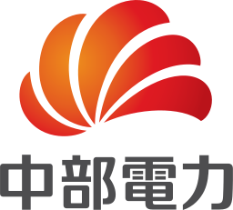
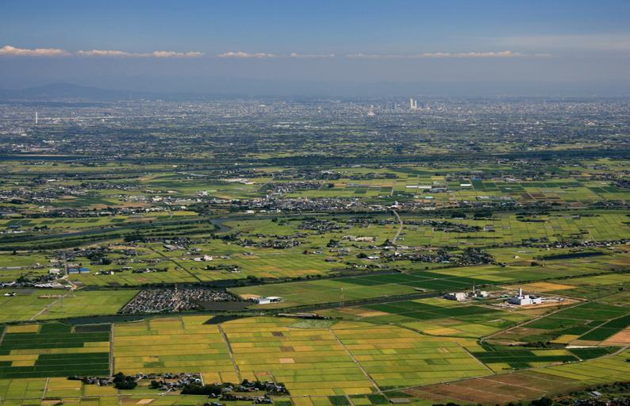
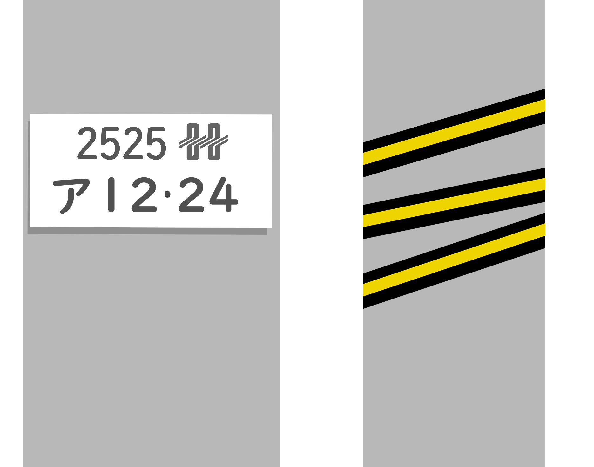

<ul class="flag-list-japan">
    <li data-nav-id="https://geopinning.space/rule/asia/japan/chubu/aichi/" title="Aichi" class="">
        

        
<a href="https://geopinning.space/rule/asia/japan/chubu/aichi/" class="flag-link">Aichi</a>

    </li>
    <li data-nav-id="https://geopinning.space/rule/asia/japan/chubu/shizuoka/" title="Shizuoka" class="">
        

        
<a href="https://geopinning.space/rule/asia/japan/chubu/shizuoka/" class="flag-link">Shizuoka</a>

    </li>
    <li data-nav-id="https://geopinning.space/rule/asia/japan/chubu/yamanashi/" title="Yamanashi" class="">
        

        
<a href="https://geopinning.space/rule/asia/japan/chubu/yamanashi/" class="flag-link">Yamanashi</a>

    </li>
</ul>

    <h2 class="section-title">Overview</h2>
    <ul class="rule-list">
         <li>The Chubu Electric Power logo remained in use until 2020.</li>
    </ul>

{}
{}
{}
Utility poles and logos for Chubu Electric Power appear in Aichi, Gifu, Mie, Shizuoka west of the Fuji River, and Nagano.
{}

{}
{}

    <h2 class="section-title">Tokai Region</h2>
    <ul class="rule-list">
         <li>The Nobi Plain spreads across Aichi Prefecture, creating broad flat scenery.</li>
    </ul>

{}
{}
{}
The Nobi Plain covers most of Aichi and offers an expansive, level landscape.
{}

{}
{}

    <h2 class="section-title">Hokuriku</h2>
    <ul class="rule-list">
         <li>Hokuriku Electric sometimes installs spiral-shaped vehicle warning bands on its poles.</li>
    </ul>

{}
{}
{}
Spiral vehicle-warning bands like the ones on the right can be spotted{}. They were reportedly co-developed by Fukubi Chemical Industry and Hokuriku Electric Power{{% ref "https://ja.wikipedia.org/wiki/%E3%83%95%E3%82%AF%E3%83%93%E5%8C%96%E5%AD%A6%E5%B7%A5%E6%A5%AD" "Fukubi Chemical Industry" %}}.
{}

{}
{}

