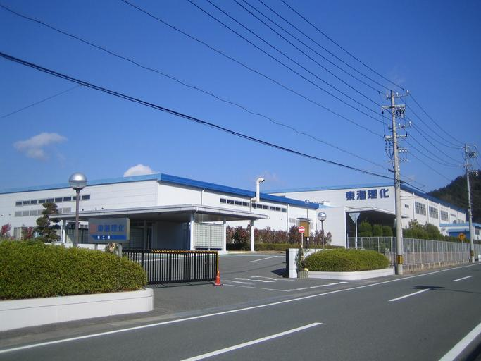
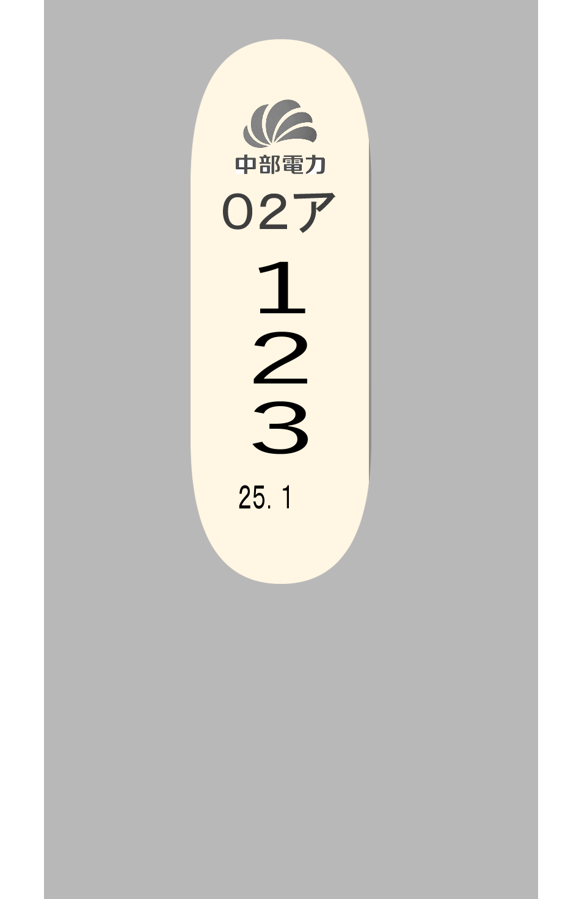

    <h2 class="section-title">全域</h2>
    <ul class="rule-list">
        <li>東海で横断歩道の道路標示に切れ目が無いのは愛知県</li>
    </ul>
    {}

{}
{}
{}
♢の線に切れ目がない{}。岐阜・三重・静岡はあることが多い。
{}

{}
{}
{}
工場の数は日本で一番多い{}。工業出荷額は2位の大阪の倍以上である52兆円にのぼる{}。
{}

{}
{}
{}
愛知県、岐阜県、三重県、富士川以西の静岡県、長野県では中部電力の電柱やロゴが見つかる。
{}

{}
{}
