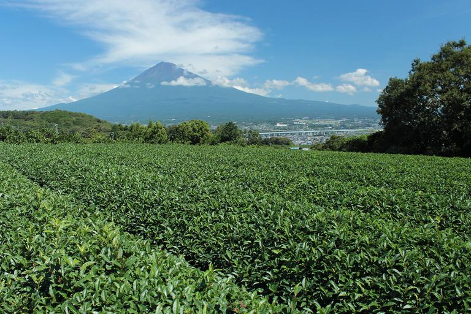

    <h2 class="section-title">全域</h2>
    <ul class="rule-list">
        <li>お茶の生産が多い</li>
    </ul>
    {}

{}
{}
{}
お茶の生産が多いが、近年は{}とほぼ同じ生産量となっている。
{}

{}
{}
{}
愛知県、岐阜県、三重県、富士川以西の静岡県、長野県では中部電力の電柱やロゴが見つかる。
{}

{}
{}
