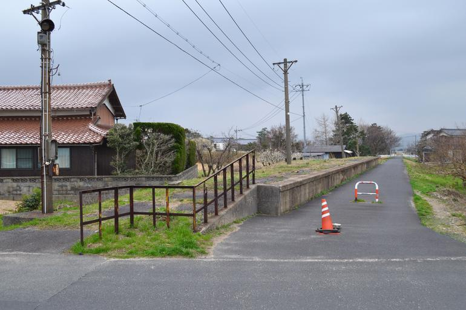

<ul class="flag-list-japan">
    <li data-nav-id="https://geopinning.space/rule/asia/japan/chugoku/yamaguchi/" title="Yamaguchi" class="">
        

        
<a href="https://geopinning.space/rule/asia/japan/chugoku/yamaguchi/" class="flag-link">Yamaguchi</a>

    </li>
</ul>

    <h2 class="section-title">Panorama general</h2>
    <ul class="rule-list">
        <li>En la costa de San’in oriental y central abundan las viviendas con tejas Sekishū; sus techos se distinguen por su color rojo.</li>
    </ul>

{}
{}
{}
Las tejas Sekishū son tejas de arcilla fabricadas en la zona de Iwami, prefectura de Shimane. Se usan ampliamente en la región de San’in y destacan por su tono rojo parduzco, especialmente desde el este hasta el centro de Shimane.
{}

<iframe width="560" height="315" src="https://www.youtube.com/embed/p39GXc3C0Co?si=VasSAla-Mtp063zt" title="YouTube video player" frameborder="0" allow="accelerometer; autoplay; clipboard-write; encrypted-media; gyroscope; picture-in-picture; web-share" referrerpolicy="strict-origin-when-cross-origin" allowfullscreen></iframe>

{}
{}
