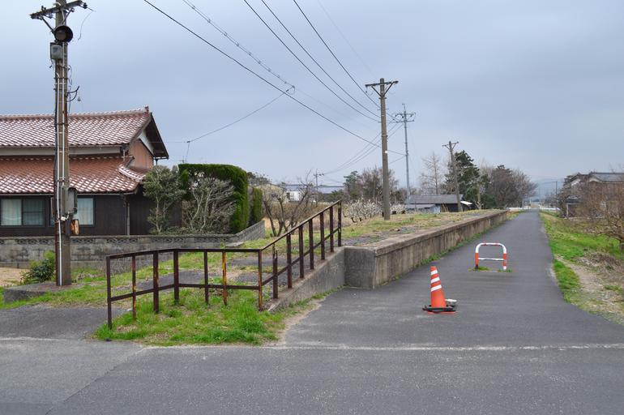

<ul class="flag-list-japan">
    <li data-nav-id="https://geopinning.space/rule/asia/japan/chugoku/yamaguchi/" title="山口" class="">
        

        
<a href="https://geopinning.space/rule/asia/japan/chugoku/yamaguchi/" class="flag-link">山口</a>

    </li>
</ul>

    <h2 class="section-title">全域</h2>
    <ul class="rule-list">
        <li>石州瓦を用いた家が東広島を中心に山陰地方にあり屋根が赤色っぽい</li>
    </ul>

{}
{}
{}
石州瓦は島根県の石見地方で生産されている粘土瓦。山陰地方で広く使われていて、赤茶色であるのが特徴的。島根・広島を中心に多く利用されている。
{}

<iframe width="560" height="315" src="https://www.youtube.com/embed/p39GXc3C0Co?si=VasSAla-Mtp063zt" title="YouTube video player" frameborder="0" allow="accelerometer; autoplay; clipboard-write; encrypted-media; gyroscope; picture-in-picture; web-share" referrerpolicy="strict-origin-when-cross-origin" allowfullscreen></iframe>

{}
{}
