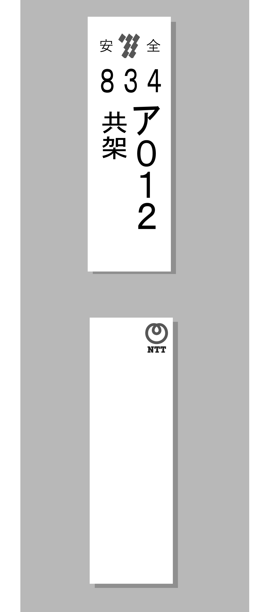

<ul class="flag-list-japan">
    <li data-nav-id="https://geopinning.space/rule/asia/japan/kyusyu/kumamoto/" title="Kumamoto" class="">
        

        
<a href="https://geopinning.space/rule/asia/japan/kyusyu/kumamoto/" class="flag-link">Kumamoto</a>

    </li>
    <li data-nav-id="https://geopinning.space/rule/asia/japan/kyusyu/kagoshima/" title="Kagoshima" class="">
        

        
<a href="https://geopinning.space/rule/asia/japan/kyusyu/kagoshima/" class="flag-link">Kagoshima</a>

    </li>
    <li data-nav-id="https://geopinning.space/rule/asia/japan/kyusyu/okinawa/" title="Okinawa" class="">
        

        
<a href="https://geopinning.space/rule/asia/japan/kyusyu/okinawa/" class="flag-link">Okinawa</a>

    </li>
</ul>

    <h2 class="section-title">Panorama general</h2>
    <ul class="rule-list">
        <li>Busca logotipos de Kyushu Electric Power.</li>
        <li>La hierba plateada (Miscanthus) es abundante{}.</li>
    </ul>

{}
{}
{}
Las placas de los postes de Kyushu Electric Power aparecen con frecuencia; reconocer el logotipo confirma que estás en su zona de servicio.
{}

{}
{}
{}
Es habitual ver matas de Miscanthus en las cunetas.
{}

{}
{}
