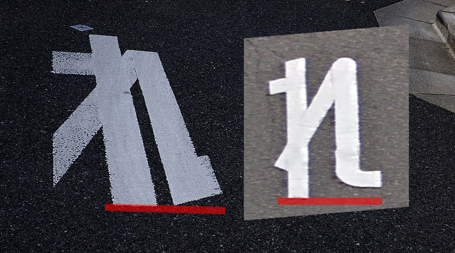

    <h2 class="section-title">全域</h2>
    <ul class="rule-list">
                <li>ススキが多い{}</li>
                <li>熊本の標識には赤いテープが巻いてある</li>
                <li class="no-evidence" style="opacity:0.4">路面の『止まれ』の文字の『れ』の縦棒が他の地域と長さが違う</li>
                <li>ハブ除けの用心棒がある地域がある</li>
    </ul>

{}
{}
{}
道端にススキが生えているイメージがある。
{}

{}
{}

<iframe src="https://www.google.com/maps/embed?pb=!4v1692498918732!6m8!1m7!1srQrtkqES3w9c_BR_yvUPtA!2m2!1d32.80231926283436!2d130.7126236386223!3f196.996058395289!4f-4.546818426557863!5f1.4481201808439264" width="295" height="295" style="border:0;" allowfullscreen="" loading="lazy" referrerpolicy="no-referrer-when-downgrade"></iframe>
<iframe src="https://www.google.com/maps/embed?pb=!4v1692498956757!6m8!1m7!1sEiLLSHpVbeEUH5jj6_vGUw!2m2!1d32.61699605399913!2d130.5044729941945!3f357.3785875568813!4f-9.783548882673983!5f1.5366184664772655" width="295" height="295" style="border:0;" allowfullscreen="" loading="lazy" referrerpolicy="no-referrer-when-downgrade"></iframe>

{}
{}
{}
100%ではなさそうな上に正しいかわからないが、れが長く感じる。右が熊本や長崎にありそうな『れ』。
{}

{}
{}
{}
加計呂麻島・宇検村の田検地区には残念ながらストリートビューはない
{}

<blockquote class="twitter-tweet">
用心棒。ハブが出たときにこの棒で退治する。奄美大島南部・加計呂麻島などで多く見られる。集落内で約10メートルごとに置かれている。写真は、加計呂麻島阿多地と宇検村田検の用心棒。かつては毎月「巳」の日にノロがハブ除けの祭りをする集落もあった。 <a href="https://t.co/9U7F9iQHGx">pic.twitter.com/9U7F9iQHGx</a>
&mdash; 現代民俗学 関西学院大学 島村恭則研究室 (@kg_vernacular) <a href="https://twitter.com/kg_vernacular/status/1692785803146215588?ref_src=twsrc%5Etfw">August 19, 2023</a></blockquote> 

{}
{}
