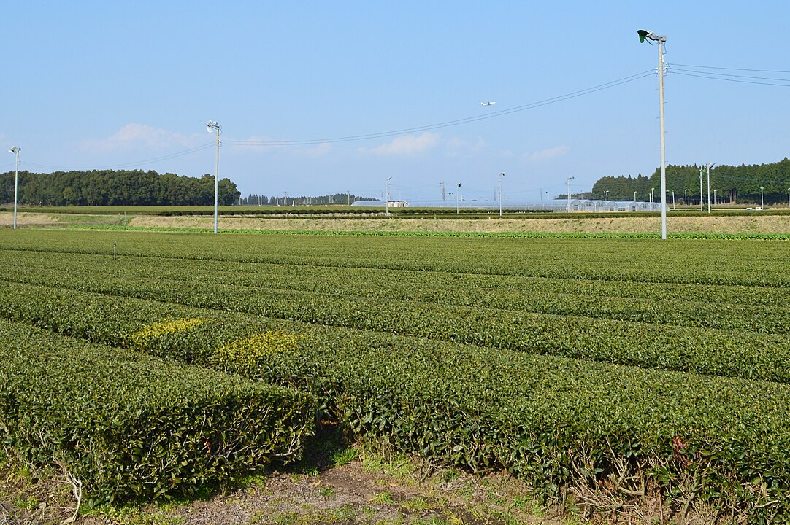
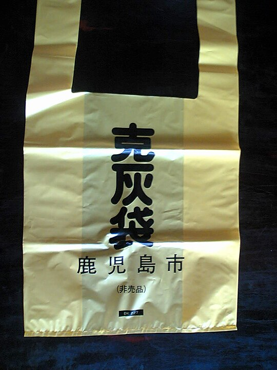

    <h2 class="section-title">Overview</h2>
    <ul class="rule-list">
        <li>As of 2023 it is Japan’s top tea producer, so tea plantations are widespread.</li>
        <li>Collection points for volcanic ash bags (kokuhai bukuro) appear around town.</li>
    </ul>
    {}

{}
{}
{}
Tea output rivals Shizuoka and in recent statistics ranks first in Japan{}.
{}

{}
{}
{}
There are roadside drop-off spots for volcanic ash bags used to collect ash from Sakurajima.
{}

{}
{}
{}
Utility poles with Kyushu Electric Power plates can be seen.
{}

{}
{}

    <h4 class="mb-4">Notable companies</h4>
    <table class="table table-striped table-bordered">
        <thead class="table-light">
            <tr>
                <th scope="col" class="col-width-2">Company</th>
                <th scope="col" class="col-width-1">Code</th>
                <th scope="col" class="col-width-7">Description</th>
                <th scope="col" class="col-width-05">Financials</th>
                <th scope="col" class="col-width-05">Dividend history</th>
            </tr>
        </thead>
        <tbody class="corp-desc">
            <tr>
                <td>Sumitomo Metal Mining</td>
                <td>{}</td>
                <td>Operates the Hishikari mine, Japan’s only gold mine with commercial-scale production.</td>
                <td>{}</td>
                <td>{}</td>
            </tr>
            <tr>
                <td>Japan Aerospace Exploration Agency (JAXA)</td>
                <td>-</td>
                <td>National research and development agency responsible for aerospace policy. ※Not a private company.</td>
                <td>-</td>
                <td>-</td>
            </tr>
        </tbody>
    </table>

