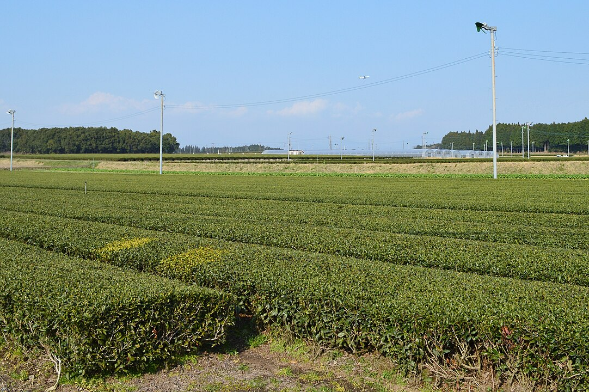

    <h2 class="section-title">全域</h2>
    <ul class="rule-list">
        <li>茶の生産は2023年時点で日本一であり、茶畑が多い</li>
        <li>克灰袋（こくはいぶくろ）の捨て場所が街中にある</li>
    </ul>
    {}

{}
{}
{}
お茶の生産が静岡とほぼ同率か、もしくは日本一{}。
{}

{}
{}
{}
桜島の火山灰を回収するための克灰袋（こくはいぶくろ）の捨て場所が街中にある。
{}

{}
{}
{}
九州電力の電柱プレートが見つかる。
{}

{}
{}

    <h4 class="mb-4">代表的な企業の説明</h4>
    <table class="table table-striped table-bordered">
        <thead class="table-light">
            <tr>
                <th scope="col" class="col-width-2">企業名</th>
                <th scope="col" class="col-width-1">コード</th>
                <th scope="col" class="col-width-7">説明</th>
                <th scope="col" class="col-width-05">決算</th>
                <th scope="col" class="col-width-05">配当履歴</th>
            </tr>
        </thead>
        <tbody class="corp-desc">
            <tr>
                <td>住友金属鉱山</td>
                <td>{}</td>
                <td>日本において商業的規模の操業が行われている唯一の金鉱山である菱刈鉱山を運営する。</td>
                <td>{}</td>
                <td>{}</td>
            </tr>
            <tr>
                <td>宇宙航空研究開発機構（JAXA）</td>
                <td>-</td>
                <td>航空宇宙開発政策を担う国立研究開発法人。※企業ではありません</td>
                <td>-</td>
                <td>-</td>
            </tr>
        </tbody>
    </table>

