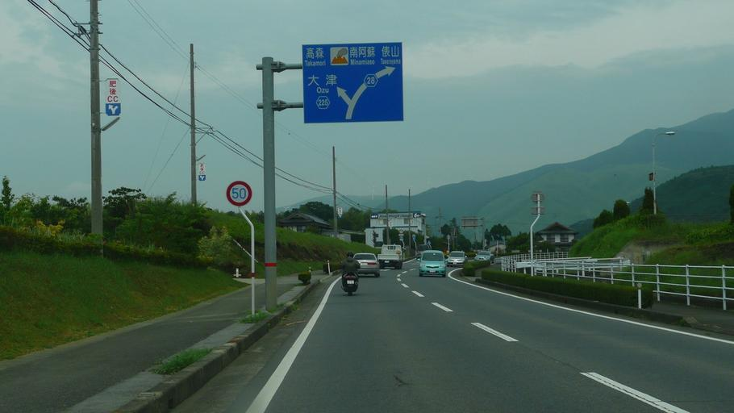
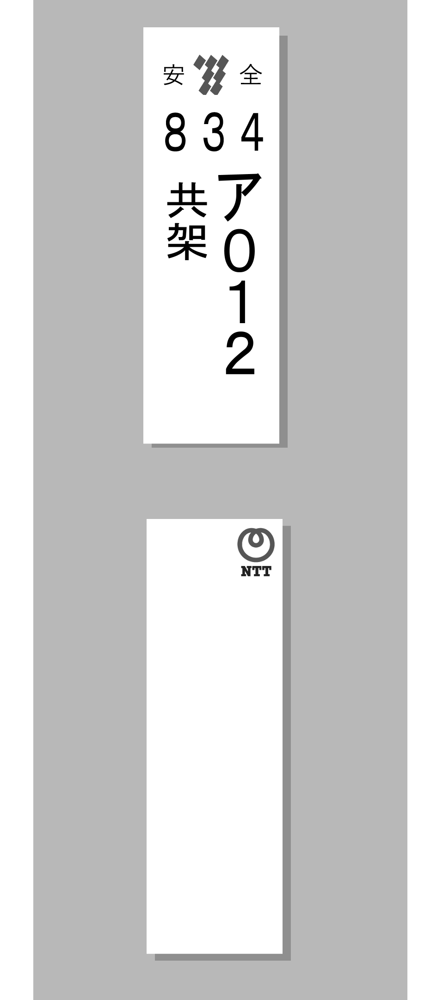
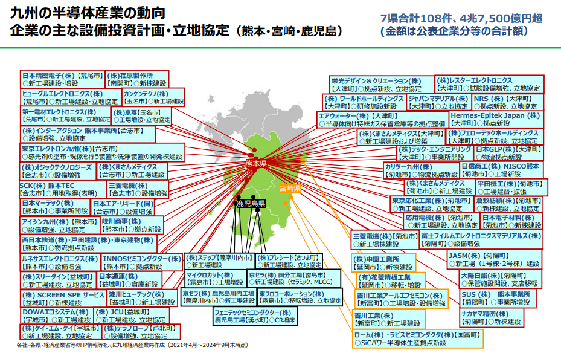

    <h2 class="section-title">全域</h2>
    <ul class="rule-list">
        <li>熊本の標識には赤いテープが巻いてある</li>
        <li>菊陽町を中心に半導体企業が多く進出している</li>
    </ul>
    {}

{}
{}
{}
標識や看板の支柱に赤いテープが巻いてある。
{}

{}
{}
{}
九州電力の電柱プレートが見つかる。
{}

{}
{}

    <h2 class="section-title">{}</h2>
    <ul class="rule-list">
        <li>熊本県菊陽町を中心に半導体企業の進出が進んでいる</li>
    </ul>

{}
{}
{}
TSMCの進出をきっかけに、半導体関連企業が非常に多く進出している{}{}。
{}

{}
{}

    <h4 class="mb-4">代表的な企業の説明</h4>
    <table class="table table-striped table-bordered">
        <thead class="table-light">
            <tr>
                <th scope="col" class="col-width-2">企業名</th>
                <th scope="col" class="col-width-1">コード</th>
                <th scope="col" class="col-width-7">説明</th>
                <th scope="col" class="col-width-05">決算</th>
                <th scope="col" class="col-width-05">配当履歴</th>
            </tr>
        </thead>
        <tbody class="corp-desc">
            <tr>
                <td>Japan Advanced Semiconductor Manufacturing（JASM）</td>
                <td>-</td>
                <td>世界最大の半導体ファウンドリTSMCが熊本県に設立した子会社。</td>
                <td>{{% corplink "https://www.tsmc.com/static/japanese/careers/jasm/about-jasm.html#:~:text=%E3%80%8CJapan%20Advanced%20Semiconductor%20Manufacturing%E6%A0%AA%E5%BC%8F,%E3%81%AB%E8%A8%AD%E7%AB%8B%E3%81%97%E3%81%9F%E5%AD%90%E4%BC%9A%E7%A4%BE%E3%81%A7%E3%81%99%E3%80%82" %}}</td>
                <td>-</td>
            </tr>
            <tr>
                <td>荏原製作所</td>
                <td>{}</td>
                <td>水や資源向けのポンプを製造する大手メーカー。とりわけ肥料プラント向けの高圧アンモニアポンプは100%のシェアを持つ。</td>
                <td>{}</td>
                <td>{}</td>
            </tr>
            <tr>
                <td>富士フィルムエレクトロニクスマテリアルズ</td>
                <td>{}</td>
                <td>リソグラフィ材料やイメージセンサ―向け材料の製造を行う。</td>
                <td>{}</td>
                <td>{}</td>
            </tr>
            <tr>
                <td>平田機工</td>
                <td>{}</td>
                <td>『生産ライン』を生産するメーカー。</td>
                <td>{}</td>
                <td>{}</td>
            </tr>
        </tbody>
    </table>

