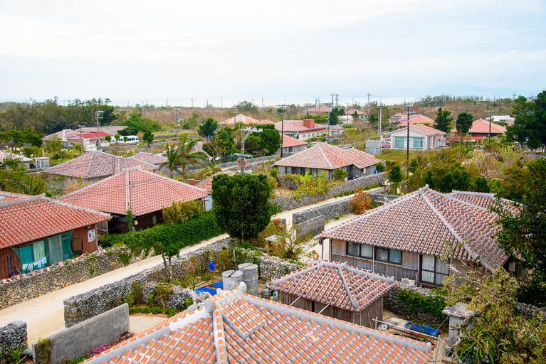

    <h2 class="section-title">全域</h2>
    <ul class="rule-list">
        <li>平屋の建物が多く屋根上に給水タンクがある</li>
        <li>建物に白い平らな建物が多い</li>
        <li>壁などに「石敢當」と書いてある</li>
    </ul>
    {}

{}
{}
{}
台風対策として平屋になっており、なおかつ石垣で囲まれていることが多い。
{}

{}
{}
{}
建物に白い平らな屋根のものが多く、屋根上に給水タンクが乗っている家もある。
{}

<iframe src="https://www.google.com/maps/embed?pb=!4v1683083285833!6m8!1m7!1s7T7nZtXF9RdFedeQ024HoA!2m2!1d26.62078102715673!2d128.0161371817551!3f284.6506826658781!4f5.485782662082784!5f2.563901709112036" width="295" height="295" style="border:0;" allowfullscreen="" loading="lazy" referrerpolicy="no-referrer-when-downgrade"></iframe>
<iframe src="https://www.google.com/maps/embed?pb=!4v1683083410905!6m8!1m7!1snqMY0g7WGxcjpbI9xMJz2Q!2m2!1d26.60338043034416!2d127.9813056125943!3f205.77416744581558!4f17.297234583707507!5f0.7820865974627469" width="295" height="295" style="border:0;" allowfullscreen="" loading="lazy" referrerpolicy="no-referrer-when-downgrade"></iframe>

{}
{}

{}
壁などに「石敢當（いしがんとう）」と書いてある{{% by "https://ja.wikipedia.org/wiki/%E7%9F%B3%E6%95%A2%E7%95%B6" "wiki" "石敢當" %}}。日本では沖縄県に多く分布するが本州でもたまに見つかる。
{}

<iframe src="https://www.google.com/maps/embed?pb=!4v1683083747455!6m8!1m7!1sXHZ0XCHlIw6xTkkGbgs0Sg!2m2!1d26.60253532362954!2d127.9788960388839!3f275.76262759443347!4f-21.70337315607435!5f3.325193203789971" width="295" height="295" style="border:0;" allowfullscreen="" loading="lazy" referrerpolicy="no-referrer-when-downgrade"></iframe>
<iframe src="https://www.google.com/maps/embed?pb=!4v1683083847336!6m8!1m7!1sXVX5xguWxqhSrK5i3IFfag!2m2!1d26.16008713631775!2d127.7925042947905!3f80.85335976852608!4f-12.546076375350623!5f3.325193203789971" width="295" height="295" style="border:0;" allowfullscreen="" loading="lazy" referrerpolicy="no-referrer-when-downgrade"></iframe>

{}
{}

{}
シーサーもいる
{}

<iframe src="https://www.google.com/maps/embed?pb=!4v1683084316753!6m8!1m7!1s7jPpewf2ogXSJD3qdptidA!2m2!1d26.33528106647002!2d126.800851296781!3f328.97859891082965!4f-11.196751149329117!5f3.325193203789971" width="295" height="295" style="border:0;" allowfullscreen="" loading="lazy" referrerpolicy="no-referrer-when-downgrade"></iframe>
<iframe src="https://www.google.com/maps/embed?pb=!4v1683084345344!6m8!1m7!1s93DILiKLA6NXuX5Gh18NZg!2m2!1d26.33479027717829!2d126.801471808458!3f284.9639662071006!4f-2.727803256719895!5f3.325193203789971" width="295" height="295" style="border:0;" allowfullscreen="" loading="lazy" referrerpolicy="no-referrer-when-downgrade"></iframe>

{}
{}

    <h4 class="mb-4">代表的な企業の説明</h4>
    <table class="table table-striped table-bordered">
        <thead class="table-light">
            <tr>
                <th scope="col" class="col-width-2">企業名</th>
                <th scope="col" class="col-width-1">コード</th>
                <th scope="col" class="col-width-7">説明</th>
                <th scope="col" class="col-width-05">決算</th>
                <th scope="col" class="col-width-05">配当履歴</th>
            </tr>
        </thead>
        <tbody class="corp-desc">
            <tr>
                <td>沖縄電力</td>
                <td>{}</td>
                <td>立地の関係もあり火力発電依存。そのため石油・天然ガス価格の影響を受けやすい。</td>
                <td>{}</td>
                <td>{}</td>
            </tr>
        </tbody>
    </table>

