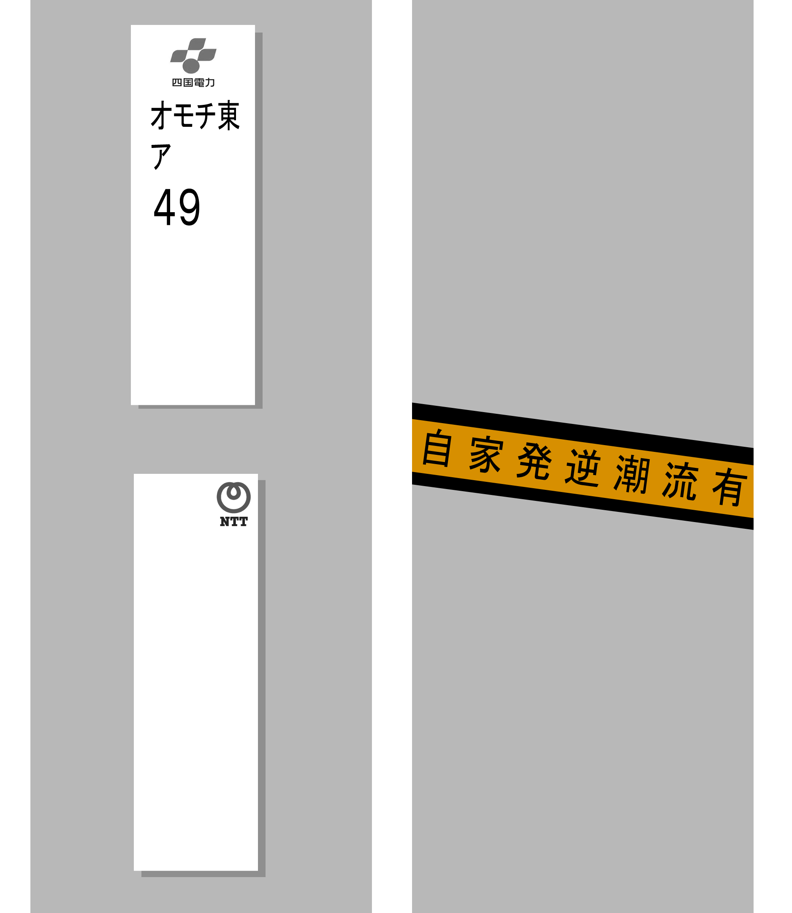

    <h2 class="section-title">Panorama general</h2>
    <ul class="rule-list">
        <li>Busca logotipos de la compañía Shikoku Electric Power y la etiqueta naranja 「自家発送電流有」 en los equipos de distribución.</li>
    </ul>

{}
{}
{}
Las placas de los postes pertenecientes a Shikoku Electric Power son una pista habitual. Cuando los sistemas solares privados están conectados a la red, puede aparecer una pegatina naranja con 「自家発送電流有」; si incluye la marca de Shikoku Electric, es probable que estés en la isla.
{}

{}
{}
