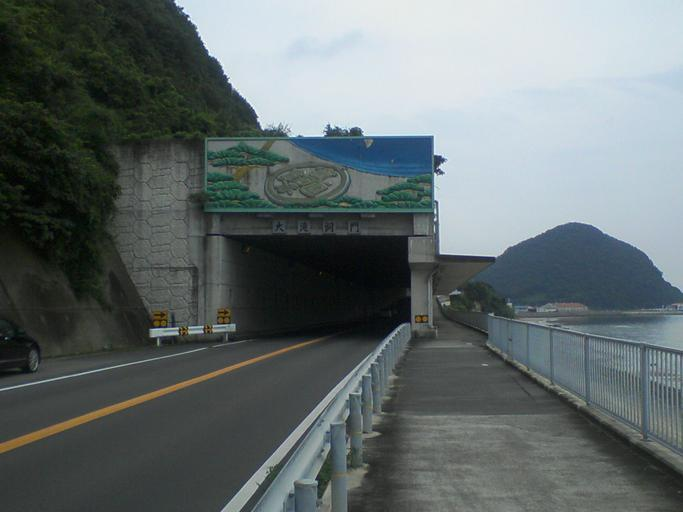
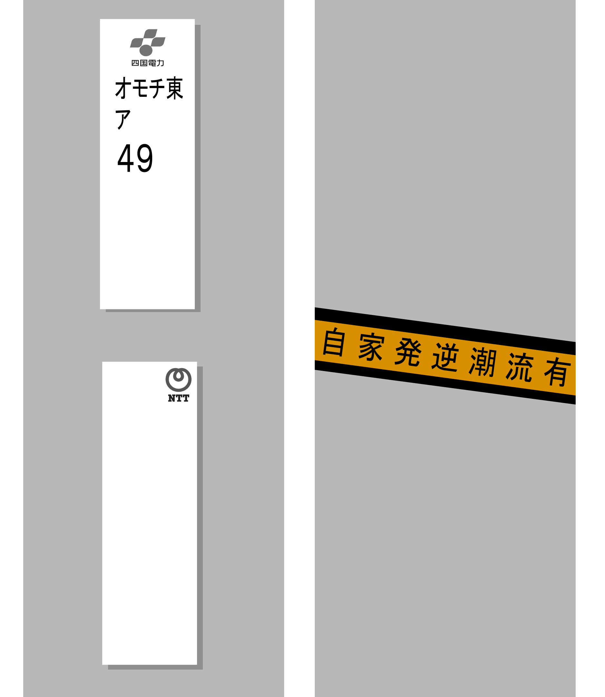

    <h2 class="section-title">全域</h2>
    <ul class="rule-list">
        <li>オレンジの●がふたつ描かれた看板がある</li>
    </ul>
    {}

{}
{}
{}
オレンジの●がふたつ描かれた看板がある。
{}

{}
{}
{}
四国電力の電柱プレートが見つかる。太陽光発電などの自家発電システムを連結している場合は『自家発逆潮流有』のラベルが見つかるが、オレンジテープのラベルは四国電力だと思われる。
{}

{}
{}

    <h4 class="mb-4">代表的な企業の説明</h4>
    <table class="table table-striped table-bordered">
        <thead class="table-light">
            <tr>
                <th scope="col" class="col-width-2">企業名</th>
                <th scope="col" class="col-width-1">コード</th>
                <th scope="col" class="col-width-7">説明</th>
                <th scope="col" class="col-width-05">決算</th>
                <th scope="col" class="col-width-05">配当履歴</th>
            </tr>
        </thead>
        <tbody class="corp-desc">
            <tr>
                <td>四国化成</td>
                <td>{}</td>
                <td>プリント配線板表面処理薬剤の世界シェア一位。不溶性硫黄など他の材料でも国内トップ。</td>
                <td>{}</td>
                <td>{}</td>
            </tr>
        </tbody>
    </table>

