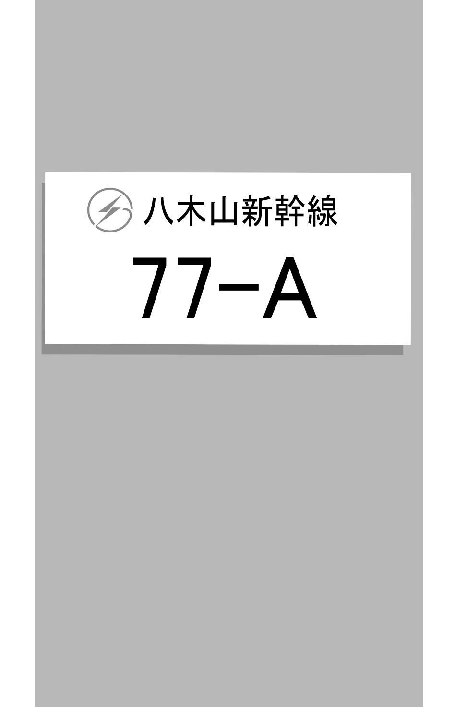
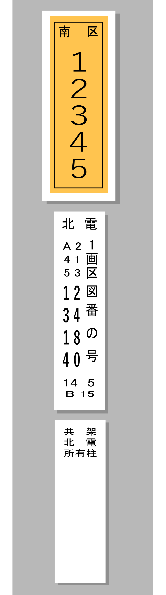

<ul class="flag-list-japan">
    <li data-nav-id="https://geopinning.space/rule/asia/japan/tohoku/hokkaido/" title="Hokkaido" class="">
        

        
<a href="https://geopinning.space/rule/asia/japan/tohoku/hokkaido/" class="flag-link">Hokkaido</a>

    </li>
</ul>

    <h2 class="section-title">Panorama umum</h2>
    <ul class="rule-list">
        <li>Sering terlihat logo Tohoku Electric Power atau Hokkaido Electric Power.</li>
        <li>Banyak rumah khas daerah bersuhu dingin (terutama di Hokkaido).
            <ul>
                <li>Rumah dengan tangki minyak tanah bernama “home tank” sangat mencolok {}</li>
                <li>Garasi bergaya Cascade umum ditemukan.</li>
            </ul>
        </li>
    </ul>

{}
{}
{}
Pelat logam mendatar menunjukkan tiang milik Tohoku Electric Power, sedangkan tiang yang kadang memiliki pelat kuning dimiliki oleh Hokkaido Electric Power.
{}

{}
{}
{}
Rumah yang memiliki tangki minyak tanah “home tank” mudah dikenali.
{}

By Ka23 13 - Own work, <a href="https://creativecommons.org/licenses/by-sa/4.0" title="Creative Commons Attribution-Share Alike 4.0">CC BY-SA 4.0</a>, <a href="https://commons.wikimedia.org/w/index.php?curid=142923992">Link</a>

{}
{}

