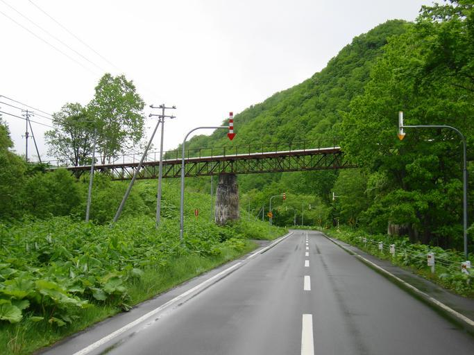
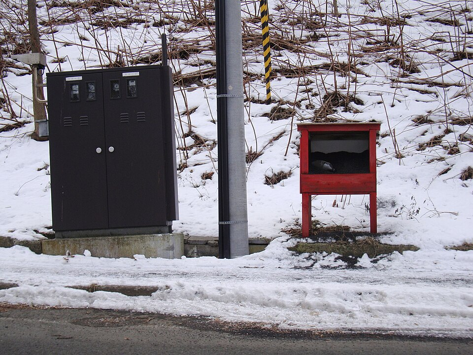
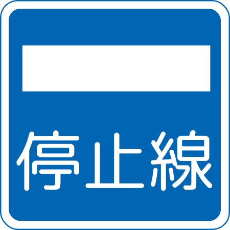

    <h2 class="section-title">全域</h2>
    <ul class="rule-list">
        <li>道路に視線誘導標がある</li>
        <li>コンビニにセイコーマートがある</li>
        <li>道路にスノーポールがある</li>
        <li>寒い地域特有の家が多い
            <ul>
                <li>屋根が平ら</li>
                <li>カスケード型のガレージがある</li>
                <li>ホームタンクと呼ばれる灯油タンクのある家が目立つ{}</li>
            </ul>
        </li>
    </ul>
    {}

{}
{}
{}
雪が多い地域は道路の上に矢印（固定式視線誘導柱）がある。北海道以外でも雪が多い地域に同じものがある{}ので他の要素と合わせて北海道と判断する。
{}

{}
{}

{}
道端にフキが大量に生えていることがある。フキ自体は全国で見られるが、大量に生えているのは北海道以外あまりない。
{}

{}
{}
{}
左側に大き目の数字が並んだレイアウト。見分けはつきやすい{}。
{}

{}
{}
{}
コンビニはセイコーマートが特徴的。
{}

{}
{}

{}
北海道には灯油タンク（ホームタンクと呼ばれる４９０㍑灯油が保存できるタンク）が家の外にある。屋根からの雪下ろしをしなくても大丈夫なように工夫された、遠くからみるとまっ平な屋根に見えるスノーダクト屋根・フラットルーフ屋根が多い。また、誰もいない場所に雪が自然に落ちるように設計された屋根も多い。屋根の上の雪を下すためのはしごも見えるはず。車庫は耐久性の高いカスケードガレージが使われていることがある{}。
{}

By <a href="//commons.wikimedia.org/wiki/User:Sgroey" title="User:Sgroey">Sgroey</a> - Own work, <a href="https://creativecommons.org/licenses/by-sa/4.0" title="Creative Commons Attribution-Share Alike 4.0">CC BY-SA 4.0</a>, <a href="https://commons.wikimedia.org/w/index.php?curid=115473171">Link</a>

{}
{}

{}
交差点付近に砂箱があることも。路面が滑りにくくなるようにするための砂が入っている。ご当地砂箱もあるらしい（<a href="https://tokukita.jp/gotouchineta/hokkaido-sunabako.html">出典</a>）。
{}

{}
{}

{}
北海道以外であまり見られない標識もあるかも{}？
{}

{}
{}

    <h4 class="mb-4">代表的な企業の説明</h4>
    <table class="table table-striped table-bordered">
        <thead class="table-light">
            <tr>
                <th scope="col" class="col-width-2">企業名</th>
                <th scope="col" class="col-width-1">コード</th>
                <th scope="col" class="col-width-7">説明</th>
                <th scope="col" class="col-width-05">決算</th>
                <th scope="col" class="col-width-05">配当履歴</th>
            </tr>
        </thead>
        <tbody class="corp-desc">
            <tr>
                <td>ジャックス</td>
                <td>{}</td>
                <td>信販業界で国内第2位の総取扱高の企業。</td>
                <td>{}</td>
                <td>{}</td>
            </tr>
            <tr>
                <td>北海道電力</td>
                <td>{}</td>
                <td>札幌市に本社を置く電力会社。ほくでん、HEPCOとも。</td>
                <td>{}</td>
                <td>{}</td>
            </tr>
        </tbody>
    </table>

