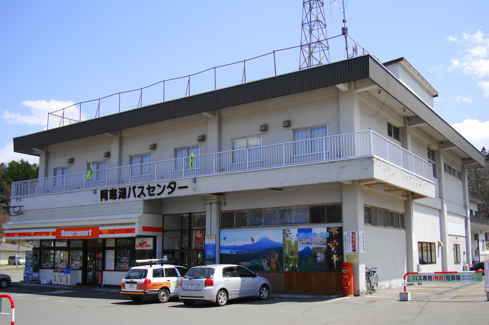

    <ul class="rule-list">
        <li>道路に視線誘導標がある</li>
        <li>コンビニにセイコーマートがある</li>
        <li>道路にスノーポールがある</li>
        <li>寒い地域特有の家が多い
            <ul>
                <li>屋根が平ら</li>
                <li>カスケード型のガレージがある</li>
                <li>ホームタンクと呼ばれる灯油タンクのある家が目立つ{}</li>
            </ul>
        </li>
    </ul>
    {}

{}
{}
{}
雪が多い地域は道路の上に矢印（固定式視線誘導柱）がある。北海道以外でも雪が多い地域に同じものがある{}ので他の要素と合わせて北海道と判断する。
{}

{}
{}
{}
コンビニはセイコーマートが特徴的。
{}

{}
{}

{}
北海道には灯油タンク（ホームタンクと呼ばれる４９０㍑灯油が保存できるタンク、ほとんど白色で緑・黒・黄・赤のものもある）が家の外にある。屋根からの雪下ろしをしなくても大丈夫なように工夫された、遠くからみるとまっ平な屋根に見えるスノーダクト屋根・フラットルーフ屋根が多い。また、誰もいない場所に雪が自然に落ちるように設計された屋根（遠くから見るとへの形）も多い。車庫は耐久性の高いカスケードガレージが使われていることがある（<a href="https://www.s-bic.co.jp/cascade/about.html">出典</a>）。
{}

<iframe src="https://www.google.com/maps/embed?pb=!4v1681859886520!6m8!1m7!1s-bAJKISeXX9I2EgV0lrVrw!2m2!1d42.84533330722992!2d141.66561898281!3f134.7584640744099!4f-2.197463705254961!5f3.325193203789971" width="295" height="295" style="border:0;" allowfullscreen="" loading="lazy" referrerpolicy="no-referrer-when-downgrade"></iframe>
<iframe src="https://www.google.com/maps/embed?pb=!4v1681860775271!6m8!1m7!1sZCq_ruuFMivTjOoBIcdSlg!2m2!1d43.81272522499885!2d142.448496823835!3f324.5998603746964!4f2.738884001552151!5f3.325193203789971" width="295" height="295" style="border:0;" allowfullscreen="" loading="lazy" referrerpolicy="no-referrer-when-downgrade"></iframe>
<iframe src="https://www.google.com/maps/embed?pb=!4v1681860798046!6m8!1m7!1sq87gzwMH3gW7iem6VN69ZQ!2m2!1d43.81286800739591!2d142.4483242167853!3f252.17890284412655!4f0.6251349643517017!5f2.8609201218789653" width="295" height="295" style="border:0;" allowfullscreen="" loading="lazy" referrerpolicy="no-referrer-when-downgrade"></iframe>

{}
{}

{}
交差点付近に砂箱があることも。路面が滑りにくくなるようにするための砂が入っている。ご当地砂箱もあるらしい（<a href="https://tokukita.jp/gotouchineta/hokkaido-sunabako.html">出典</a>）。
{}

{}
{}

{}
北海道以外であまり見られない標識もあるかも{}？
{}

{}
{}

