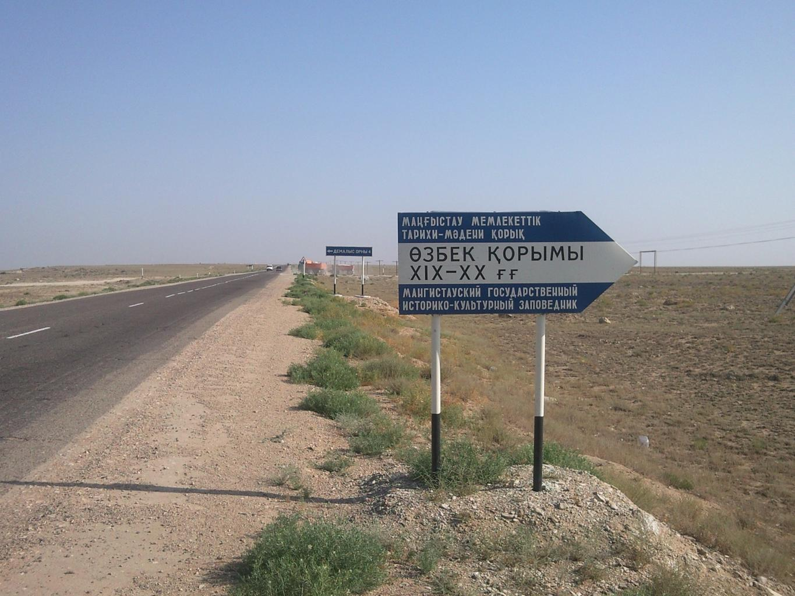
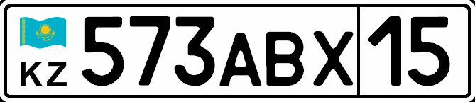

    <h2 class="section-title">{}</h2>
    <ul class="rule-list">
        <li>車は右側通行</li>
        <li>カザフ語とロシア語が使用されている</li>
        <li>Google Carが見える</li>
    </ul>
    {}

{}
{}

{}
カザフ語とロシア語が使用されている。Google Carが見える{}。
{}

{}
ナンバープレートの左側に水色の国旗が見えることがある。
{}

{}

{}

{}
{}
