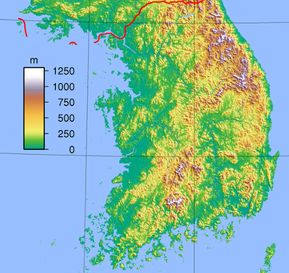
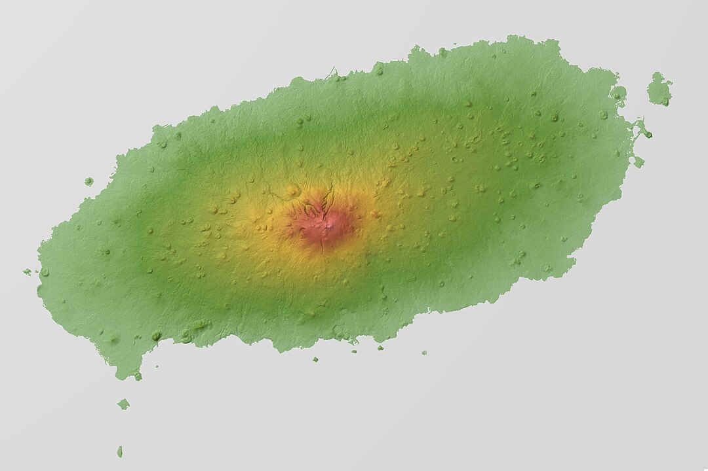
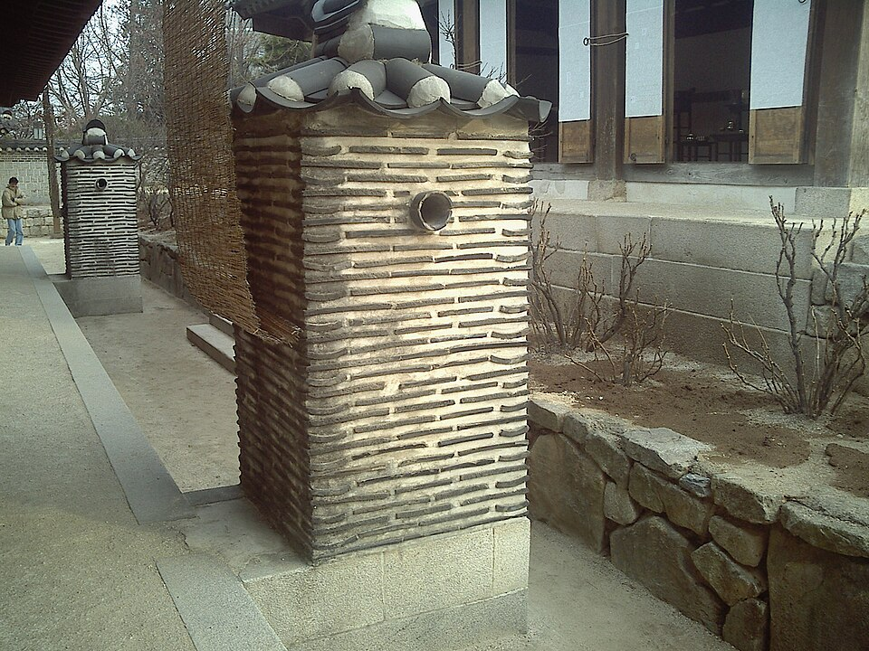
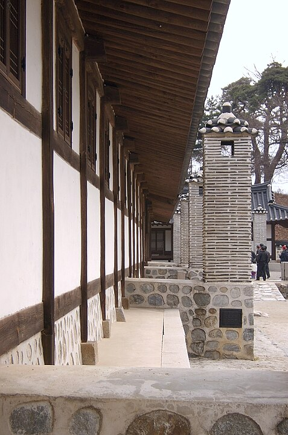

    <h2 class="section-title">{}</h2>
    <ul class="rule-list">
        <li>Bahasa yang digunakan adalah bahasa Korea</li>
        <li>Kendaraan menggunakan jalur kanan</li>
        <li>Terdapat pola <b>miring</b> berwarna kuning dan hitam di tiang listrik, mirip dengan yang ada di {}</li>
        <li>Rambu peringatan berwarna oranye</li>
    </ul>
    {}

{}
{}

{}
Bahasa Korea digunakan, dan tiang listrik memiliki pola <b>miring</b> berwarna kuning dan hitam.
{}

{}
Banyak ditemukan pohon pinus {}
{}

{}
Terdapat bollard dengan bentuk yang khas {}
{}

{}
Rambu peringatan berwarna oranye {}
{}

{}
{}

<iframe src="https://www.google.com/maps/embed?pb=!4v1692461958189!6m8!1m7!1sufcExAzNyVK6kTioAmKXyw!2m2!1d38.12472280191126!2d128.3102625946252!3f112.39219960263972!4f-8.431733233949728!5f1.7427477120226769" width="400" height="290" style="border:0;" allowfullscreen="" loading="lazy" referrerpolicy="no-referrer-when-downgrade"></iframe>

{}
{}

    <h2 class="section-title">{}</h2>
    <ul class="rule-list">
        <li>Terdapat daerah pegunungan di timur laut dan barat daya, sehingga terkadang terlihat gunung di kedua sisi jalan.
            <ul>
                <li>Timur Laut {}</li>
                <li>Barat Daya {}</li>
            </ul>
        </li>
        <li>Jeju adalah pulau vulkanik dengan puncak tertinggi di tengah pulau.</li>
        <li>Ondol berkembang di bagian utara, sementara lantai kayu lebih umum di bagian selatan. {}</li>
    </ul>

{}
{}
{}
Terdapat daerah pegunungan di bagian pedalaman timur laut dan barat daya.
{}

By <a href="//commons.wikimedia.org/wiki/User:Sadalmelik" title="User:Sadalmelik">Sadalmelik</a> - Own work, <a href="https://creativecommons.org/licenses/by-sa/3.0" title="Creative Commons Attribution-Share Alike 3.0">CC BY-SA 3.0</a>, <a href="https://commons.wikimedia.org/w/index.php?curid=2665772">Link</a>

{}
{}
{}
Pulau vulkanik berbentuk oval dengan tanah yang cenderung berwarna hitam, mirip dengan {}, dan banyak tumbuhan ilalang seperti di Kyushu. Terdapat satu puncak tertinggi di tengah pulau, sehingga tidak ada jalan yang diapit oleh gunung tinggi. Namun, terdapat beberapa bukit dengan ketinggian antara puluhan hingga sekitar 100 meter. {}
{}

{}
{}
{}
Meskipun gambar rumah biasanya tidak terlihat dari luar, gaya tradisional Hanok mungkin jarang menjadi petunjuk dalam permainan. Berikut adalah gambar ondol, tetapi sangat jarang terlihat.
{}

{}
Rumah di bagian selatan, tetapi tembok dalam rumah biasanya tidak terlihat dari luar.
{}

<iframe src="https://www.google.com/maps/embed?pb=!4v1696591748017!6m8!1m7!1s1E9Hu_WLNHa4V4tWmToBNQ!2m2!1d34.90975647767016!2d126.8577613753698!3f45.073992309286695!4f-1.68103061875901!5f0.6420795713657415" width="550" height="300" style="border:0;" allowfullscreen="" loading="lazy" referrerpolicy="no-referrer-when-downgrade"></iframe>

{}
{}

    <ul class="rule-list">
        <li>Kode area telepon dapat digunakan untuk mempersempit lokasi. {}. Peta berikut menunjukkan kode area telepon.</li>
    </ul>

{}

    <h2 class="section-title">{}</h2>
    <ul class="rule-list">
        <li>Pulau Udo terletak di sebelah timur Jeju dan memiliki suasana yang mirip dengan Jeju. {}. Pulau ini memiliki dataran subur yang cocok untuk pertanian dan peternakan, serta hampir tidak memiliki hutan liar.</li>
    </ul>

{}
{}
{}
Hampir seluruh area, kecuali di bagian tenggara yang sedikit memiliki jalan, adalah lahan pertanian. Tanah dan dinding batu berwarna hitam, mirip dengan Jeju, tetapi hampir tidak ada hutan maupun gunung tinggi. {}
{}

{}
{}