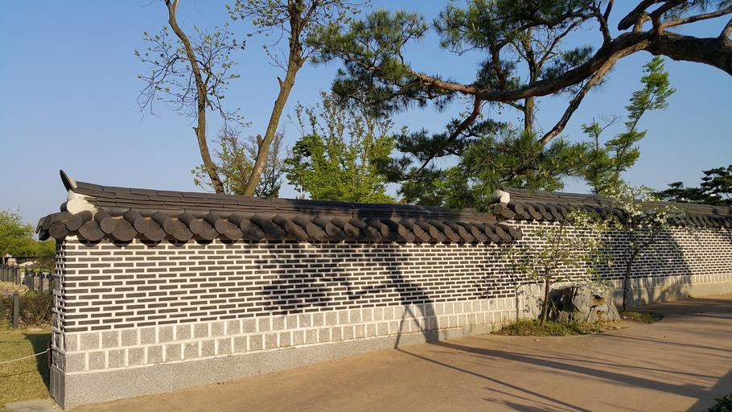
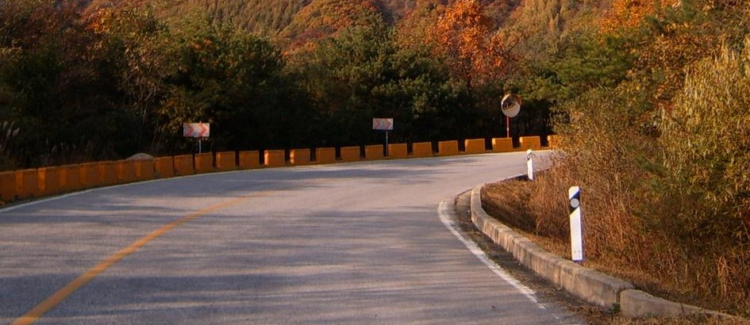
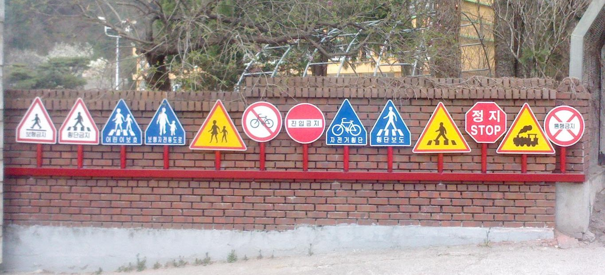
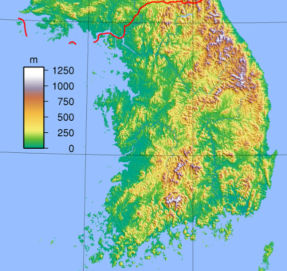
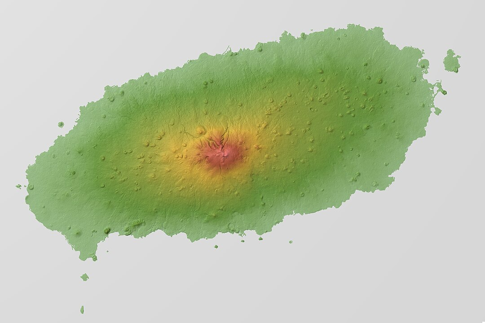
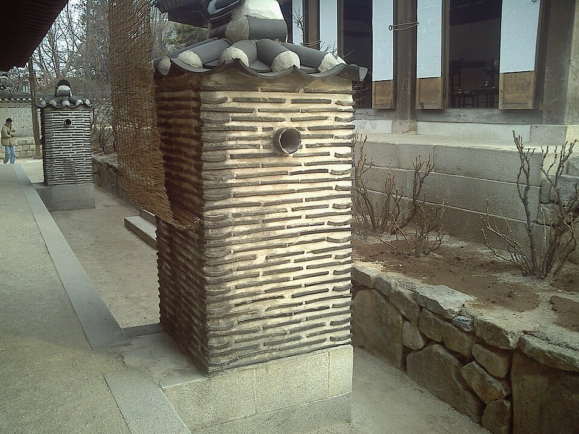
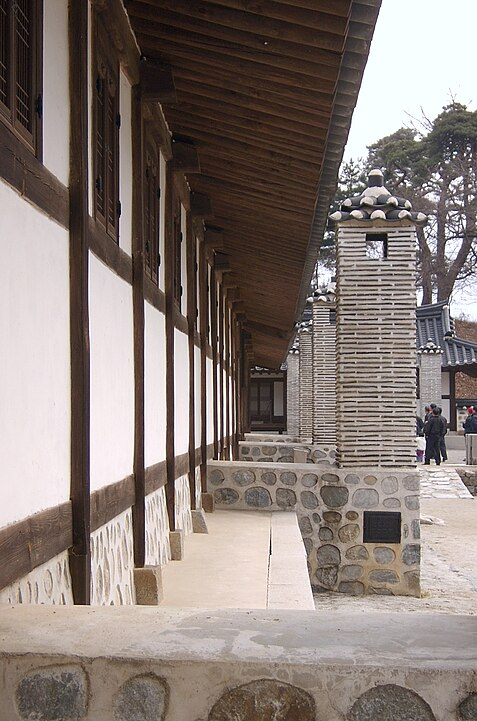

    <h2 class="section-title">{}</h2>
    <ul class="rule-list">
        <li>言語は韓国語</li>
        <li>車は右側通行</li>
        <li>{}と同じく電柱に黄色と黒の<b>斜め</b>のストライプがある</li>
        <li>警告看板がオレンジ色</li>
    </ul>
    {}

{}
{}

{}
韓国語が使用されており、電柱に黄色と黒で彩られた<b>斜め</b>のストライプがある。
{}

{}
松の木が多い{}
{}

{}
特徴的な形のボラードがある
{}

{}
警告看板がオレンジ色
{}

{}
{}

<iframe src="https://www.google.com/maps/embed?pb=!4v1692461958189!6m8!1m7!1sufcExAzNyVK6kTioAmKXyw!2m2!1d38.12472280191126!2d128.3102625946252!3f112.39219960263972!4f-8.431733233949728!5f1.7427477120226769" width="400" height="290" style="border:0;" allowfullscreen="" loading="lazy" referrerpolicy="no-referrer-when-downgrade"></iframe>

{}
{}

    <h2 class="section-title">{}</h2>
    <ul class="rule-list">
        <li>北東と南西に山岳地帯があり道の両サイドに山が見えることがある
            <ul>
                <li>北東{}</li>
                <li>南西{}</li>
            </ul>
        </li>
        <li>済州島は火山由来の島で島の中央に最高峰がある</li>
        <li>オンドルは北の方で、板の間は南の方で発達したらしい{}</li>
    </ul>

{}
{}
{}
北東と南西の内陸に山岳地帯がある
{}

By <a href="//commons.wikimedia.org/wiki/User:Sadalmelik" title="User:Sadalmelik">Sadalmelik</a> - Own work, <a href="https://creativecommons.org/licenses/by-sa/3.0" title="Creative Commons Attribution-Share Alike 3.0">CC BY-SA 3.0</a>, <a href="https://commons.wikimedia.org/w/index.php?curid=2665772">Link</a>

{}
{}
{}
楕円形をした火山島で同じく火山島である{}のように土が黒っぽいことが多い。中央に最高峰がひとつあるだけなので、道が山に挟まれていることはほぼありえない。道の両側に高い山がある場合（{}のような場所）は恐らく済州島ではない。
{}

{}
{}
{}
家の中が見えることはほとんどないのでヒントとしては使いづらいかも。以下はオンドルの画像だが見たことが無い。
{}

{}
南部の家
{}

<iframe src="https://www.google.com/maps/embed?pb=!4v1696591748017!6m8!1m7!1s1E9Hu_WLNHa4V4tWmToBNQ!2m2!1d34.90975647767016!2d126.8577613753698!3f45.073992309286695!4f-1.68103061875901!5f0.6420795713657415" width="550" height="300" style="border:0;" allowfullscreen="" loading="lazy" referrerpolicy="no-referrer-when-downgrade"></iframe>

{}
{}

    <ul class="rule-list">
        <li>市外局番である程度範囲を絞り込むことができる{}。以下のマップの番号が市外局番。</li>
    </ul>

{}

    <h2 class="section-title">{}</h2>
    <ul class="rule-list">
        <li>表札の数字は通りからの距離を表していて道路名と建物番号が書かれている{}</li>
    </ul>

