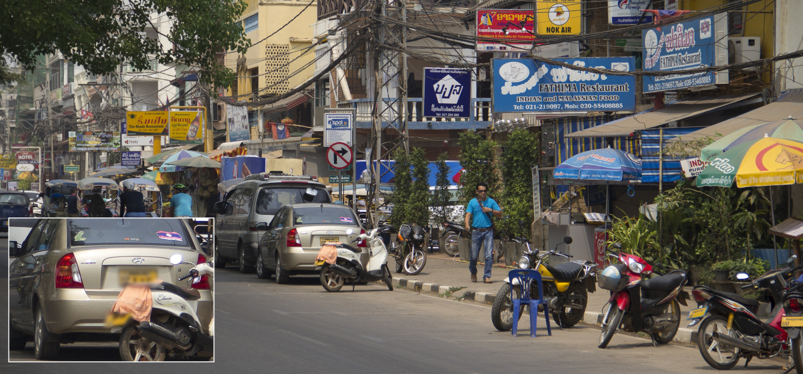
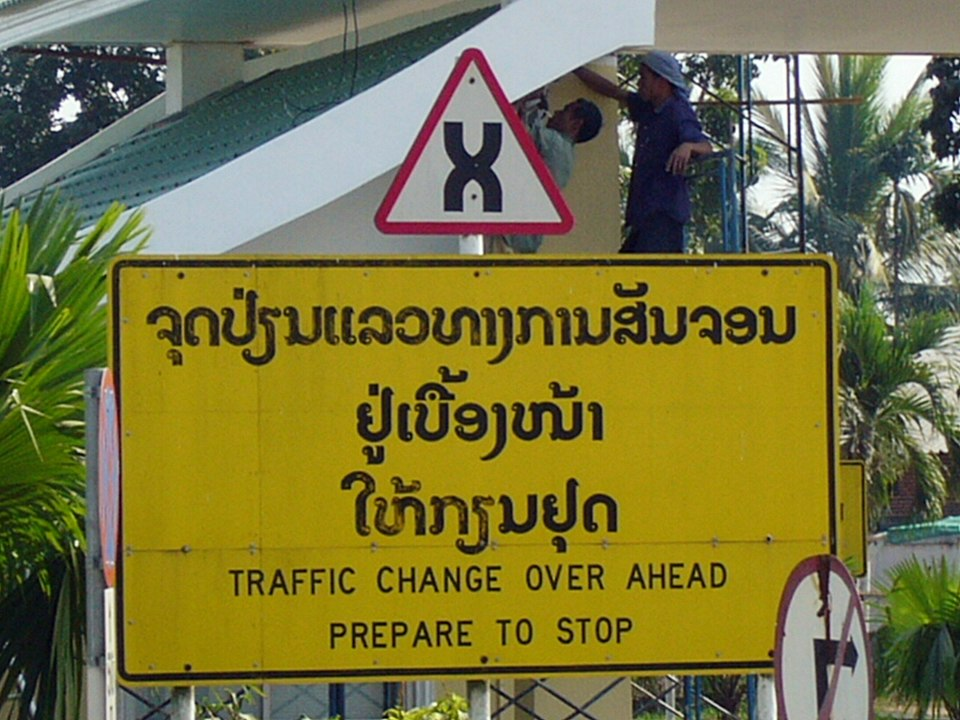
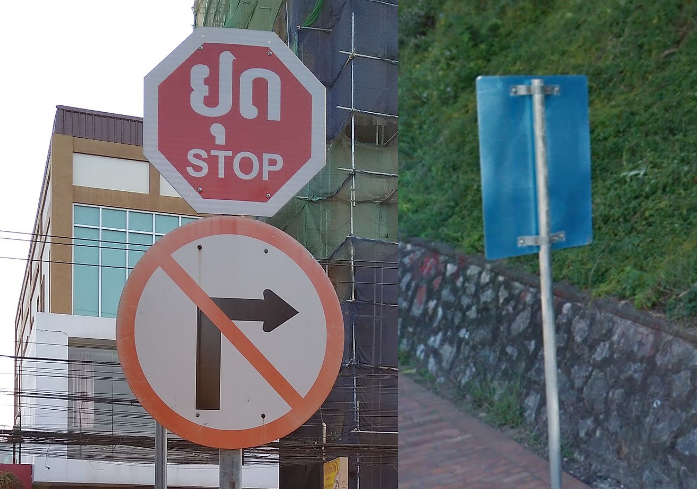
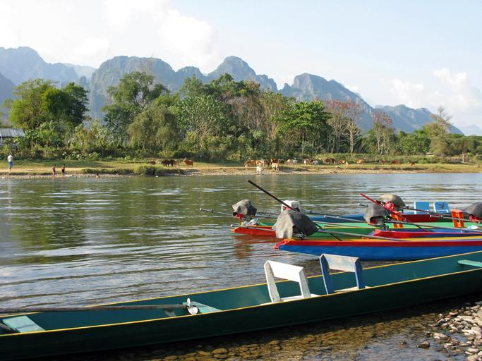

    <h2 class="section-title">{}</h2>
    <ul class="rule-list">
        <li>La circulación es por el lado derecho.</li>
        <li>Las matrículas suelen ser negras con caracteres claros.</li>
        <li>El dominio nacional es .la.</li>
        <li>El reverso de varias señales informativas aparece pintado de color celeste.</li>
        <li class="no-evidence">Fuera de Vientián apenas se ven coches en Street View.</li>
    </ul>
    {}

{}
{}
{}
Los vehículos particulares llevan matrículas negras y se circula por la derecha{}. En cambio, {} conduce por el lado izquierdo.
{}

{}
El idioma oficial es el lao, por lo que las señales de alto y otros avisos tienen grafías propias.
{}

<table class="word-list">
<tr>
    <th>Idioma</th> <th>Escritura</th>
</tr>
<tr><td>Jemer</td><td>ភោខE��ីយដ្ឋានជប៉ុខE/td></tr>
<tr><td>Lao</td><td>ຮ້ານອາຫານຍີ່ປຸ່ກE/td></tr>
<tr><td>Tailandés</td><td>ร้านอาหารญี่ปุ่กE/td></tr>
</table>

{}
Fuera de Vientián las carreteras están casi vacías; es habitual encontrarse con escenas sin coches.
{}

<iframe src="https://www.google.com/maps/embed?pb=!4v1686681996128!6m8!1m7!1skKjEXMjlcxLLxw7alD_-iA!2m2!1d19.89297895778401!2d102.139081518515!3f133.37511689777247!4f-89!5f0.7820865974627469" width="495" height="295" style="border:0;" allowfullscreen="" loading="lazy" referrerpolicy="no-referrer-when-downgrade"></iframe>

{}
Varias señales tienen la cara posterior pintada de color celeste. Ese mismo tono aparece también en {}.
{}

{}
{}
{}
Encontrarás hitos blancos y negros muy parecidos a los de Tailandia, con bordes rectos.
{}

<iframe src="https://www.google.com/maps/embed?pb=!4v1682156065057!6m8!1m7!1s_GOrlJ6qlmll5JcU5-8N2Q!2m2!1d17.89566739608804!2d102.7204188911393!3f307.13405333819395!4f-26.016123257733646!5f3.2201248475094664" width="295" height="295" style="border:0;" allowfullscreen="" loading="lazy" referrerpolicy="no-referrer-when-downgrade"></iframe>

{}
{}
{}
El lao es el idioma oficial del país.
{}

<table class="word-list">
<tr>
    <th>Idioma</th> <th>Escritura</th>
</tr>
<tr><td>Japonés</td><td>日本料理レストラン</td></tr>
<tr><td>Cingalés</td><td>ජපනශEඁE��න්ශE��</td></tr>
<tr><td>Asamés</td><td>জাপানীঁEৰুE��্টুৰুE��্ঁE/td></tr>
<tr><td>Canarés</td><td>ಜಪಾನೀಸುEರುE��್ಟೋರುE��ಟುE/td></tr>
<tr><td>Guyaratí</td><td>જાપાનીઁEરુE��્ટોરન્ઁE/td></tr>
<tr><td>Tamil</td><td>ஜப்பானிய உணவகமுE/td></tr>
<tr><td>Telugú</td><td>జపనీసుEరుE��్టారుE��టుE/td></tr>
<tr><td>Bengalí</td><td>জাপানি রুE��্তোরা</td></tr>
<tr><td>Hindi</td><td>जापानी रुE��्टोरुE��ँE/td></tr>
<tr><td>Jemer</td><td>ភោខE��ីយដ្ឋានជប៉ុខE/td></tr>
<tr><td>Lao</td><td>ຮ້ານອາຫານຍີ່ປຸ່ກE/td></tr>
<tr><td>Tailandés</td><td>ร้านอาหารญี่ปุ่กE/td></tr>
</table>

{}
{}

    <h2 class="section-title">{}</h2>
    <ul class="rule-list">
        <li class="no-evidence">En Vang Vieng se observan montañas kársticas de piedra caliza{}.</li>
    </ul>

{}
{}

{}
{}

    <ul class="rule-list">
        <li class="no-evidence">Los diseños de las placas de calle cambian según la ciudad.</li>
    </ul>

{}
{}

<a data-flickr-embed="true" href="https://www.flickr.com/photos/tigertraillaos/16227618552/in/photolist-qHYMCL-eKp32y-FL3W1C-f4kDBT-kt81PR-q2ViyM-bWbDNY-9jgM5v-bVqVeg-zhwqjQ-7YEAyp-9ktK7q-mvN8ma-q2X2fm-dUJfkx-82Nh98-9ea6Em-bWbzYN-a7PTjH-9desNB-psZmsY-p1A4Uy-pezcin-e1rVnD-q1Phe1-o8vh99-nR88ia-8j2N3q-brRuTi-5NJMNr-7naoKt-peBvkW-f4A5ih-j1EfGQ-55XdSn-o6Drfm-dXtLcz-kDGeiU-aqh24U-dWeFsK-c97dmd-anXwRj-68JHMi-dWkkjd-dUJ3zR-oG4xWA-AGwbpx-a9oNbU-qaEtBF-Cepnkp" title="laos-vientiane-french-street-sign-tiger-trail-photo-by-cyril-eberle-CEB_9572"></a>

{}
{}

<iframe src="https://www.google.com/maps/embed?pb=!4v1686683910958!6m8!1m7!1s54i3lPxhz8wrm93-DQs5LA!2m2!1d19.88538315585645!2d102.1368704792641!3f226.7199194703969!4f-10.959218382083236!5f3.3141337805568174" width="295" height="295" style="border:0;" allowfullscreen="" loading="lazy" referrerpolicy="no-referrer-when-downgrade"></iframe>

{}
{}

<iframe src="https://www.google.com/maps/embed?pb=!4v1686683686473!6m8!1m7!1sLI50TkU7-7CKi1-dA7imJA!2m2!1d16.55840340475947!2d104.7496955558114!3f313.9022413503186!4f-4.245691810731117!5f3.325193203789971" width="295" height="295" style="border:0;" allowfullscreen="" loading="lazy" referrerpolicy="no-referrer-when-downgrade"></iframe>

{}
{}
{}
El diseño se parece al de Luang Prabang, pero la esquina inferior derecha muestra un número; parece un formato muy consistente.
{}

<iframe src="https://www.google.com/maps/embed?pb=!4v1686684022096!6m8!1m7!1sXuv5OscM3dhGjcSj7t64uA!2m2!1d18.91971609057496!2d102.4483848353054!3f20.904230773404873!4f-19.806052191080013!5f3.325193203789971" width="295" height="295" style="border:0;" allowfullscreen="" loading="lazy" referrerpolicy="no-referrer-when-downgrade"></iframe>

{}
{}
{}
Hay menos señales que en otras ciudades, pero a veces aparecen carteles con un adorno dorado en la parte superior. Al ser un destino turístico, incluso los rótulos mencionan “Pakse” en inglés, así que puedes orientarte aunque no encuentres la placa.
{}

<iframe src="https://www.google.com/maps/embed?pb=!4v1686684707027!6m8!1m7!1sWRLjjKdIrjGe20wwdautCQ!2m2!1d15.12167617277633!2d105.8017633474254!3f44.920309591713874!4f-9.301377899545201!5f3.325193203789971" width="195" height="295" style="border:0;" allowfullscreen="" loading="lazy" referrerpolicy="no-referrer-when-downgrade"></iframe>
<iframe src="https://www.google.com/maps/embed?pb=!4v1686685119713!6m8!1m7!1sv3c01DN3dIAqEQSqaxdSpg!2m2!1d15.11719182863964!2d105.8064755975009!3f202.58384227119325!4f-9.89541873920571!5f3.325193203789971" width="195" height="295" style="border:0;" allowfullscreen="" loading="lazy" referrerpolicy="no-referrer-when-downgrade"></iframe>
<iframe src="https://www.google.com/maps/embed?pb=!4v1686685178258!6m8!1m7!1sv_A8sElkA9JWfuo7-xFpjA!2m2!1d15.11849950747342!2d105.8044653882287!3f99.01356437804438!4f-9.175144438084999!5f3.325193203789971" width="195" height="295" style="border:0;" allowfullscreen="" loading="lazy" referrerpolicy="no-referrer-when-downgrade"></iframe>

{}
{}
