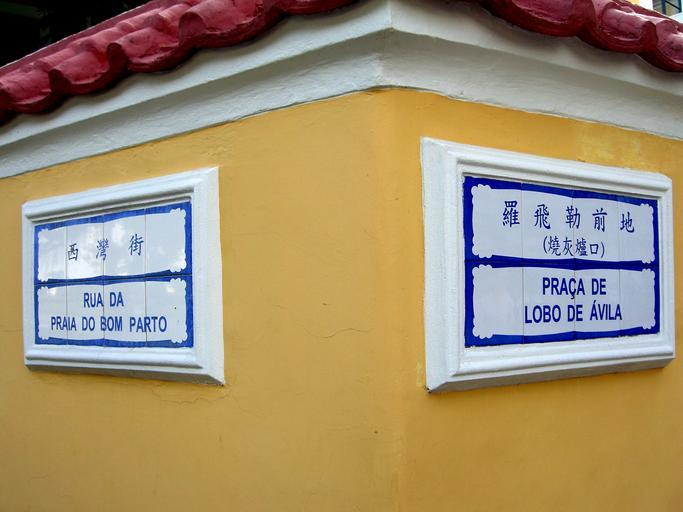
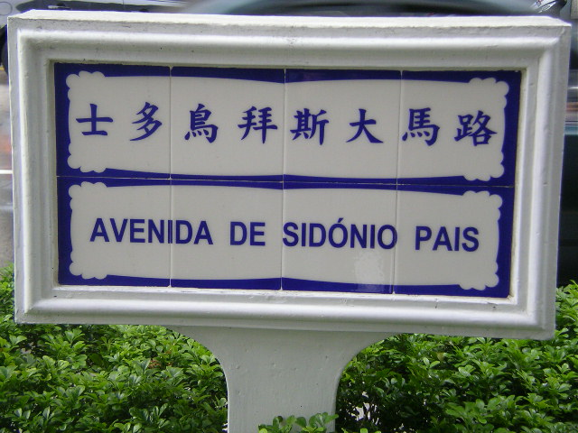
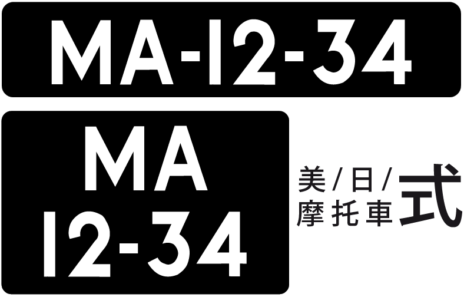

    <h2 class="section-title">{}</h2>
    <ul class="rule-list">
        <li>Domain is .mo</li>
        <li>Most license plates have a black background. Bus license plates have the letters in yellow.</li>
    </ul>
    {}

{}
{}

{}
Often, the street name is written on a white ceramic tile-like object{}. It is also unique in that the street names are written in two languages.
{}

{}
Most license plates have a black background.
If the front and back of the license plate are black, it may not be {} but Macau.
{}

{}

By Woodennature - Own work, <a href="https://creativecommons.org/licenses/by-sa/3.0/deed.ja">CC BY-SA 3.0</a>, <a href="https://commons.wikimedia.org/w/index.php?curid=5951838">Wikimedia Commons</a>

By Woodennature - Own work, <a href="https://creativecommons.org/licenses/by-sa/3.0/deed.ja">CC BY-SA 3.0</a>, <a href="https://commons.wikimedia.org/w/index.php?curid=5951344">Wikimedia Commons</a>, （一部を加工しています）
{}

{}
There are many parking areas on the street and many uniquely shaped meters{}.
{}

By <a href="//commons.wikimedia.org/w/index.php?title=User:ATR50&amp;amp;action=edit&amp;amp;redlink=1" class="new" title="User:ATR50 (page does not exist)">ATR50</a> - Own work, <a href="http://www.gnu.org/copyleft/fdl.html" title="GNU Free Documentation License">GFDL</a>, <a href="https://commons.wikimedia.org/w/index.php?curid=15054264">Link</a>

{}
{}

<iframe src="https://www.google.com/maps/embed?pb=!4v1688094397504!6m8!1m7!1sjhi0wmOlIe-PbabtodLADA!2m2!1d22.11620515769555!2d113.5532590190688!3f249.60700589086787!4f18.48411418011284!5f3.325193203789971" width="295" height="295" style="border:0;" allowfullscreen="" loading="lazy" referrerpolicy="no-referrer-when-downgrade"></iframe>

{}
{}
