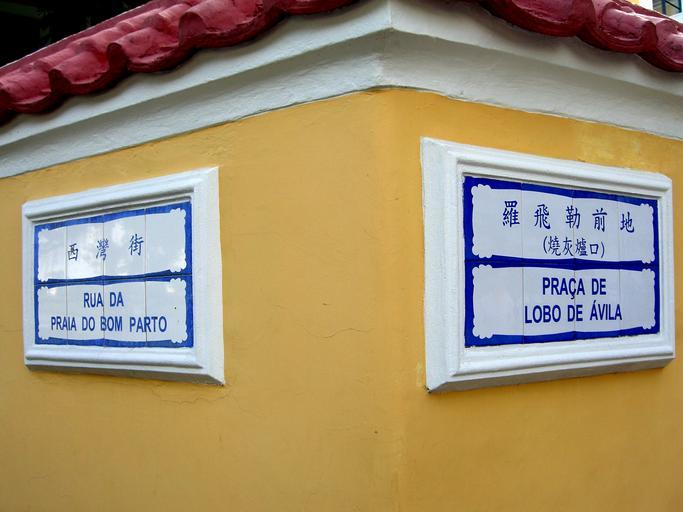
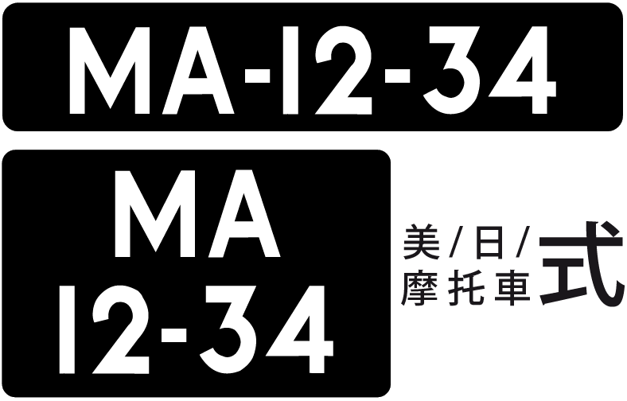

    <h2 class="section-title">{}</h2>
    <ul class="rule-list">
        <li>ドメインは.mo</li>
        <li>中国語とポルトガル語が公用語となっている</li>
        <li>ナンバープレートは黒背景のものが多い</li>
    </ul>
    {}

{}
{}

{}
白い陶器製のタイルのようなものに通り名が書かれていることが多い{}。２言語で書かれている点も特徴的。ちなみに{}でも似たような形の通り名看板が散見される{}。
{}

{}
ナンバープレートは黒背景のものが多い{}。バスのナンバープレートは黒背景に黄色の文字が書かれている{}。ナンバープレートで前後が黒色の場合は{}ではなく澳門かも。{}も同じ色のナンバープレートがあるので注意。
{}

{}

By Woodennature - Own work, <a href="https://creativecommons.org/licenses/by-sa/3.0/deed.ja">CC BY-SA 3.0</a>, <a href="https://commons.wikimedia.org/w/index.php?curid=5951838">Wikimedia Commons</a>

By Woodennature - Own work, <a href="https://creativecommons.org/licenses/by-sa/3.0/deed.ja">CC BY-SA 3.0</a>, <a href="https://commons.wikimedia.org/w/index.php?curid=5951344">Wikimedia Commons</a>, （一部を加工しています）
{}

{}
路上に駐車エリアが多く独特な形のメーターが多い{}。
{}

By <a href="//commons.wikimedia.org/w/index.php?title=User:ATR50&amp;amp;action=edit&amp;amp;redlink=1" class="new" title="User:ATR50 (page does not exist)">ATR50</a> - Own work, <a href="http://www.gnu.org/copyleft/fdl.html" title="GNU Free Documentation License">GFDL</a>, <a href="https://commons.wikimedia.org/w/index.php?curid=15054264">Link</a>

{}
{}
{}
都心部でない場所の電柱に三角の突起が付いている。
{}

<iframe src="https://www.google.com/maps/embed?pb=!4v1688094397504!6m8!1m7!1sjhi0wmOlIe-PbabtodLADA!2m2!1d22.11620515769555!2d113.5532590190688!3f249.60700589086787!4f18.48411418011284!5f3.325193203789971" width="295" height="295" style="border:0;" allowfullscreen="" loading="lazy" referrerpolicy="no-referrer-when-downgrade"></iframe>

{}
{}

    <h2 class="section-title">{}</h2>
    <ul class="rule-list">
        <li>範囲が非常に狭いので道路の角度で地域を絞り込めば動かずに5000点が狙えるかも</li>
    </ul>

{}
{}
{}
たとえば<a href="https://goo.gl/maps/jXJoypUyjaNigz699">ここ</a>{}の場合、南が開けて山が見えないので海沿いと考えてみる。そのあと真下を向いて道路の角度を見ると同じような角度のエリアは右下（画像のピンを指している箇所周辺）の部分しかないため、場所がほとんど絞り込める。最後は道路の別れ方と交差点の位置などを見て位置調整すればOK（画像出典：<a href="https://goo.gl/maps/aprSygQosB8xyGCo9">Google Map</a>）。
{}

{}
{}