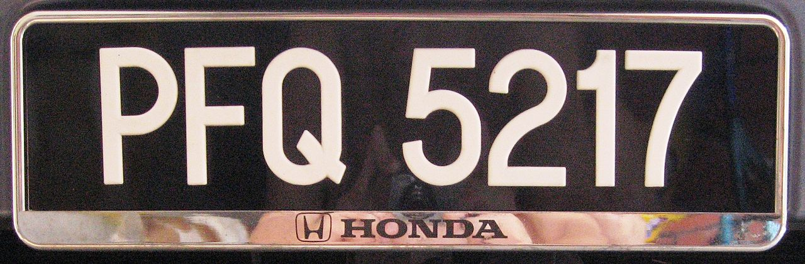
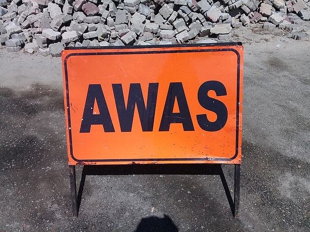
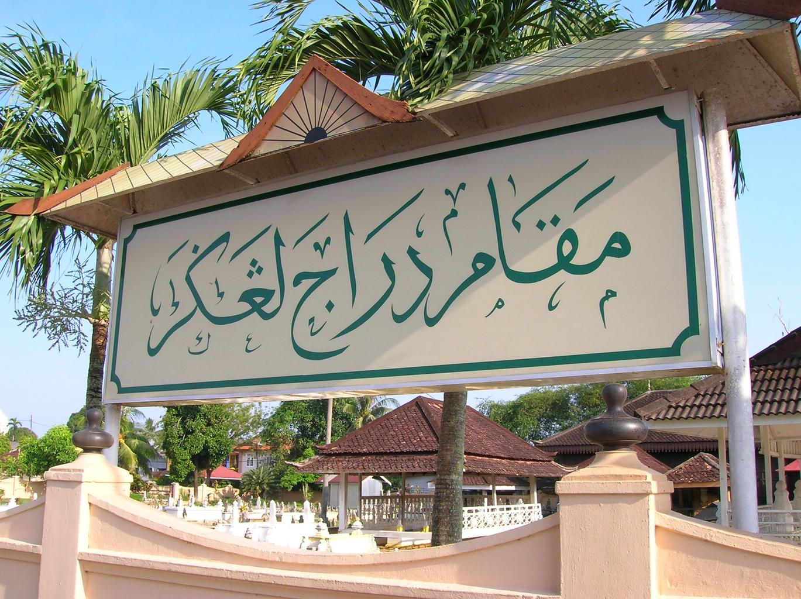
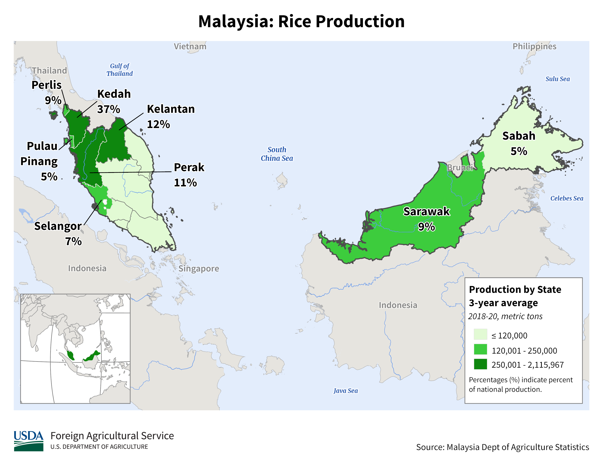

    <h2 class="section-title">{}</h2>
    <ul class="rule-list">
        <li>The domain is .my</li>
        <li>Official languages include Malay and English</li>
        <li>Cars drive on the left</li>
        <li>Yellow hexagonal route numbers</li>
        <li>Stop signs say berhenti</li>
        <li>License plates are white text on black</li>
        <li>If you see a black label on utility poles, it is the peninsula{}</li>
        <li>SDN BHD / BHD mean company / public company</li>
        <li>Signs often use black-and-white striped poles</li>
        <li>Roads are mostly asphalt, not concrete</li>
    </ul>
    {}

{}
{}

{}
Yellow hexagonal route numbers{}. The Malaysian Public Works Department logo is also a yellow hexagon and appears on signs{}. Many signs use black-and-white striped poles, and the centerline is usually white. Roads with double white lines in the center like this are rare outside Malaysia{}.
{}

{}Most centerlines are double white. Roads like this are almost always Malaysia{}.
{}

{}{}{} and, very rarely, {} can also show double white lines{}.
{}

{}
Stop signs say berhenti{}.
{}

{}
If you see a black label on utility poles, it is the peninsula rather than Borneo{}{}. But black-label-like poles in Indonesia’s Riau Islands have misled me before{}, so check the surroundings too.
{}

By Ardeka Balian Aga Fo…, <a href="https://creativecommons.org/licenses/by-sa/3.0" title="Creative Commons Attribution-Share Alike 3.0">CC BY-SA 3.0</a>, <a href="https://commons.wikimedia.org/w/index.php?curid=56022236">Link</a>

{}
Depending on the mosaic, the license plate may look split into two{}. If it looks split into three, it might be {}.
{}

{}

By Slleong - Own work, <a href="https://creativecommons.org/licenses/by-sa/3.0/deed.ja">CC BY-SA 3.0</a>, <a href="https://commons.wikimedia.org/w/index.php?curid=9529171">Wikimedia Commons(Link)</a>
{}

{}
Asphalt roads are common and concrete roads are rare. Concrete roads usually appear only in remote places such as outlying islands{}. Roadside signs and bollards often show place names and route numbers{}.
{}

{}
Petronas Gas (PGB), run by the national oil and gas company Petronas, appears on signs with locations{}. The example below is a station in {}. Petrona🍆.
{}

{}
"AWAS" means caution in Malay{}.
{}

{}
{}
{}
SDN BHD / BHD mean company / public company in Malaysia
{}

<iframe src="https://www.google.com/maps/embed?pb=!4v1681094513055!6m8!1m7!1sYRlhpp1aBIpZxijvoVu0ZA!2m2!1d4.592198714091221!2d101.0844063944407!3f298.35050437596914!4f16.795660891195553!5f3.325193203789971" width="295" height="295" style="border:0;" allowfullscreen="" loading="lazy" referrerpolicy="no-referrer-when-downgrade"></iframe>
<iframe src="https://www.google.com/maps/embed?pb=!4v1680608840026!6m8!1m7!1sX5lIc524AiJNKc-mfpjJ5w!2m2!1d3.069872218239332!2d101.5488705795945!3f110.14004331524838!4f-3.514524711095703!5f3.325193203789971" width="295" height="295" style="border:0;" allowfullscreen="" loading="lazy" referrerpolicy="no-referrer-when-downgrade"></iframe>

{}
{}

<iframe width="590" height="295" src="https://www.youtube.com/embed/Bsd_bvTY0_w" title="YouTube video player" frameborder="0" allow="accelerometer; autoplay; clipboard-write; encrypted-media; gyroscope; picture-in-picture; web-share" allowfullscreen></iframe>

{}
{}

 

    <h2 class="section-title">{}</h2>
    <ul class="rule-list">
        <li>If you see Jawi script on street names or supermarket signs, it may be the northern or southern peninsula{}.</li>
        <li>Agricultural distribution is uneven
            <ul>
                <li>Oil palm plantations are common on the east side of the peninsula and around Sabah</li>
                <li>Rice paddies are more common in the far north of the peninsula</li>
                <li>Data source: <a href="https://ipad.fas.usda.gov/countrysummary/default.aspx?id=MY">U.S. Malaysia Production Country Summary (USDA)</a></li>
            </ul>
        </li>
        <li>Refer to <a href="https://docs.google.com/document/d/1BYu38SKT5Gej-jjHZ0cESvmRGPGT1KqaBpRgQa3Ctz0/edit">The Malaysia Doc by zi8gzag</a></li>
    </ul>

{}
{}
{}
Common in the northern peninsula (Terengganu, Kelantan, Kedah, Perlis) and the southern peninsula (Johor, the state closest to Singapore). If the sign is yellow, it is likely Johor{}. Jawi script also appears in Indonesia’s Riau and Riau Islands.
{}

{}
{}

{}
Large palm plantations often surround red ● palm oil mills. Central Sarawak has few roads, so if you see large plantations, lean toward eastern Sabah.
{}

<iframe src="https://www.google.com/maps/embed?pb=!4v1683781808462!6m8!1m7!1sZaUVLl9S1qZG0kqPOxasPg!2m2!1d5.149618991020001!2d118.2227603125666!3f353.7620043272403!4f2.4044239282482636!5f1.7698202104649674" width="590" height="280" style="border:0;" allowfullscreen="" loading="lazy" referrerpolicy="no-referrer-when-downgrade"></iframe>

{}
{}

{}
Rice paddies are most common in the far north.
{}

<iframe src="https://www.google.com/maps/embed?pb=!4v1683781975727!6m8!1m7!1sKVRNUq1XkjFkTlt-FWwJ7A!2m2!1d6.257753139942261!2d100.3186941871063!3f100.26260459083646!4f1.0836826427593422!5f1.4588197954522921" width="590" height="280" style="border:0;" allowfullscreen="" loading="lazy" referrerpolicy="no-referrer-when-downgrade"></iframe>

{}
{}

    <h2 class="section-title">{}</h2>
    <ul class="rule-list">
        <li>There is a resort island called Mabul where you can scuba dive{}</li>
        <li>On Tioman Island, the driver’s hand is visible</li>
    </ul>

{}
{}
{}
Located at Malaysia’s easternmost area{}.
{}

{}
{}

{}
Concrete roads are very rare in Malaysia. Remote areas like islands often have concrete roads. Sloped areas where asphalt cannot be evenly rolled also tend to be concrete. Mountainous Thailand, island-heavy Philippines{}, and mountainous Colombia{} also have concrete roads.
{}

<iframe src="https://www.google.com/maps/embed?pb=!4v1691904266081!6m8!1m7!1s4XDQlxUS-63_ZoeO0ifCLg!2m2!1d2.815183796206949!2d104.1546025502086!3f255.77!4f-24.680000000000007!5f0.4000000000000002" width="400" height="300" style="border:0;" allowfullscreen="" loading="lazy" referrerpolicy="no-referrer-when-downgrade"></iframe>

{}
{}
