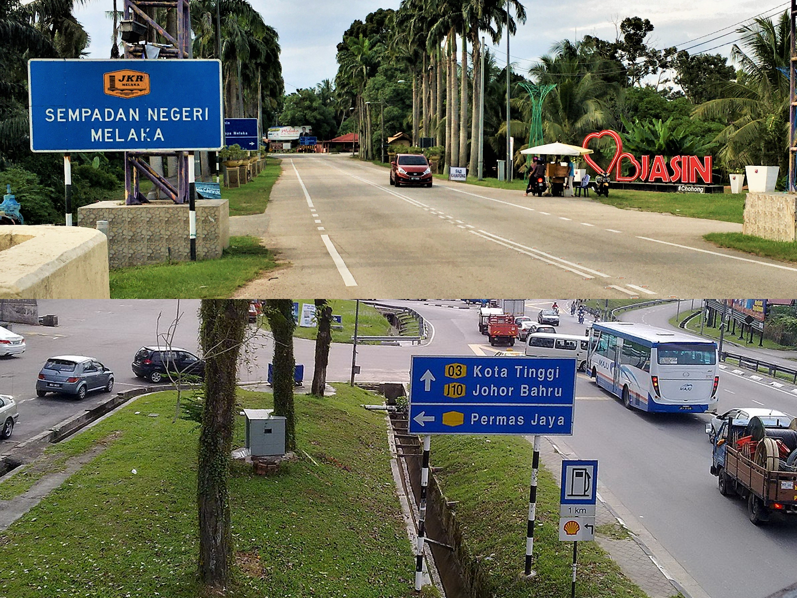
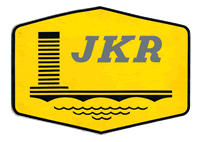

    <h2 class="section-title">{}</h2>
    <ul class="rule-list">
        <li>Domain: .my</li>
        <li>Bahasa resmi: Bahasa Melayu dan Inggris</li>
        <li>Kendaraan berjalan di kiri</li>
        <li>Nomor jalan berbentuk heksagonal berwarna kuning</li>
        <li>Rambu berhenti bertuliskan berhenti</li>
        <li>Plat nomor kendaraan berwarna hitam dengan tulisan putih</li>
        <li>Tiang listrik memiliki label hitam di sisi Semenanjung Malaysia {}</li>
        <li>SDN BHD dan BHD berarti perusahaan swasta dan publik di Malaysia</li>
        <li>Tiang rambu jalan sering kali memiliki pola bergaris hitam dan putih</li>
        <li>Jalanan umumnya terbuat dari aspal, bukan beton</li>
    </ul>
    {}

{}
{}

{}
Nomor jalan berbentuk heksagonal berwarna kuning {}. Logo Departemen Pekerjaan Umum Malaysia juga berbentuk heksagonal kuning dan sering ditemukan pada rambu {}. Tiang rambu jalan memiliki pola garis hitam dan putih, dan garis tengah jalan biasanya dua garis putih. Ciri khas ini jarang ditemukan di negara lain {}.
{}

{}
Garis tengah jalan hampir selalu dua garis putih. Jalan dengan garis ini hampir pasti berada di Malaysia {}.
{}

{}
Garis ini jarang ditemukan di {} {}, dan sangat jarang di {} {}.
{}

{}
Rambu berhenti bertuliskan berhenti {}.
{}

{}
Tiang listrik dengan label hitam menandakan lokasi di Semenanjung Malaysia, bukan di Borneo {}. Namun, label serupa juga ditemukan di Kepulauan Riau, Indonesia, sehingga perlu diperiksa lebih lanjut {}.
{}

By Ardeka Balian Aga Fo…, <a href="https://creativecommons.org/licenses/by-sa/3.0" title="Creative Commons Attribution-Share Alike 3.0">CC BY-SA 3.0</a>, <a href="https://commons.wikimedia.org/w/index.php?curid=56022236">Link</a>

{}
Plat nomor kendaraan dapat terlihat terpisah karena efek blur {}. Jika terlihat terbagi menjadi tiga, kemungkinan itu adalah {}.
{}

{}

By Slleong - Own work, <a href="https://creativecommons.org/licenses/by-sa/3.0/deed.ja">CC BY-SA 3.0</a>, <a href="https://commons.wikimedia.org/w/index.php?curid=9529171">Wikimedia Commons(Link)</a>
{}

{}
Sebagian besar jalan di Malaysia terbuat dari aspal, dan jalan beton jarang ditemukan kecuali di daerah terpencil seperti pulau {}. Banyak rambu jalan memiliki nama lokasi dan nomor jalan tertulis {}.
{}

{}
Petronas Gas Berhad adalah perusahaan milik negara yang memasok minyak dan gas di Malaysia. Lokasi sering tercantum di rambu {}. Contoh: {}.
{}

{}
Kata 'AWAS' berarti 'hati-hati' dalam Bahasa Melayu {}.
{}

{}
{}
{}
SDN BHD dan BHD berarti perusahaan swasta dan publik di Malaysia.
{}

<iframe src="https://www.google.com/maps/embed?pb=!4v1681094513055!6m8!1m7!1sYRlhpp1aBIpZxijvoVu0ZA!2m2!1d4.592198714091221!2d101.0844063944407!3f298.35050437596914!4f16.795660891195553!5f3.325193203789971" width="295" height="295" style="border:0;" allowfullscreen="" loading="lazy" referrerpolicy="no-referrer-when-downgrade"></iframe>
<iframe src="https://www.google.com/maps/embed?pb=!4v1680608840026!6m8!1m7!1sX5lIc524AiJNKc-mfpjJ5w!2m2!1d3.069872218239332!2d101.5488705795945!3f110.14004331524838!4f-3.514524711095703!5f3.325193203789971" width="295" height="295" style="border:0;" allowfullscreen="" loading="lazy" referrerpolicy="no-referrer-when-downgrade"></iframe>

{}
{}

<iframe width="590" height="295" src="https://www.youtube.com/embed/Bsd_bvTY0_w" title="YouTube video player" frameborder="0" allow="accelerometer; autoplay; clipboard-write; encrypted-media; gyroscope; picture-in-picture; web-share" allowfullscreen></iframe>

{}
{}

    <h2 class="section-title">{}</h2>
    <ul class="rule-list">
        <li>Jika tulisan Jawi ditemukan di nama jalan atau papan supermarket, kemungkinan besar berada di wilayah utara atau selatan Semenanjung Malaysia {}.</li>
        <li>Pola distribusi pertanian berbeda di setiap wilayah:
            <ul>
                <li>Perkebunan kelapa sawit banyak ditemukan di sisi timur Semenanjung Malaysia dan sekitar Sabah.</li>
                <li>Persawahan sering ditemukan di wilayah utara Semenanjung Malaysia.</li>
                <li>Sumber data: <a href="https://ipad.fas.usda.gov/countrysummary/default.aspx?id=MY">U.S. Malaysia Production Country Summary (U.S. Department of Agriculture)</a></li>
            </ul>
        </li>
        <li>Lihat dokumen ini untuk informasi lebih lengkap: <a href="https://docs.google.com/document/d/1BYu38SKT5Gej-jjHZ0cESvmRGPGT1KqaBpRgQa3Ctz0/edit">The Malaysia Doc by zi8gzag</a>.</li>
    </ul>

{}
{}
{}
Tulisan Jawi banyak digunakan di wilayah utara Semenanjung Malaysia (Trengganu, Kelantan, Kedah, Perlis) dan wilayah selatan (Johor). Jika papan nama berwarna kuning, kemungkinan besar berada di Johor {}. Tulisan ini juga ditemukan di Riau dan Kepulauan Riau, Indonesia.
{}

{}
{}

{}
Area di sekitar Palm Oil Mill yang ditandai dengan lingkaran merah ● biasanya memiliki perkebunan kelapa sawit skala besar. Di wilayah tengah Sarawak, jalan sangat terbatas, sehingga jika ada perkebunan besar, cobalah fokus di sisi timur Sabah.
{}

<iframe src="https://www.google.com/maps/embed?pb=!4v1683781808462!6m8!1m7!1sZaUVLl9S1qZG0kqPOxasPg!2m2!1d5.149618991020001!2d118.2227603125666!3f353.7620043272403!4f2.4044239282482636!5f1.7698202104649674" width="590" height="280" style="border:0;" allowfullscreen="" loading="lazy" referrerpolicy="no-referrer-when-downgrade"></iframe>

{}
{}

{}
Sawah paling banyak ditemukan di wilayah paling utara Semenanjung Malaysia.
{}

<iframe src="https://www.google.com/maps/embed?pb=!4v1683781975727!6m8!1m7!1sKVRNUq1XkjFkTlt-FWwJ7A!2m2!1d6.257753139942261!2d100.3186941871063!3f100.26260459083646!4f1.0836826427593422!5f1.4588197954522921" width="590" height="280" style="border:0;" allowfullscreen="" loading="lazy" referrerpolicy="no-referrer-when-downgrade"></iframe>

{}
{}

    <h2 class="section-title">{}</h2>
    <ul class="rule-list">
        <li>Pulau Mabul adalah resor untuk menyelam scuba {}</li>
        <li>Pulau Tioman menunjukkan tangan pengemudi dalam gambar.</li>
    </ul>

{}
{}
{}
Lokasinya berada di ujung timur Malaysia {}.
{}

{}
{}
{}
Pulau ini memiliki jalan beton, sesuatu yang jarang ditemukan di Malaysia. Jalan beton biasanya ditemukan di pulau terpencil atau area berbukit di mana sulit untuk menggunakan mesin pengaspal. Jalan beton juga sering ditemukan di negara seperti Thailand (daerah berbukit), Filipina {}, atau Kolombia di wilayah pegunungan {}.
{}

<iframe src="https://www.google.com/maps/embed?pb=!4v1691904266081!6m8!1m7!1s4XDQlxUS-63_ZoeO0ifCLg!2m2!1d2.815183796206949!2d104.1546025502086!3f255.77!4f-24.680000000000007!5f0.4000000000000002" width="400" height="300" style="border:0;" allowfullscreen="" loading="lazy" referrerpolicy="no-referrer-when-downgrade"></iframe>

{}
{}
