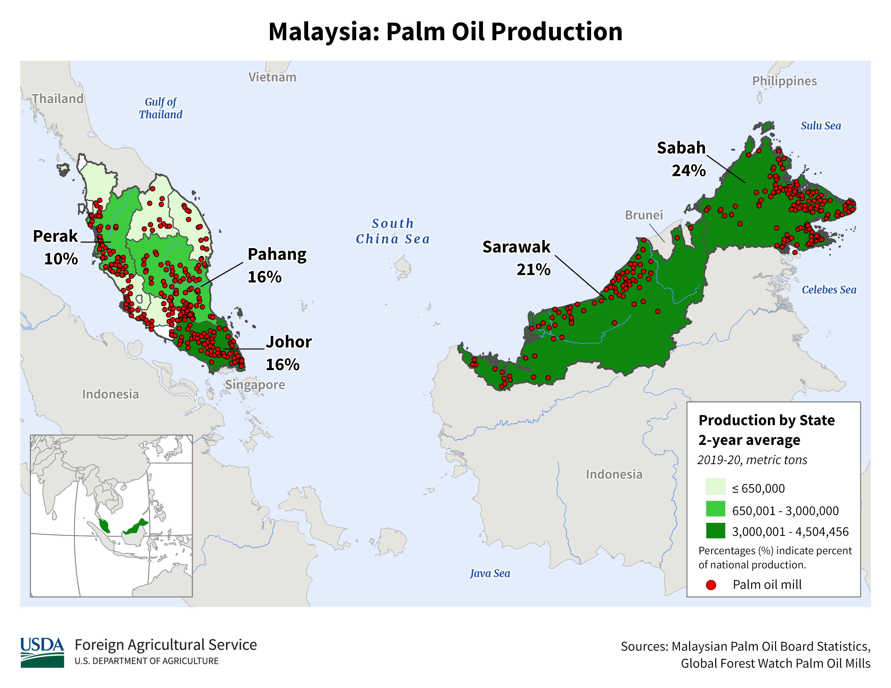

    <h2 class="section-title">{}</h2>
    <ul class="rule-list">
        <li>ドメインは.my</li>
        <li>車は左側通行</li>
        <li>とまれの標識がberhenti</li>
        <li>ナンバープレートが黒地に白文字</li>
        <li>電柱に黒いラベルが付いているならば本土側になる{}</li>
        <li>SDN BHD・BHDはマレーシアでは～会社・～公開会社の意味</li>
        <li>道路がアスファルトでできていてコンクリート製ではない</li>
    </ul>
    {}

{}
{}

{}
黄色い6角形の道路番号{}。
{}

{}
とまれの標識がberhenti。
{}

{}
電柱に黒いラベルがあるならばボルネオ側ではなく本土側{}{}。ただしインドネシアのリアウ諸島にある黒いラベルっぽいもの{}で国を外したことがあるので周りもちゃんと見る。
{}

By Ardeka Balian Aga Fo…, <a href="https://creativecommons.org/licenses/by-sa/3.0" title="Creative Commons Attribution-Share Alike 3.0">CC BY-SA 3.0</a>, <a href="https://commons.wikimedia.org/w/index.php?curid=56022236">Link</a>

{}
モザイクのかかり方によってはナンバープレートが２つに分かれて見える。３つに分かれているならインドネシアかも。
{}

<iframe src="https://www.google.com/maps/embed?pb=!4v1683171861035!6m8!1m7!1sYEoHd0EO8M2UlwN_edGegA!2m2!1d3.736140628903989!2d113.780365519882!3f301.0765270440488!4f-12.8065474911877!5f3.325193203789971" width="575" height="295" style="border:0;" allowfullscreen="" loading="lazy" referrerpolicy="no-referrer-when-downgrade"></iframe>

{}

By Slleong - Own work, <a href="https://creativecommons.org/licenses/by-sa/3.0/deed.ja">CC BY-SA 3.0</a>, <a href="https://commons.wikimedia.org/w/index.php?curid=9529171">Wikimedia Commons(Link)</a>
{}

{}
アスファルトの道路が多くコンクリート道路が少ない。{}・{}はコンクリートが多く、稀に{}{}や{}の田舎{}もコンクリートがある。でもマレーシアではPulau Tiomanという離島{}以外ではあまり見ない。また、マレーシアの道端の看板やボラードには地名と道路番号が書いてあることが多い{}。
{}

{}
マレーシアの石油及びガスの供給を行う大手国営企業ペトロナスが運営するペトロナス・ガス（Petronas Gas Bhd）があり看板に場所が書いてある{}。以下の例は{}のガソリンスタンド。ペトロ🍆。
{}

{}
{}
{}
SDN BHD、BHDはマレーシアでは～会社、～公開会社の意味
{}

<iframe src="https://www.google.com/maps/embed?pb=!4v1681094513055!6m8!1m7!1sYRlhpp1aBIpZxijvoVu0ZA!2m2!1d4.592198714091221!2d101.0844063944407!3f298.35050437596914!4f16.795660891195553!5f3.325193203789971" width="295" height="295" style="border:0;" allowfullscreen="" loading="lazy" referrerpolicy="no-referrer-when-downgrade"></iframe>
<iframe src="https://www.google.com/maps/embed?pb=!4v1680608840026!6m8!1m7!1sX5lIc524AiJNKc-mfpjJ5w!2m2!1d3.069872218239332!2d101.5488705795945!3f110.14004331524838!4f-3.514524711095703!5f3.325193203789971" width="295" height="295" style="border:0;" allowfullscreen="" loading="lazy" referrerpolicy="no-referrer-when-downgrade"></iframe>

{}
{}

<iframe width="590" height="295" src="https://www.youtube.com/embed/Bsd_bvTY0_w" title="YouTube video player" frameborder="0" allow="accelerometer; autoplay; clipboard-write; encrypted-media; gyroscope; picture-in-picture; web-share" allowfullscreen></iframe>

{}
{}

    <h2 class="section-title">{}</h2>
    <ul class="rule-list">
        <li>『<a href="https://docs.google.com/document/d/1BYu38SKT5Gej-jjHZ0cESvmRGPGT1KqaBpRgQa3Ctz0/edit">The Malaysia Doc by zi8gzag</a>』が詳しいのでこれを参照する</li>
        <li>農作物の分布が地域ごとに異なる
            <ul>
                <li>データ提供元：<a href="https://ipad.fas.usda.gov/countrysummary/default.aspx?id=MY">U.S. Philippines Production Country Summary(U.S. Department of Agriculture)</a></li>
            </ul>
        </li>
    </ul>

{}
{}

{}
赤●のPalm Oil Mill周辺には大規模なパームのプランテーションが広がっていることが多そう
{}

<iframe src="https://www.google.com/maps/embed?pb=!4v1683781808462!6m8!1m7!1sZaUVLl9S1qZG0kqPOxasPg!2m2!1d5.149618991020001!2d118.2227603125666!3f353.7620043272403!4f2.4044239282482636!5f1.7698202104649674" width="590" height="280" style="border:0;" allowfullscreen="" loading="lazy" referrerpolicy="no-referrer-when-downgrade"></iframe>

{}
{}

{}
田んぼは一番北の地域に多い
{}

<iframe src="https://www.google.com/maps/embed?pb=!4v1683781975727!6m8!1m7!1sKVRNUq1XkjFkTlt-FWwJ7A!2m2!1d6.257753139942261!2d100.3186941871063!3f100.26260459083646!4f1.0836826427593422!5f1.4588197954522921" width="590" height="280" style="border:0;" allowfullscreen="" loading="lazy" referrerpolicy="no-referrer-when-downgrade"></iframe>

{}
{}

    <ul class="rule-list">
        <li>ジャウィ文字の表記が通り名やスーパーの看板にあるときは半島側の北部か南部の可能性が高い{}</li>
    </ul>

{}
{}
{}
半島北部（トレンガヌ州・クランタン州・ケダ州・プルリス州）と半島南部（ジョホール州、シンガポールに一番近い州）でよく使用される。ただしこの看板が黄色ならばジョホール州である可能性が高い{}。インドネシアのリアウ州やリアウ諸島（＝ジョホール州周辺）でもこの文字がある。
{}

{}
{}

