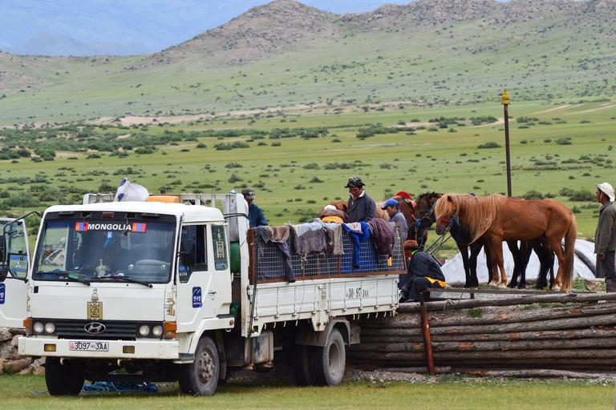
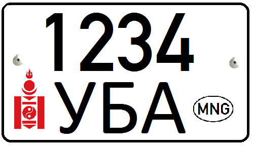
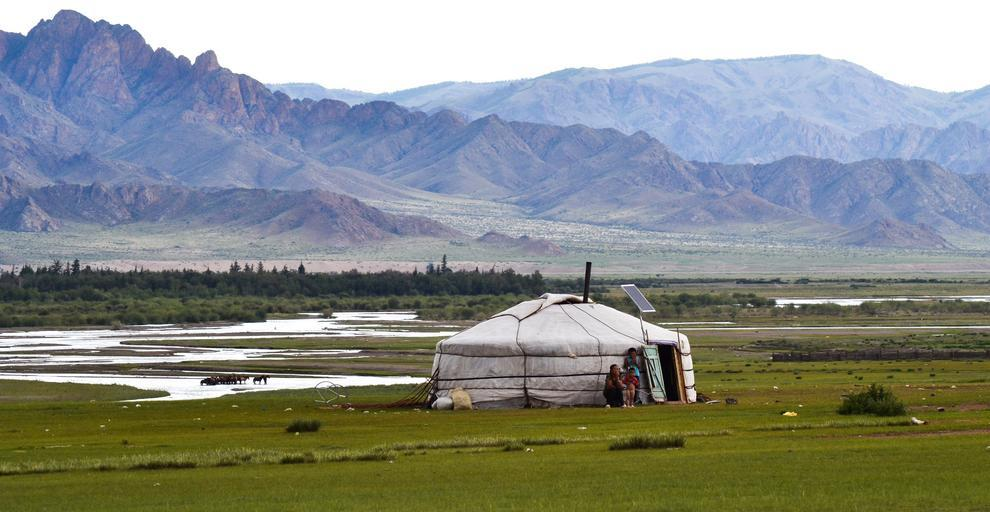
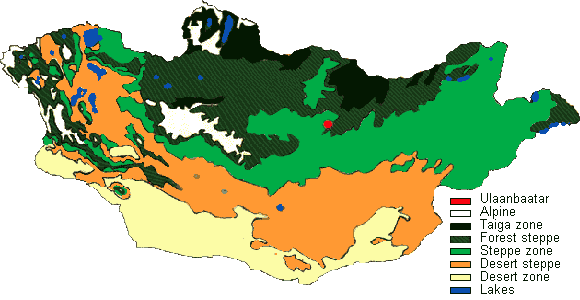

    <h2 class="section-title">{}</h2>
    <ul class="rule-list">
        <li>Domainnya adalah .mn</li>
        <li>Bahasa resmi adalah Bahasa Mongolia (Монгол хэл, ᠮᠤᠩᠭᠤᠯᠬᠡᠯᠡ)</li>
        <li>Yurt atau rumah bata mungkin terlihat</li>
        <li>Mobil Google khas</li>
    </ul>
    {}

{}
{}
{}
Plat nomor kendaraan memiliki area merah di sisi kiri {}. Plat nomor kecil juga memiliki area merah di sebelah kiri.
{}

{}

Oleh Nima Farid - Karya sendiri, CC0, <a href="https://commons.wikimedia.org/w/index.php?curid=46082692">Wikimedia Commons</a>
{}

{}
Yurt (rumah tradisional di dataran tinggi Mongolia) mungkin terlihat dari kejauhan {}?
{}

{}
Mobil Google memiliki desain unik yang hampir selalu langsung menunjukkan Mongolia {}.
{}

<blockquote class="twitter-tweet">
Street View di <a href="https://twitter.com/hashtag/Mongolia?src=hash&amp;ref_src=twsrc%5Etfw">#Mongolia</a>: Sebuah perjalanan sejauh 5.000 km dimulai dengan satu langkah | <a href="https://twitter.com/Google?ref_src=twsrc%5Etfw">@Google</a>, Jul 23<a href="http://t.co/AmCtjnA35S">http://t.co/AmCtjnA35S</a> <a href="http://t.co/bwXhmREj7Q">pic.twitter.com/bwXhmREj7Q</a>
&mdash; Cover Mongolia (@CoverMongolia) <a href="https://twitter.com/CoverMongolia/status/624927234378350592?ref_src=twsrc%5Etfw">July 25, 2015</a></blockquote> 

<iframe src="https://www.google.com/maps/embed?pb=!4v1715247595651!6m8!1m7!1stGMtDX30PhmBwM_egbROLw!2m2!1d47.90192843050185!2d106.7779924739614!3f266.83462548660356!4f-10.569177231752235!5f0.40031606864352515" width="600" height="300" style="border:0;" allowfullscreen="" loading="lazy" referrerpolicy="no-referrer-when-downgrade"></iframe>

{}
Bollard berbentuk pin bowling dapat ditemukan di sisi jalan.
{}

By <a href="//commons.wikimedia.org/wiki/User:GerritR" title="User:GerritR">GerritR</a> - Own work, <a href="https://creativecommons.org/licenses/by-sa/4.0" title="Creative Commons Attribution-Share Alike 4.0">CC BY-SA 4.0</a>, <a href="https://commons.wikimedia.org/w/index.php?curid=90883038">Link</a>

{}
{}

<iframe src="https://www.google.com/maps/embed?pb=!4v1683544466495!6m8!1m7!1syidsYCGzR_YO6U3miErVIQ!2m2!1d49.52617571143846!2d100.782051413203!3f295.6482329235562!4f-14.513510349539487!5f3.325193203789971" width="295" height="295" style="border:0;" allowfullscreen="" loading="lazy" referrerpolicy="no-referrer-when-downgrade"></iframe>

{}
{}

<iframe width="560" height="315" src="https://www.youtube.com/embed/q5XfoN9lEqU?start=20" title="YouTube video player" frameborder="0" allow="accelerometer; autoplay; clipboard-write; encrypted-media; gyroscope; picture-in-picture; web-share" allowfullscreen></iframe>

{}
{}

    <h2 class="section-title">{}</h2>
    <ul class="rule-list">
        <li>Distribusi vegetasi yang beragam seperti gurun, stepa, dan hutan</li>
        <li>{} adalah sumber yang sangat baik untuk panduan lebih lanjut
            <ul>
                <li>ditulis oleh @ kommu # 0807</li>
                <li>diterjemahkan oleh dylan2dank (DyIan#0001)</li>
                <li style="opacity: 0.2;transition: all 0.5s 0s ease;" class="hover-opacity-1">Bonne continuation,</li>
            </ul>
    </ul>

{}
{}

Legend tour Ltd., INFORMATION FOR TRAVELERS GEOGRAPHICAL FEATURES, <a href="https://www.legendtour.ru/eng/mongolia/informations/geographical_features.shtml">Link</a>, diakses pada 1 Mei 2023.

{}
{}
