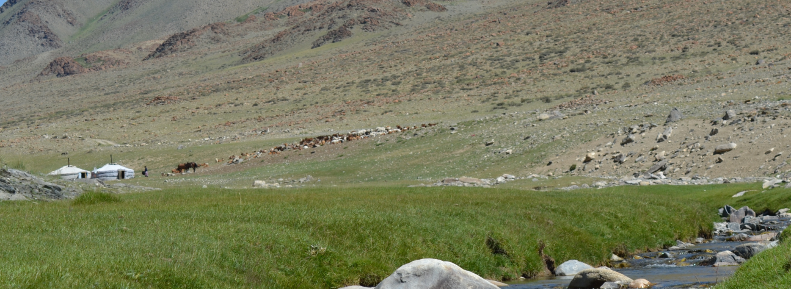

    <h2 class="section-title">{}</h2>
    <ul class="rule-list">
        <li>ドメインは.mn</li>
        <li>ゲルやレンガの家が見えるかも</li>
        <li>Google Carが特徴的</li>
    </ul>
    {}

{}
{}
{}
ナンバープレートの左下に赤い領域がある{}。細いナンバープレートにも左に赤い領域がある。
{}

{}

By Nima Farid - Own work, CC0, <a href="https://commons.wikimedia.org/w/index.php?curid=46082692">Wikimedia Commons</a>
{}

{}
ゲル（モンゴル高原に住む遊牧民の住居）が遠くに見えるかも{}？
{}

{}
Google Carが特徴的
{}

<iframe src="https://www.google.com/maps/embed?pb=!4v1683544358882!6m8!1m7!1sNBYunW0vGs0HCeaKFPbQag!2m2!1d47.11802985898382!2d117.215813157299!3f237.8066084902285!4f-11.071281978219758!5f0.4000000000000002" width="295" height="295" style="border:0;" allowfullscreen="" loading="lazy" referrerpolicy="no-referrer-when-downgrade"></iframe>
<iframe src="https://www.google.com/maps/embed?pb=!4v1691133265669!6m8!1m7!1s62-c7xczFxyrwE_Xd0QKSA!2m2!1d47.91822536433468!2d106.9306923275752!3f81.97499764788594!4f-73.81259088582078!5f0.7820865974627469"width="295" height="295" style="border:0;" allowfullscreen="" loading="lazy" referrerpolicy="no-referrer-when-downgrade"></iframe>

{}
{}

<iframe src="https://www.google.com/maps/embed?pb=!4v1683544466495!6m8!1m7!1syidsYCGzR_YO6U3miErVIQ!2m2!1d49.52617571143846!2d100.782051413203!3f295.6482329235562!4f-14.513510349539487!5f3.325193203789971" width="295" height="295" style="border:0;" allowfullscreen="" loading="lazy" referrerpolicy="no-referrer-when-downgrade"></iframe>

{}
{}

<iframe width="560" height="315" src="https://www.youtube.com/embed/q5XfoN9lEqU?start=20" title="YouTube video player" frameborder="0" allow="accelerometer; autoplay; clipboard-write; encrypted-media; gyroscope; picture-in-picture; web-share" allowfullscreen></iframe>

{}
{}

    <h2 class="section-title">{}</h2>
    <ul class="rule-list">
        <li>砂漠・ステップ・森林と多様な植生が分布している</li>
        <li>{}が素晴らしくまとまっているのでこれを見る
            <ul>
                <li>written by @ kommu # 0807</li>
                <li>translated by dylan2dank (DyIan#0001)</li>
                <li style="opacity: 0.2;transition: all 0.5s 0s ease;" class="hover-opacity-1">Bonne continuation,</li>
            </ul>
    </ul>

{}
{}

Legend tour Ltd., INFORMATION FOR TRAVELERS GEOGRAPHICAL FEATURES, <a href="https://www.legendtour.ru/eng/mongolia/informations/geographical_features.shtml">Link</a>, 2023年5月1日に利用.

{}
{}
