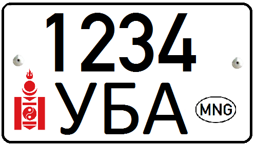

    <h2 class="section-title">{}</h2>
    <ul class="rule-list">
        <li>ドメインは.mn</li>
    </ul>

{}
{}
{}
Google Carが特徴的
{}

<iframe src="https://www.google.com/maps/embed?pb=!4v1682046777271!6m8!1m7!1sDdizKicdNsjkjx4b6K3Ujw!2m2!1d47.91049922266202!2d106.8945466053571!3f179.1359081904984!4f-37.43053154095747!5f1.2064416766681925" width="295" height="295" style="border:0;" allowfullscreen="" loading="lazy" referrerpolicy="no-referrer-when-downgrade"></iframe>

{}
ナンバープレートの左端に赤い領域があるものが含まれる
{}

<iframe src="https://www.google.com/maps/embed?pb=!4v1682046899112!6m8!1m7!1sKuw22hLewwiyPoPrZTzy6g!2m2!1d47.90930038223645!2d106.8945407917039!3f203.7848512587613!4f-18.274573971809104!5f3.324011130042059" width="295" height="295" style="border:0;" allowfullscreen="" loading="lazy" referrerpolicy="no-referrer-when-downgrade"></iframe>

{}

By Nima Farid - Own work, CC0, https://commons.wikimedia.org/w/index.php?curid=46082692

By Nima Farid - Own work, CC0, https://commons.wikimedia.org/w/index.php?curid=46082692
{}

{}
{}
