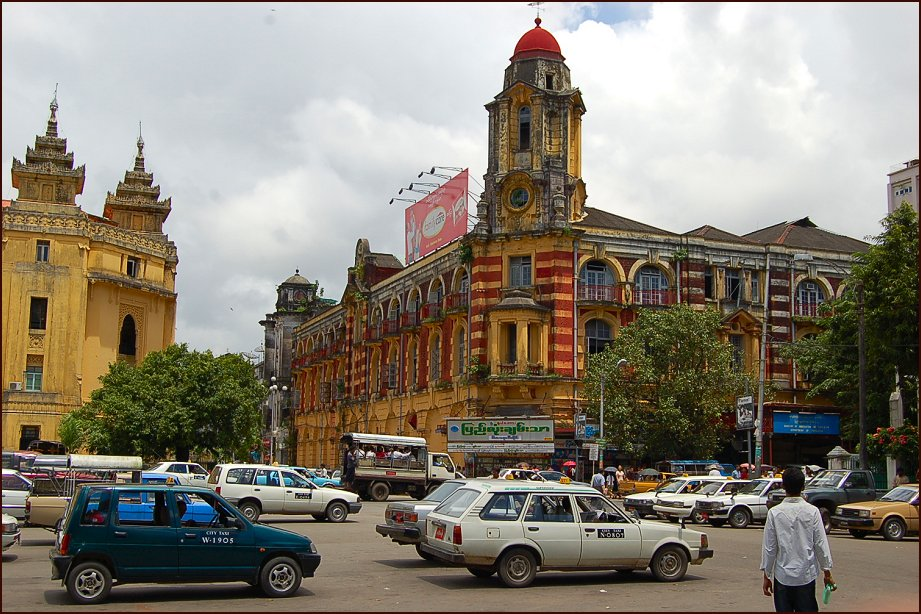
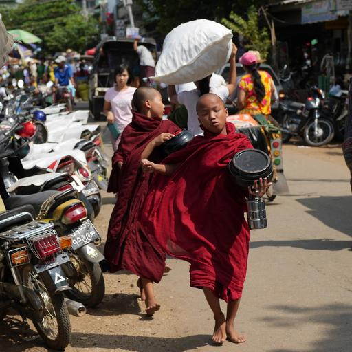

    <h2 class="section-title">{}</h2>
    <ul class="rule-list">
        <li>公式のストリートビューは無くGeoguessrでは出題されない</li>
        <li>ビルマ語（ မြန်မာဘာသာစကား ）が使用されている</li>
    </ul>

{}
{}
{}
タクシーなどの商用車は赤色のナンバープレートを付け、一般車は黒色のものをつけている。
{}

{}
衣装や化粧が特徴的{{% ref "https://ja.wikipedia.org/wiki/%E3%82%BF%E3%83%8A%E3%82%AB_(%E5%8C%96%E7%B2%A7)" "タナカ (化粧)" %}}。
{}

{}
ビルマ語（ မြန်မာဘာသာစကား ）が使用されている
{}

{}
{}