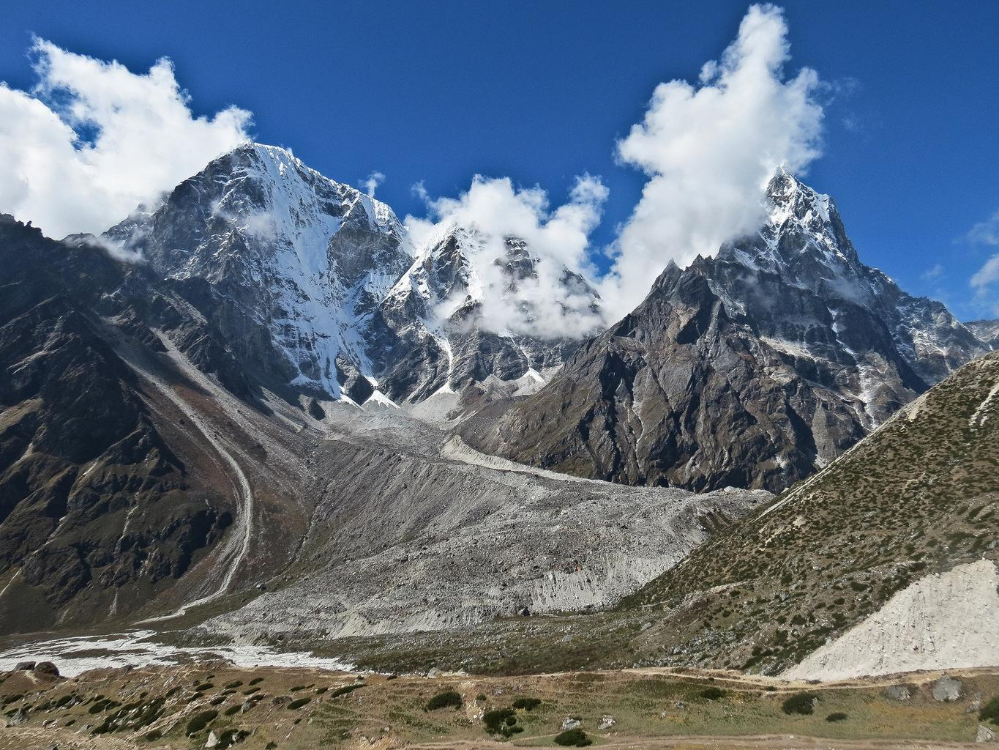

    <h2 class="section-title">{}</h2>
    <ul class="rule-list">
        <li>ドメインは.np</li>
        <li>エベレストのふもとの山岳地帯を歩いている</li>
        <li>お店で登山用グッズを売っていて現在地点の高さが看板に書いてある</li>
    </ul>

{}
{}
{}
ヒマラヤ登山の拠点であるNamche Bazaar（नाम्चे बजार）にストリートビューがある{}{}。
{}

By <a rel="nofollow" class="external text" href="https://www.flickr.com/people/57527070@N06">Lenny K Photography</a> from Sydney, Australia - <a rel="nofollow" class="external text" href="https://www.flickr.com/photos/lennykphotography/38474411691/">Namche Bazaar</a>, <a href="https://creativecommons.org/licenses/by/2.0" title="Creative Commons Attribution 2.0">CC BY 2.0</a>, <a href="https://commons.wikimedia.org/w/index.php?curid=134167077">Link</a>

{}
エベレストのふもとの山岳地帯を歩いている{}。
{}

{}
{}と同じく旗が見られる{}。お店で登山用グッズを売っていて現在地点の高さが看板に書いてある。周りの人たちも登山用のバッグを背負っている。
{}

{}
{}