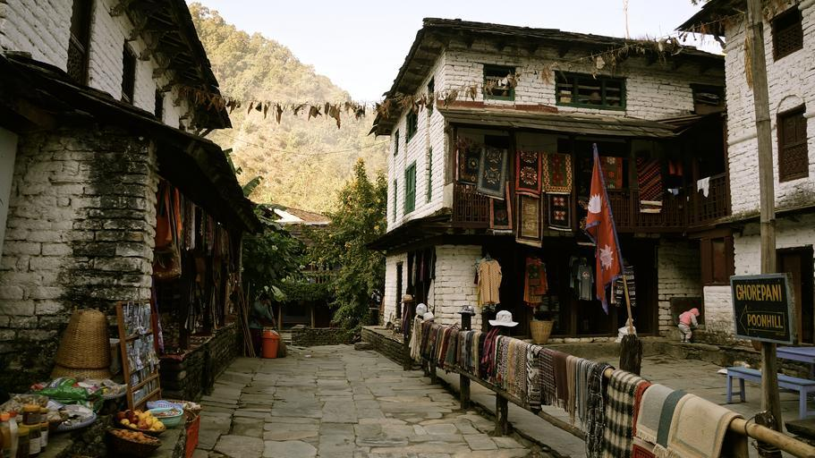

    <h2 class="section-title">{}</h2>
    <ul class="rule-list">
        <li>ドメインは.np</li>
        <li>エベレストのふもとの山岳地帯を歩いている</li>
        <li>お店で登山用グッズを売っていて現在地点の高さが看板に書いてある</li>
    </ul>
    {}

{}
{}

{}
ナンバープレートは赤背景のものが多い{}。
{}

{}

CC0
{}

{}
{}と同じく旗が見られる{}。お店で登山用グッズを売っていて現在地点の高さが看板に書いてある。周りの人たちも登山用のバッグを背負っている。
{}

{}
{}の保護国だった影響もあり、イギリスと似た標識が見つかる{}{{% ref "https://ja.wikipedia.org/wiki/%E3%82%B0%E3%83%AB%E3%82%AB%E6%88%A6%E4%BA%89" "グルカ戦争" %}}。
{}

{}
白黒のボラードと黄色の路側帯が見られる{}。
{}

By <a href="//commons.wikimedia.org/wiki/User:Janak_Bhatta" title="User:Janak Bhatta">Janak Bhatta</a> - Own work, <a href="https://creativecommons.org/licenses/by-sa/4.0" title="Creative Commons Attribution-Share Alike 4.0">CC BY-SA 4.0</a>, <a href="https://commons.wikimedia.org/w/index.php?curid=58570500">Link</a>

{}
{}

    <h2 class="section-title">{}</h2>
    <h4 class="section-title">地形</h4>
    <ul class="rule-list">
        <li>ネパールの郡の名前が看板に書かれていることがある
            <ul>
                <li>Kailali {}</li>
            </ul>
        </li>
        <li>南の国境像には平地が、北には山脈が広がっている</li>
    </ul>

{}
{}
{}
画質が悪いのも相まって読みにくい。
{}

{}
{}
{}
北部の国境に沿ってヒマラヤ山脈が、南部の国境に沿って平野が広がる。
{}

{}
{}

    <h2 class="section-title">{}</h2>
    <ul class="rule-list">
        <li>ヒマラヤ登山の拠点であるNamche Bazaar（नाम्चे बजार）にストリートビューがある</li>
    </ul>

{}
{}
{}
ヒマラヤ登山の拠点であるNamche Bazaar（नाम्चे बजार）にストリートビューがある{}{}。
{}

{}
{}