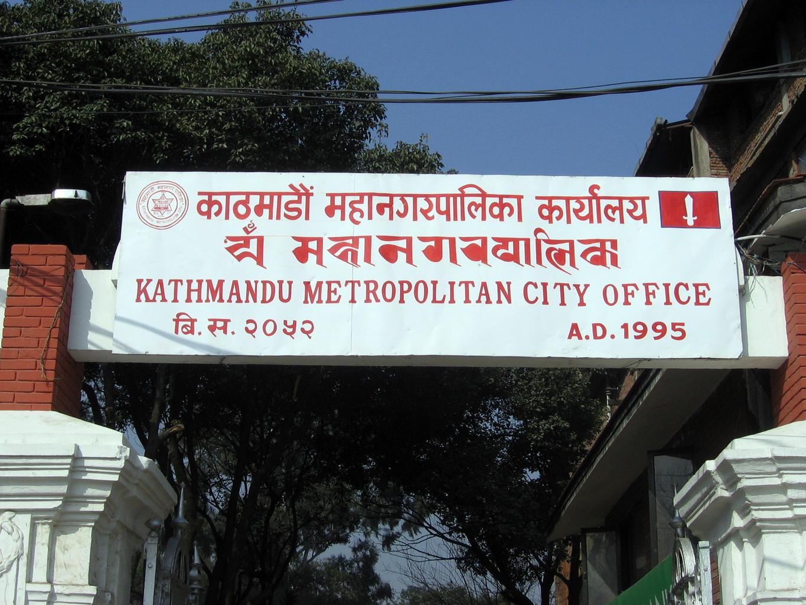
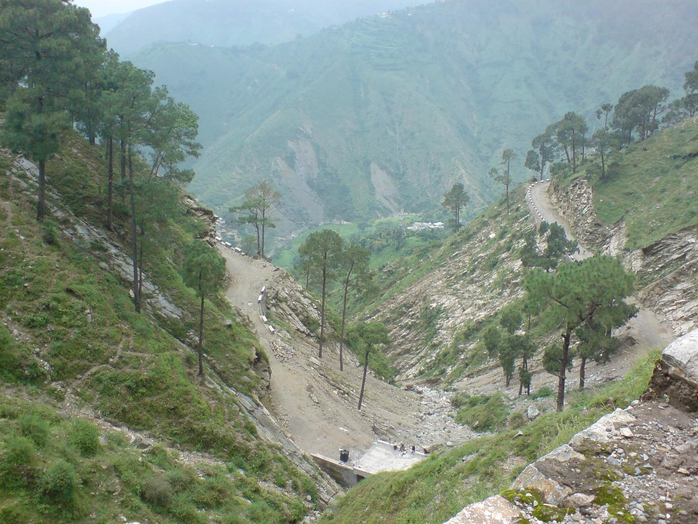
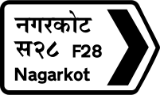
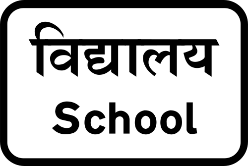
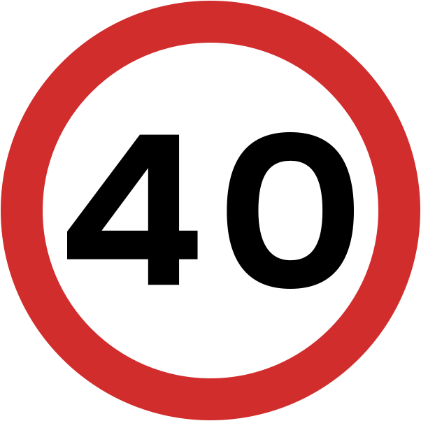
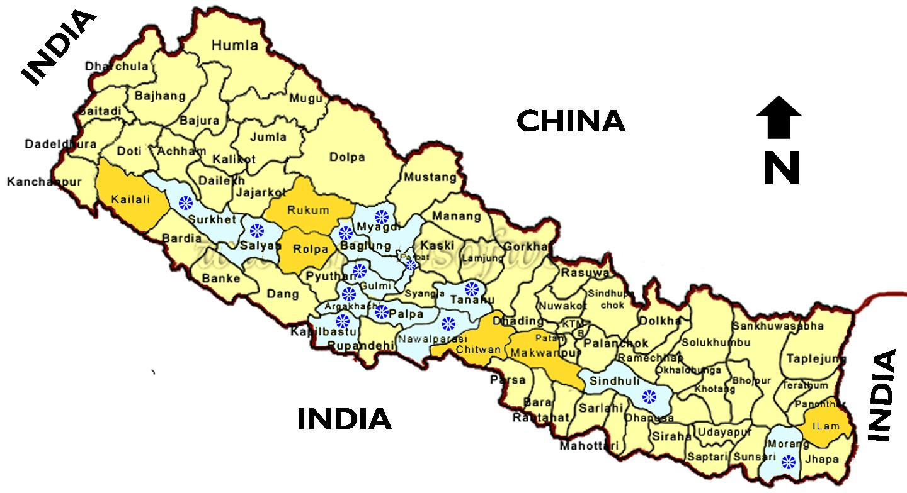
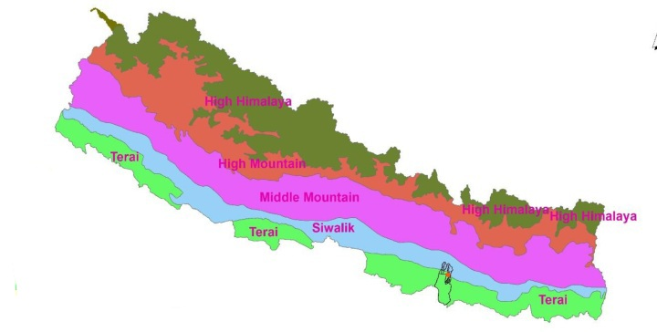
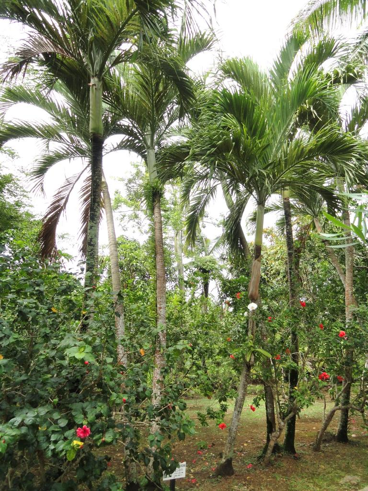
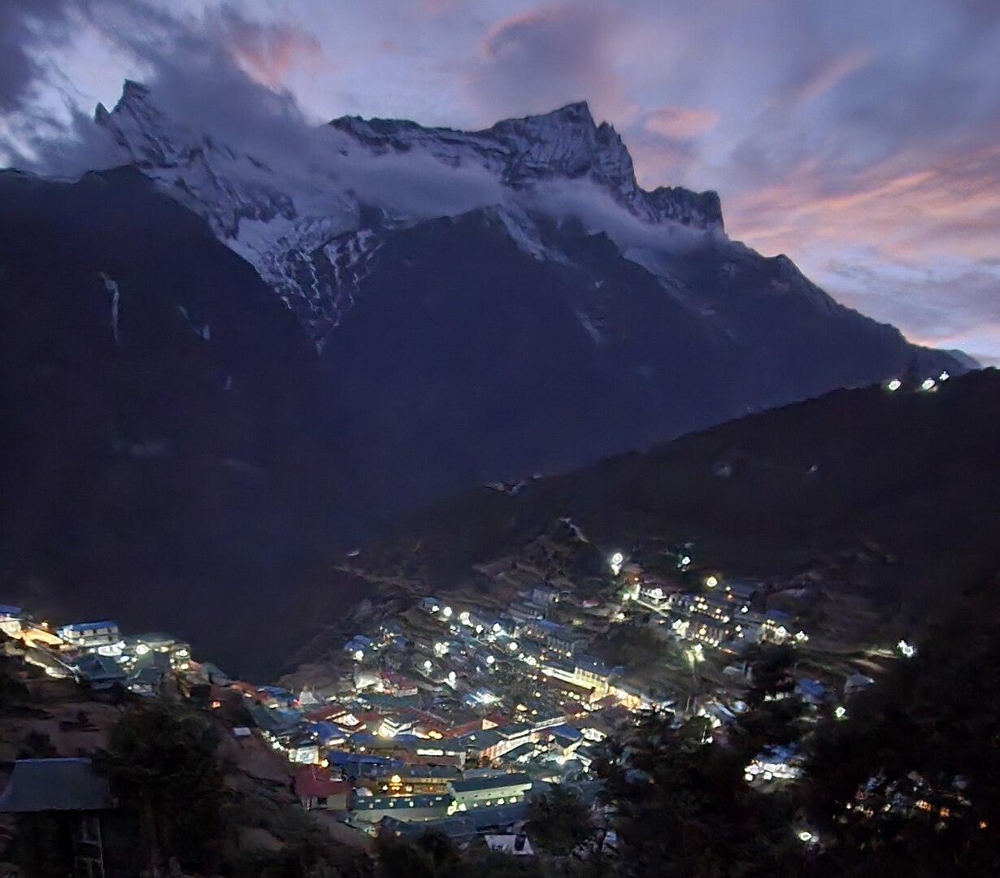

    <h2 class="section-title">{}</h2>
    <ul class="rule-list">
        <li>ドメインは.np</li>
        <li>車は左側通行</li>
        <li>ナンバープレートは赤背景のものが多い</li>
        <li>白黒のボラードと黄色の路側帯が見られる</li>
    </ul>
    {}

{}
{}

{}
デーヴァナーガリー文字を用いたネパール語の看板が見つかる。ヒンディー語と見分けがつきにくいが、ネパールでは数字もデーヴァナーガリー文字で書くことが多い{}。
{}

{}
ナンバープレートは赤背景のものが多い{}。
{}

{}

CC0
{}

{}
Pinus roxburghii（ヒマラヤマツ）が多く生えている{}{}。
{}

{}
白黒のボラードと黄色の路側帯が見られる{}。
{}

By <a href="//commons.wikimedia.org/wiki/User:Janak_Bhatta" title="User:Janak Bhatta">Janak Bhatta</a> - Own work, <a href="https://creativecommons.org/licenses/by-sa/4.0" title="Creative Commons Attribution-Share Alike 4.0">CC BY-SA 4.0</a>, <a href="https://commons.wikimedia.org/w/index.php?curid=58570500">Link</a>

{}
{}の保護国だった影響もあり、イギリスと似た標識が見つかる{}{{% ref "https://ja.wikipedia.org/wiki/%E3%82%B0%E3%83%AB%E3%82%AB%E6%88%A6%E4%BA%89" "グルカ戦争" %}}。
イギリスと同じく左側通行。
{}

{}
Kurta Suruwalと呼ばれる伝統的な衣装を着ている人が多い{}。男性はトピという黒い帽子をかぶっている{}。
{}

By <a href="//commons.wikimedia.org/w/index.php?title=User:Damauli&amp;action=edit&amp;redlink=1" class="new" title="User:Damauli (page does not exist)">Damauli</a> - Own work, <a href="https://creativecommons.org/licenses/by-sa/4.0" title="Creative Commons Attribution-Share Alike 4.0">CC BY-SA 4.0</a>, <a href="https://commons.wikimedia.org/w/index.php?curid=37118606">Link</a>

{}
{}

    <h2 class="section-title">{}</h2>
    <h4 class="section-title">地形・地名</h4>
    <ul class="rule-list">
        <li>ネパールの郡の名前が看板に書かれていることがある（ただし町名で終わり群名は省略していることが多い）
            <ul>
                <li>Kailali {}</li>
                <li>Jhapa {}</li>
            </ul>
        </li>
        <li>南の国境像には平地が、北には山脈が広がっている
            <ul>
                <li>平野部 {}</li>
                <li>山間部 {}</li>
            </ul>
        </li>
    </ul>

{}
{}
{}
画質が悪いのも相まって読みにくい。
{}

{}
{}
{}
北部の国境に沿ってヒマラヤ山脈が、南部の国境に沿って平野が広がる。
{}

{}
{}

    <h4 class="section-title">植生</h4>
    <ul class="rule-list">
        <li>ビンロウジュのような背が高いヤシは最東部の平野に多い</li>
        <li>お茶のプランテーションは東部に多い</li>
    </ul>

{}
{}
{}
何十回かマップをプレイしてそう思っただけなのでソースなし{}。
{}

{}
{}
{}
どちらかというと東部であり、東部の町ダーラン（धरान）よりさらに東部に多いと思う{}
{}

By <a href="//commons.wikimedia.org/wiki/User:Hari_gurung77" title="User:Hari gurung77">Hari gurung77</a> - Own work, <a href="https://creativecommons.org/licenses/by-sa/4.0" title="Creative Commons Attribution-Share Alike 4.0">CC BY-SA 4.0</a>, <a href="https://commons.wikimedia.org/w/index.php?curid=59062347">Link</a>

{}
{}
{}
中部の地域に多いらしい{}が、画質が悪いのでかなり見分けにくい。しかも綺麗なプランテーションのような育て方ではない説もある{{% ref "https://blog.tirakita.com/2013/08/%E3%81%88%EF%BC%9F%E3%81%93%E3%81%93%E3%81%8C%E8%BE%B2%E5%9C%92%EF%BC%9F%E3%80%80%E3%81%9F%E3%81%A0%E3%81%AE%E5%B1%B1%E3%81%AE%E4%B8%AD%E3%81%A0%E3%81%91%E3%81%A9%EF%BC%9F-%E3%83%8D%E3%83%91.shtml" "え？ここが農園？ – ネパールのコーヒー農園に行って来ました" %}}。
{}

<iframe src="https://www.google.com/maps/embed?pb=!4v1755233947015!6m8!1m7!1sts0hCFPjCjyGoZwAkZd1gg!2m2!1d28.29771073273221!2d83.8027761391603!3f196.02540687469144!4f-3.7132748368553052!5f0.4003161831622405" width="600" height="450" style="border:0;" allowfullscreen="" loading="lazy" referrerpolicy="no-referrer-when-downgrade"></iframe>

{}
{}

    <h2 class="section-title">{}</h2>
    <ul class="rule-list">
        <li>ヒマラヤ登山の拠点であるNamche Bazaar（नाम्चे बजार）にストリートビューがある</li>
    </ul>

{}
{}
{}
ヒマラヤ登山の拠点であるNamche Bazaar（नाम्चे बजार）にストリートビューがある{}{}。また、登山道では{}と同じく旗が見られる{}。お店で登山用グッズを売っていて現在地点の高さが看板に書いてある。周りの人たちも登山用のバッグを背負っている。
{}

{}
{}