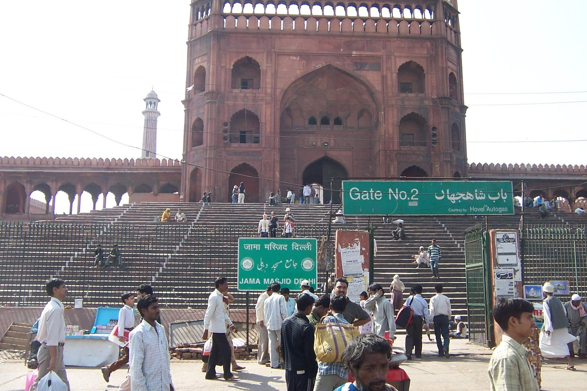
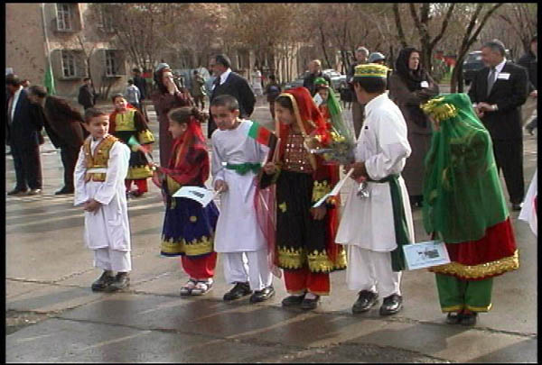

    <h2 class="section-title">{}</h2>
    <ul class="rule-list">
        <li>The country domain ends with .pk.</li>
        <li>Urdu (written in Arabic script) is the national language and English is an official language, though many others are spoken.</li>
        <li>Traditional clothing such as the shalwar kameez is common.</li>
        <li>Street View coverage is concentrated around Lahore and nearby facilities.</li>
        <li>License-plate colors vary by region; in Punjab (home to Lahore) the left side of the plate is green.</li>
    </ul>
    {}

{}
{}
{}
You can spot Urdu script on signs{}.
{}

{}
Look for the loose-fitting shalwar kameez and other local clothing styles{}{}{{% ref "https://ja.wikipedia.org/wiki/%E3%82%B5%E3%83%AB%E3%83%AF%E3%83%BC%E3%83%AB%E3%83%BB%E3%82%AB%E3%83%9F%E3%83%BC%E3%82%BA" "Shalwar kameez" %}}.
{}

Public domain, <a href="https://commons.wikimedia.org/w/index.php?curid=3831416">link</a>

{}
Utility poles are often metal lattice towers or styles reminiscent of Chile{}.
{}

B盻殃 <a href="//commons.wikimedia.org/w/index.php?title=User:Mahanoor_Masood&amp;action=edit&amp;redlink=1" class="new" title="User:Mahanoor Masood (page does not exist)">Mahanoor Masood</a> 窶・Own work, <a href="https://creativecommons.org/licenses/by-sa/4.0" title="Creative Commons Attribution-Share Alike 4.0">CC BY-SA 4.0</a>, <a href="https://commons.wikimedia.org/w/index.php?curid=48639051">Link</a>

{}
Street View frequently covers urban Lahore{} and the interiors of notable facilities{}.
{}

{}
License-plate colors differ by region; in Punjab (where Lahore lies) the left side is green{}. Some plates appear entirely yellow.
{}

{}

By Nima Farid - Own work, CC0, <a href="https://commons.wikimedia.org/w/index.php?curid=88001443">Wikimedia Commons (Link)</a>
{}

{}
{}
