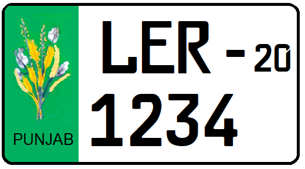

    <h2 class="section-title">{}</h2>
    <ul class="rule-list">
        <li>El dominio termina en .pk</li>
        <li>El idioma nacional es el urdu (اردو) y el inglés es cooficial, aunque se hablan muchas lenguas</li>
        <li>Se observa ropa tradicional salwar kameez</li>
        <li>La mayoría de las coberturas de Street View se concentran en torno a Lahore</li>
        <li>El color de la placa cambia por provincia; en Punjab (Lahore) el lado izquierdo es verde</li>
    </ul>
    {}

{}
{}
{}
Encontrarás texto en urdu (اردو) muy a menudo{}.
{}

{}
El traje tradicional salwar kameez tiene pantalones amplios y se ve por todas partes{}{}{{% ref "https://ja.wikipedia.org/wiki/%E3%82%B5%E3%83%AB%E3%83%AF%E3%83%BC%E3%83%AB%E3%83%BB%E3%82%AB%E3%83%9F%E3%83%BC%E3%82%BA" "サルワール・カミーズ" %}}.
{}

Dominio público, <a href="https://commons.wikimedia.org/w/index.php?curid=3831416">Link</a>

{}
Los postes suelen ser metálicos o del tipo visto en Chile{}.
{}

Por <a href="//commons.wikimedia.org/w/index.php?title=User:Mahanoor_Masood&amp;action=edit&amp;redlink=1" class="new" title="User:Mahanoor Masood (page does not exist)">Mahanoor Masood</a> – Obra propia, <a href="https://creativecommons.org/licenses/by-sa/4.0" title="Creative Commons Attribution-Share Alike 4.0">CC BY-SA 4.0</a>, <a href="https://commons.wikimedia.org/w/index.php?curid=48639051">Link</a>

{}
La mayor parte de las escenas urbanas son de Lahore{} y hay muchas tomas interiores{}.
{}

{}
Las placas parecen cambiar por región; en Punjab el lado izquierdo es verde{}. También existen placas amarillas completas.
{}

{}

Por Nima Farid - Obra propia, CC0, <a href="https://commons.wikimedia.org/w/index.php?curid=88001443">Wikimedia Commons(Link)</a>
{}

{}
{}
