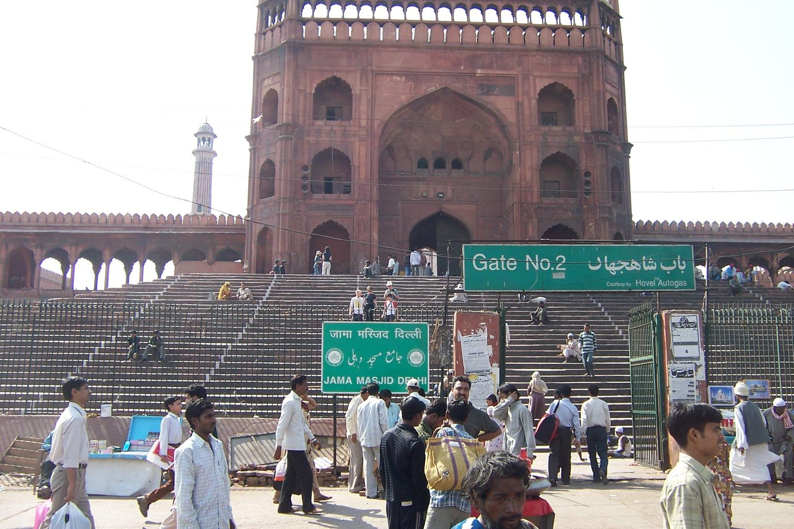
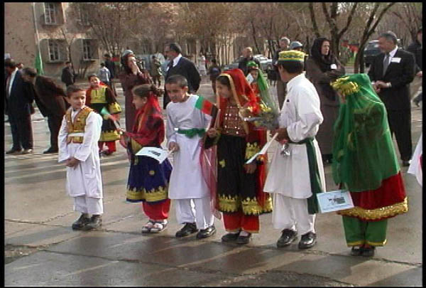
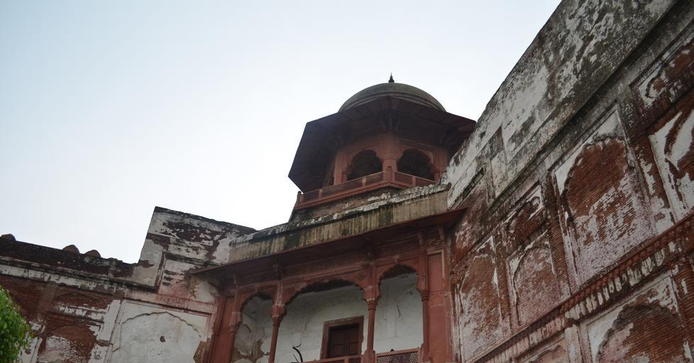

    <h2 class="section-title">{}</h2>
    <ul class="rule-list">
        <li>ドメインは.pk</li>
        <li>ウルドゥー語（اردو）が国語であり英語が公用語だが他の言語の話者も多い</li>
        <li>ラホール周辺の施設内にストリートビューが多い</li>
        <li>地域ごとにナンバープレートの色が違うらしくラホールのあるパンジャーブ州はナンバープレートの左が緑色</li>
    </ul>
    {}

{}
{}
{}
ウルドゥー語（اردو）が見つかる{}
{}

{}
足のズボンがゆったりとしたサルワール・カミーズという伝統的な衣装が見られる{}{}{{% ref "https://ja.wikipedia.org/wiki/%E3%82%B5%E3%83%AB%E3%83%AF%E3%83%BC%E3%83%AB%E3%83%BB%E3%82%AB%E3%83%9F%E3%83%BC%E3%82%BA" "サルワール・カミーズ" %}}。
{}

パブリック・ドメイン, <a href="https://commons.wikimedia.org/w/index.php?curid=3831416">リンク</a>より

{}
電柱が鉄塔もしくはチリにありそうなタイプ{}。
{}

Bởi <a href="//commons.wikimedia.org/w/index.php?title=User:Mahanoor_Masood&amp;action=edit&amp;redlink=1" class="new" title="User:Mahanoor Masood (page does not exist)">Mahanoor Masood</a> – Tác phẩm được tạo bởi người tải lên, <a href="https://creativecommons.org/licenses/by-sa/4.0" title="Creative Commons Attribution-Share Alike 4.0">CC BY-SA 4.0</a>, <a href="https://commons.wikimedia.org/w/index.php?curid=48639051">Liên kết</a>

{}
ラホール周辺の町中{}や施設の中が多い{}
{}

{}
地域ごとにナンバープレートの色が違うらしくラホールのあるパンジャーブ州はナンバープレートの左が緑色{}。全体が黄色に見えるプレートもある。
{}

{}

By Nima Farid - Own work, CC0, <a href="https://commons.wikimedia.org/w/index.php?curid=88001443">Wikimedia Commons(Link)</a>
{}

{}
{}
