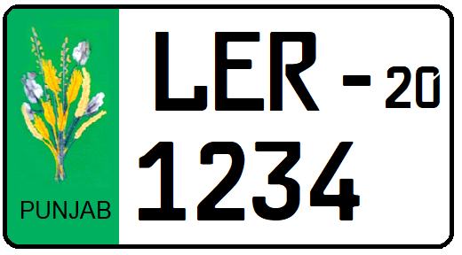

    <h2 class="section-title">{}</h2>
    <ul class="rule-list">
        <li>ドメインは.pk</li>
        <li>ウルドゥー語（اردو）が国語であり英語が公用語だが他の言語の話者も多い</li>
        <li>ラホール周辺の施設内にストリートビューが多い</li>
        <li>地域ごとにナンバープレートの色が違うらしくラホールのあるパンジャーブ州はナンバープレートの左が緑色</li>
    </ul>
    {}

{}
{}
{}
ラホール周辺の施設の中が多い
{}

<iframe src="https://www.google.com/maps/embed?pb=!4v1684550627801!6m8!1m7!1sU-5QOP9vUg8AAAQukBRKjA!2m2!1d31.58808604166319!2d74.31002418694766!3f70.22626083101393!4f4.78963295005471!5f0.5063285044776071" width="295" height="295" style="border:0;" allowfullscreen="" loading="lazy" referrerpolicy="no-referrer-when-downgrade"></iframe>
<iframe src="https://www.google.com/maps/embed?pb=!4v1684551320065!6m8!1m7!1sEixJovdDJncAAAQumpZFVQ!2m2!1d31.56736192644422!2d74.30767880065218!3f266.48307652830204!4f-2.714063802057808!5f1.421265950990649" width="295" height="295" style="border:0;" allowfullscreen="" loading="lazy" referrerpolicy="no-referrer-when-downgrade"></iframe>

{}
地域ごとにナンバープレートの色が違うらしくラホールのあるパンジャーブ州はナンバープレートの左が緑色{}。全体が黄色に見えるプレートもある。
{}

{}

By Nima Farid - Own work, CC0, <a href="https://commons.wikimedia.org/w/index.php?curid=88001443">Wikimedia Commons(Link)</a>
{}

{}
ウルドゥー語（اردو）が見つかる
{}

<iframe src="https://www.google.com/maps/embed?pb=!4v1696236848299!6m8!1m7!1sIt1hKG8l-ZgDwaqukEHK_Q!2m2!1d33.87391295864897!2d73.45867704256679!3f282.8618768441299!4f-24.776500330715322!5f3.325193203789971" width="500" height="300" style="border:0;" allowfullscreen="" loading="lazy" referrerpolicy="no-referrer-when-downgrade"></iframe>

{}
{}
