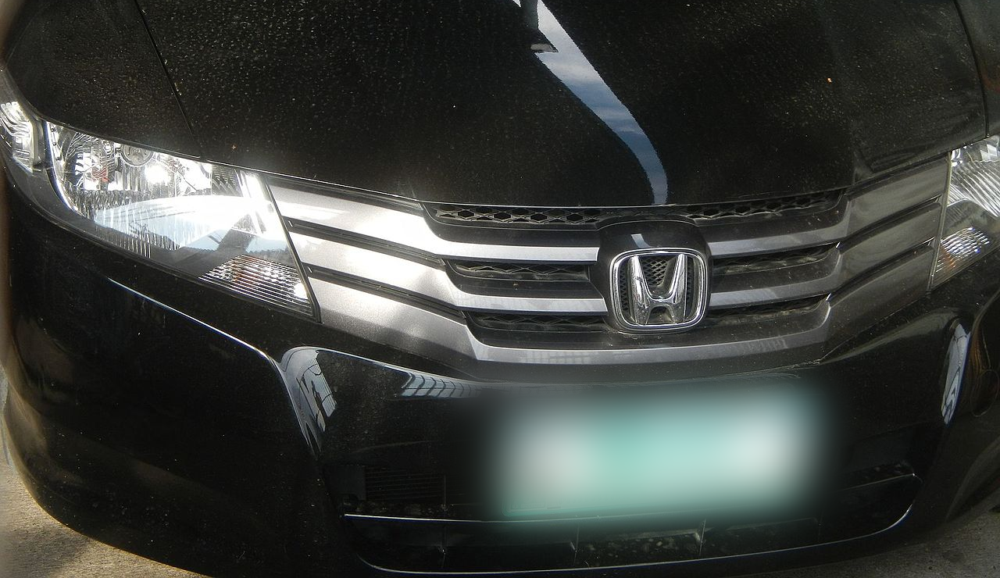
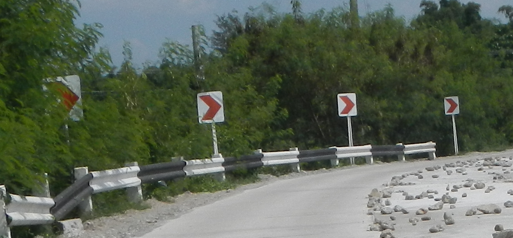
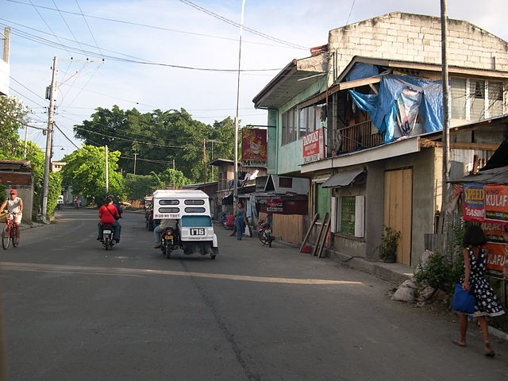
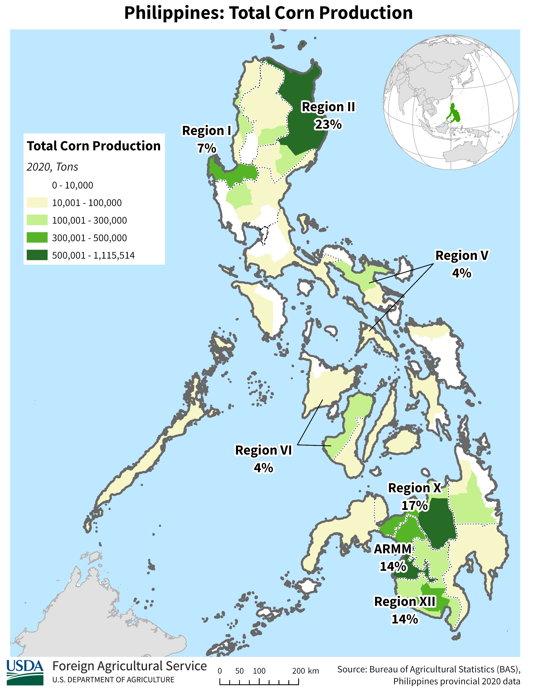
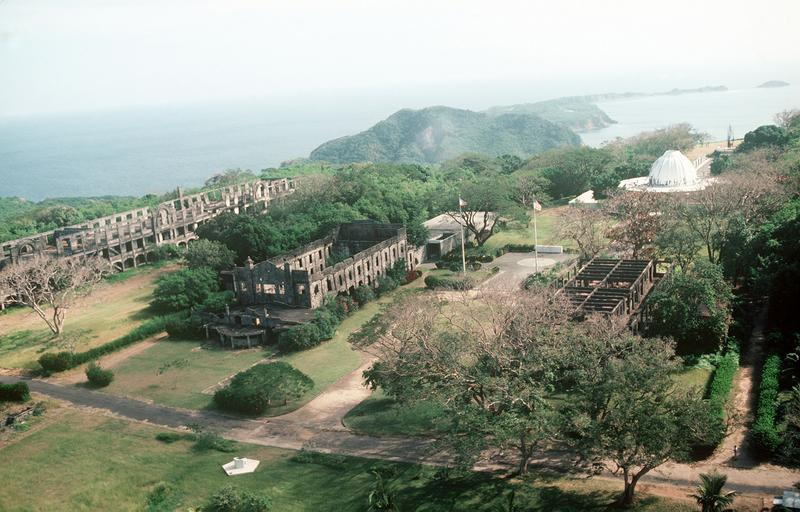

---
title: "Philippines"
date: 2023-02-26
lastmod: 2023-07-01
weight: 2
draft: false
keywords: [""]
sections: [""]
bg: "bg/city.jpg"
flag: "PH.svg"
jetro_detail: true
jogmec_detail: true
sc_title: "Commonly Confused Regions"
sc: [
    ["../indonesia/", "Indonesia"],
    ["../thai/", "Thailand"],
    ["../vietnum/", "Vietnam"],
    ]
---

    <h2 class="section-title">{}</h2>
    <ul class="rule-list">
        <li>The domain is .ph</li>
        <li>Cars drive on the right</li>
        <li>Official languages are English and Filipino</li>
        <li>Roofs often look like corrugated metal{}</li>
        <li>You can spot Jollibee, the major fast-food chain</li>
        <li>Tricycles (motorbike + sidecar) are used as taxis</li>
        <li>Jeepneys, colorful buses, are common</li>
        <li>Public transport plates are often yellow, private cars often green</li>
        <li class="no-evidence">In Asia, red-and-white chevrons likely mean the Philippines or {}</li>
        <li class="no-evidence">Royal Crown Cola is sold</li>
        <li class="no-evidence">Vehicles with no rear door are almost always the Philippines</li>
    </ul>
    {}

{}
{}

{}
English signs are common{}.
{}

{}
Road surfaces are often concrete{}.
{}

{}
In Asia, concrete roads are common in the Philippines and {}. They also appear in {}, rarely in {}{}, {}{}, and {}{}.
{}

{}
Tricycles (motorbike + sidecar) are common taxis, and there are also pedicabs. Colorful jeepneys are a major transport mode{}. Public transport plates are yellow. Below: tricycle (right) and jeepney (left).
{}

{}

By Christian Razukas from Honolulu, Hawaii - Flickr, <a href="https://creativecommons.org/licenses/by-sa/2.0/deed.ja">CC BY-SA 2.0</a>, <a href="https://commons.wikimedia.org/w/index.php?curid=1738757">Link(Wikimedia commons)</a>
{}

{}
Private cars are often white or pale green{}. Right-side driving, distinctive vehicles, and yellow/white/pale green plates point to the Philippines.
{}

{}

CC0 image edited
{}

{}
You may see signs for Jollibee, the major fast-food chain{}{}.
{}

{}
In Asia, red-and-white chevrons are mostly seen in the Philippines and {} (not certain){}.
{}

{}
{}
{}
Reddish poles and fasteners seem common.
{}

<iframe src="https://www.google.com/maps/embed?pb=!4v1680101739474!6m8!1m7!1sTyeObkPyGj8YuX9dN0z38A!2m2!1d7.422406929066982!2d125.7903360325907!3f239.67141175517145!4f-1.3145434412512884!5f3.325193203789971" width="295" height="295" style="border:0;" allowfullscreen="" loading="lazy" referrerpolicy="no-referrer-when-downgrade"></iframe>
<iframe src="https://www.google.com/maps/embed?pb=!4v1680249781531!6m8!1m7!1sCgLuMD_CQVNlp_5GCdbQuw!2m2!1d8.6718633256141!2d125.8553665045728!3f168.42819800819322!4f-6.48711248298369!5f3.325193203789971" width="295" height="295" style="border:0;" allowfullscreen="" loading="lazy" referrerpolicy="no-referrer-when-downgrade"></iframe>

{}
Red-and-white chevrons in Asia may be only the Philippines and Sri Lanka.
{}

<iframe src="https://www.google.com/maps/embed?pb=!4v1683170464065!6m8!1m7!1sxL0zZf0ZouIV1Q1ol6gClg!2m2!1d16.31629957181731!2d120.967650339569!3f36.532556860320405!4f-4.994132390042282!5f3.325193203789971" width="295" height="295" style="border:0;" allowfullscreen="" loading="lazy" referrerpolicy="no-referrer-when-downgrade"></iframe>

{}
{}

{}
Jeepneys, flashy-color buses, are a main transport mode. They often lack a rear door.
{}

<iframe src="https://www.google.com/maps/embed?pb=!4v1682995096232!6m8!1m7!1sHHe2LKmE_X5YxA3OyzVPeQ!2m2!1d14.56206716258762!2d121.0254233316108!3f102.31921952386864!4f-12.20461197764817!5f3.0970576775658447" width="295" height="295" style="border:0;" allowfullscreen="" loading="lazy" referrerpolicy="no-referrer-when-downgrade"></iframe>
<iframe src="https://www.google.com/maps/embed?pb=!4v1682995146362!6m8!1m7!1sjijVgDOnCrPSf0oUVSuAgg!2m2!1d10.31578039693279!2d123.9137359406412!3f9.69339182213827!4f-5.4011174881681825!5f3.325193203789971" width="295" height="295" style="border:0;" allowfullscreen="" loading="lazy" referrerpolicy="no-referrer-when-downgrade"></iframe>

{}
{}
{}
Royal Crown Cola is popular and sold widely. It is said to be popular in the Philippines and Georgia, USA.
{}

<iframe src="https://www.google.com/maps/embed?pb=!4v1682946461946!6m8!1m7!1smwZ8DwlYbRRabNGEpy0hLQ!2m2!1d14.68757148544302!2d121.0927406841877!3f332.1839963973208!4f9.602176566695576!5f2.779556903615186" width="295" height="295" style="border:0;" allowfullscreen="" loading="lazy" referrerpolicy="no-referrer-when-downgrade"></iframe>
<iframe src="https://www.google.com/maps/embed?pb=!4v1682946632647!6m8!1m7!1sw-y19-rOrEv8i5dry4zPNg!2m2!1d14.69027419123831!2d121.0857564704962!3f109.5246089345366!4f19.01978162440072!5f2.8627688974868883" width="295" height="295" style="border:0;" allowfullscreen="" loading="lazy" referrerpolicy="no-referrer-when-downgrade"></iframe>

{}
<a href="https://www.nikkei.com/article/DGXZQOUC144W90U1A610C2000000/">Yakult opens a new factory in the Philippines (Nikkei)</a>
{}

<iframe src="https://www.google.com/maps/embed?pb=!4v1682995366529!6m8!1m7!1s-gzdUXLqi4Atkf7YjxncUg!2m2!1d10.31816771884368!2d123.9095651656526!3f206.96585515461604!4f-21.44048400186341!5f3.325193203789971" width="295" height="295" style="border:0;" allowfullscreen="" loading="lazy" referrerpolicy="no-referrer-when-downgrade"></iframe>

{}
{}
{}
Stray dogs are common in rural areas, and there are water buffalo too.
{}

<iframe src="https://www.google.com/maps/embed?pb=!4v1683170588612!6m8!1m7!1sR1HvCC1PofCtZcbM4izrkA!2m2!1d16.31433695443026!2d120.9650755225004!3f32.04945866177463!4f-16.639471984967372!5f3.178138283318091" width="295" height="295" style="border:0;" allowfullscreen="" loading="lazy" referrerpolicy="no-referrer-when-downgrade"></iframe>
<iframe src="https://www.google.com/maps/embed?pb=!4v1680249674643!6m8!1m7!1styPReco5CCf6mijnlw9zhw!2m2!1d8.667798044980291!2d125.8604272841918!3f43.368190812299964!4f-6.674662938576006!5f3.3022879075983824" width="295" height="295" style="border:0;" allowfullscreen="" loading="lazy" referrerpolicy="no-referrer-when-downgrade"></iframe>

{}
{}

<iframe src="https://www.google.com/maps/embed?pb=!4v1680101597984!6m8!1m7!1sob1T9Xf3nxM5M-uqUiNqXA!2m2!1d7.432173159783827!2d125.8181428566435!3f318.96844721474974!4f-5.298390129420483!5f2.9122508693376283" width="295" height="295" style="border:0;" allowfullscreen="" loading="lazy" referrerpolicy="no-referrer-when-downgrade"></iframe>
<iframe src="https://www.google.com/maps/embed?pb=!4v1686312852768!6m8!1m7!1sgcqUGOCmbLYI84Ztf7xUqg!2m2!1d7.191696996355934!2d125.4523221327875!3f325.7213129758706!4f-3.487704331270592!5f3.325193203789971" width="295" height="295" style="border:0;" allowfullscreen="" loading="lazy" referrerpolicy="no-referrer-when-downgrade"></iframe>

{}
{}

    <h2 class="section-title">{}</h2>
    <ul class="rule-list">
        <li>Tagalog is common in southern Luzon and around Manila{{% ref "https://ja.wikipedia.org/wiki/%E3%82%BF%E3%82%AC%E3%83%AD%E3%82%B0%E8%AA%9E" "Tagalog" %}}</li>
        <li>Area codes can narrow the region{}</li>
        <li class="no-evidence">Newer motorcycle plate colors can hint at region</li>
        <li class="no-evidence">In northern Luzon mountains, Chilean-style poles appear</li>
    </ul>

{}
{}

{}
For a precise map, see {{% goto "https://ja.wikipedia.org/wiki/%E3%82%BF%E3%82%AC%E3%83%AD%E3%82%B0%E8%AA%9E#/media/%E3%83%95%E3%82%A1%E3%82%A4%E3%83%AB:Katagalugan.png" "this" %}}.
{}

{}
{}

By <a href="//commons.wikimedia.org/wiki/User:Howard_the_Duck" title="User:Howard the Duck">Howard the Duck</a> - Own work, <a href="http://creativecommons.org/licenses/by-sa/3.0/" title="Creative Commons Attribution-Share Alike 3.0">CC BY-SA 3.0</a>, <a href="https://commons.wikimedia.org/w/index.php?curid=3307884">Link</a>

{}
{}

{}
This plate style is only visible in 2020+ coverage, so it is not very important. See the reference for color-region mapping{}.
{}

<iframe src="https://www.google.com/maps/embed?pb=!4v1695255302278!6m8!1m7!1si8ig9GkEKo-c1TZU72IreA!2m2!1d16.0455703930407!2d120.3433047965388!3f42.07442059423329!4f-24.316664187553883!5f3.325193203789971" width="500" height="300" style="border:0;" allowfullscreen="" loading="lazy" referrerpolicy="no-referrer-when-downgrade"></iframe>

{}
{}

{}
In my experience, about 80% are in the mountains around Baguio. Rarely seen outside Luzon.
{}

<iframe src="https://www.google.com/maps/embed?pb=!4v1718905016085!6m8!1m7!1syK2mp6uhvixkYoVYrVBs2Q!2m2!1d16.45666534560502!2d120.7316623215857!3f239.11431077598633!4f-2.129470737598922!5f0.4000000000000002" width="600" height="450" style="border:0;" allowfullscreen="" loading="lazy" referrerpolicy="no-referrer-when-downgrade"></iframe>

{}
{}

    <h4 class="section-title">Tricycles</h4>
    <ul class="rule-list">
        <li>Designs differ by local transport office, so tricycles vary by region{}
            <ul>
                <li>Stepped roofs suggest the north{}</li>
                <li>Flat roofs suggest the south{}</li>
                <li class="no-evidence">Motorela is common in northern Mindanao{}</li>
                <li>If a flat roof is slightly rounded with car-like rear lights, consider Palawan</li>
                <li>In Muslim-majority northwest Mindanao, covers hide women’s legs{}. Clothing can also be distinctive.</li>
            </ul>
        </li>
    </ul>

{}
{}

{}
Stepped roofs.
{}

{}
{}

{}
No step in the roof{}. Sometimes fully flat. Photos are from Panglao Island and Tagbilaran{}.
{}

{}
{}

{}
Seats in the back carry more passengers than regular tricycles{}{}. Wikipedia says Cagayan de Oro and Bukidnon are common.
{}

{}
{}

By Patrickroque01 - Taken using my own camera, <a href="https://creativecommons.org/licenses/by-sa/4.0" title="Creative Commons Attribution-Share Alike 4.0">CC BY-SA 4.0</a>, <a href="https://commons.wikimedia.org/w/index.php?curid=136810939">Link</a>

{}
Personally, I consider Palawan if the roof is slightly rounded{} and especially made of black material{}.
{}

{}
{}

<iframe src="https://www.google.com/maps/embed?pb=!4v1719509184357!6m8!1m7!1sdo2lFFBtf6CZcJrtqEI6Gg!2m2!1d7.826952757500014!2d123.4389683168012!3f62.054770497673786!4f-9.391465568482303!5f2.9568024351328237" width="600" height="400" style="border:0;" allowfullscreen="" loading="lazy" referrerpolicy="no-referrer-when-downgrade"></iframe>

{}
This style of tuk-tuk is common. Rear seat covers are often used to hide legs{}.
{}

{}
{}

    <ul class="rule-list">
        <li>Agriculture varies by region
            <ul>
                <li>Oil palms are common in southern islands{}</li>
                <li>Sugarcane is concentrated around {}{}</li>
                <li>Data source: <a href="https://ipad.fas.usda.gov/countrysummary/default.aspx?id=RP">U.S. Philippines Production Country Summary (USDA)</a></li>
            </ul>
        </li>
    </ul>

{}
{}

{}
{}

{}
{}

<iframe src="https://www.google.com/maps/embed?pb=!4v1684979247036!6m8!1m7!1soyuS4DwL0rkYlKqevHRoDQ!2m2!1d17.553618532952!2d121.7830887444396!3f356.5108621104542!4f-16.385164862101306!5f1.4009779281897492" width="400" height="250" style="border:0;" allowfullscreen="" loading="lazy" referrerpolicy="no-referrer-when-downgrade"></iframe>

{}
{}

{}
{}

    <h2 class="section-title">{}</h2>
    <ul class="rule-list">
        <li>Learning regions and province names helps{}</li>
        <li>Construction signs often show city names</li>
        <li>ATM signs of major banks often show the town/region{}</li>
    </ul>

{}
{}

By <a href="//commons.wikimedia.org/wiki/User:HueMan1" title="User:HueMan1">HueMan1</a> - Own work, based on <a href="//commons.wikimedia.org/wiki/User:Seav" title="User:Seav">seav</a>'s <a href="//commons.wikimedia.org/wiki/File:Ph_regions_and_provinces.png" title="File:Ph regions and provinces.png">Ph regions and provinces.png</a> and <a href="//commons.wikimedia.org/wiki/User:Felipe_Aira" title="User:Felipe Aira">Felipe Aira</a>'s <a href="//commons.wikimedia.org/wiki/File:PhlMapCit.svg" title="File:PhlMapCit.svg">File:PhlMapCit.svg</a>, <a href="http://www.gnu.org/copyleft/fdl.html" title="GNU Free Documentation License">GFDL</a>, <a href="https://commons.wikimedia.org/w/index.php?curid=80077790">Link</a>

{}
{}

{}
City names are often written directly on the sign.
{}

{}
{}
{}
Signs for BDO Unibank, Bank of the Philippine Islands, Metrobank, and others often include location{}. Many normal shops also include addresses.
{}

{}
{}

    <ul class="rule-list">
        <li>Stone houses appear around Sabtang Island{}{}</li>
        <li>Corregidor Island has WWII ruins such as barracks and tunnels{}{{% ref "https://ja.wikipedia.org/wiki/%E3%82%B3%E3%83%AC%E3%83%92%E3%83%89%E3%83%BC%E3%83%AB%E5%B3%B6" "Corregidor Island" %}}. The Google car is visible.</li>
        <li>There are roads to Mount Pinatubo, which erupted in 1991{}{{% ref "https://ja.wikipedia.org/wiki/%E3%83%94%E3%83%8A%E3%83%88%E3%82%A5%E3%83%9C%E5%B1%B1" "Mount Pinatubo" %}}</li>
    </ul>

{}
{}
{}
Islands between the main island and Taiwan{}.
{}

By <a href="//commons.wikimedia.org/w/index.php?title=User:Jeremy.alinea&amp;amp;action=edit&amp;amp;redlink=1" class="new" title="User:Jeremy.alinea (page does not exist)">Jeremy.alinea</a> - Own work, <a href="https://creativecommons.org/licenses/by-sa/4.0" title="Creative Commons Attribution-Share Alike 4.0">CC BY-SA 4.0</a>, <a href="https://commons.wikimedia.org/w/index.php?curid=78822611">Link</a>

{}
{}
{}
The Google car is visible{}.
{}

{}
{}
{}

{}

{}
{}
