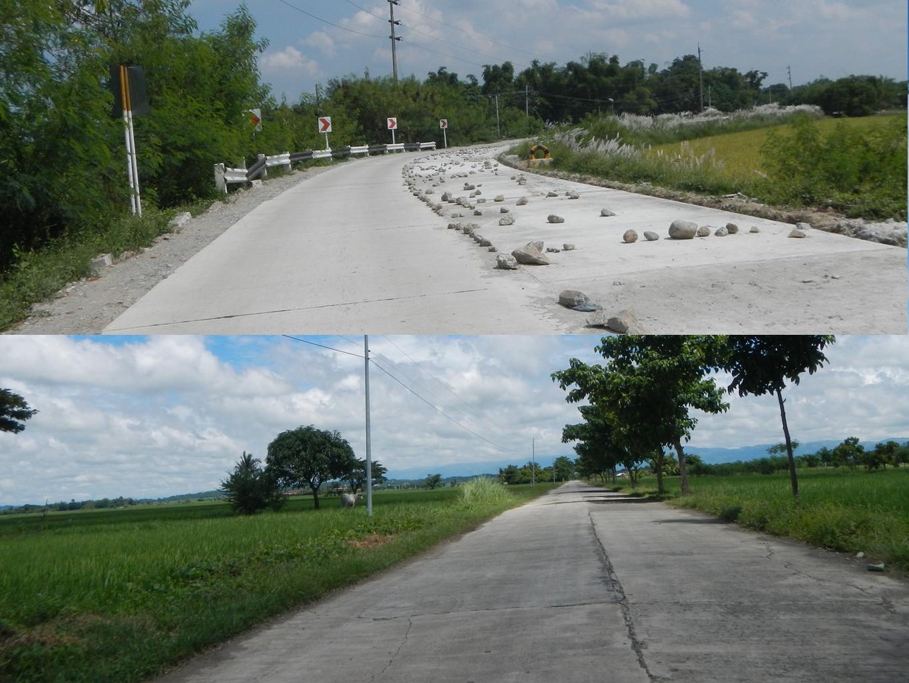
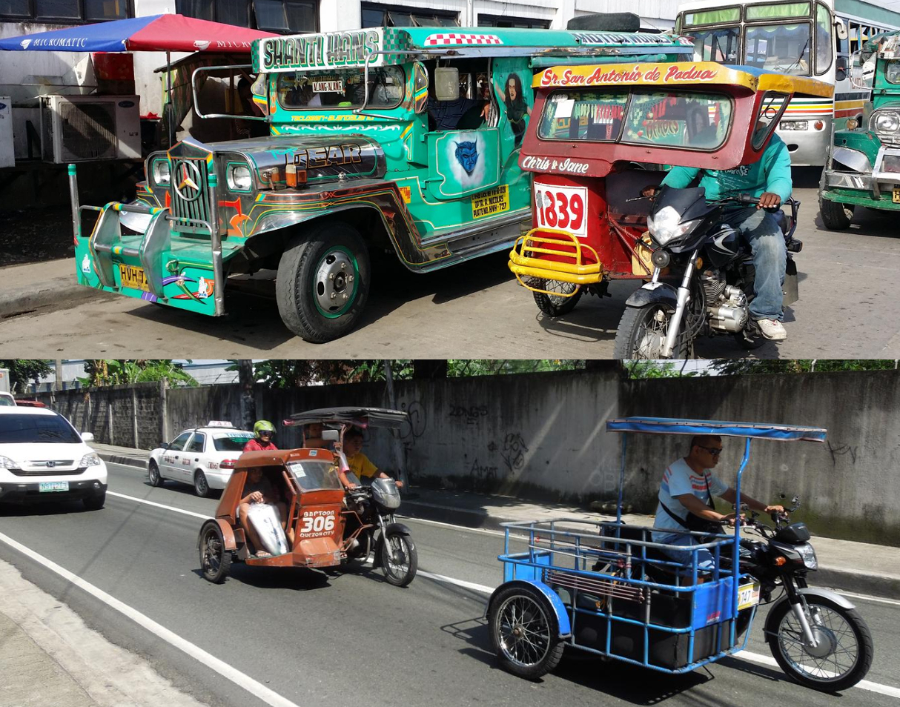
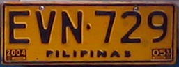
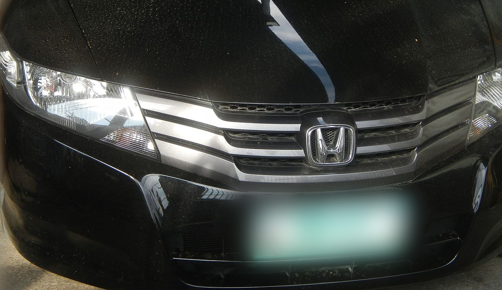
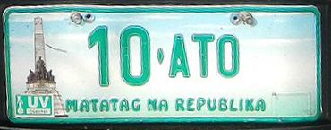
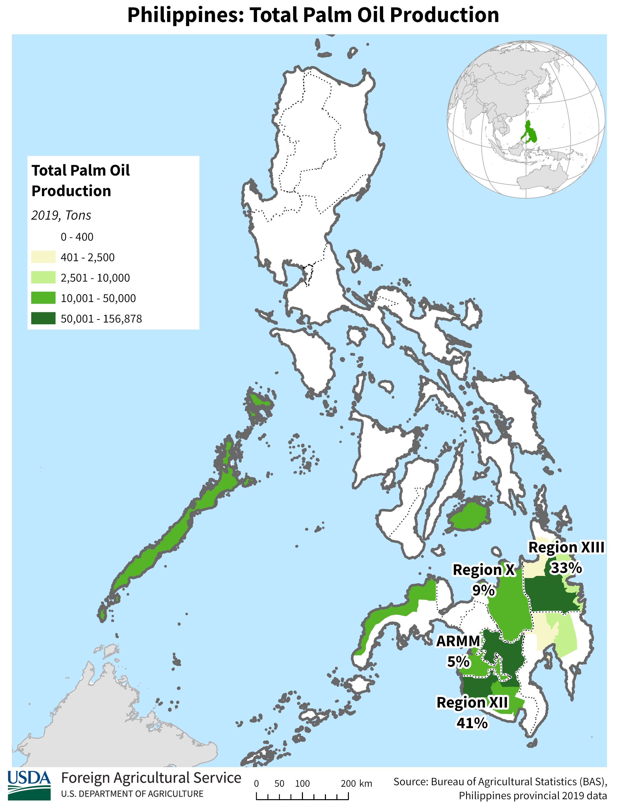
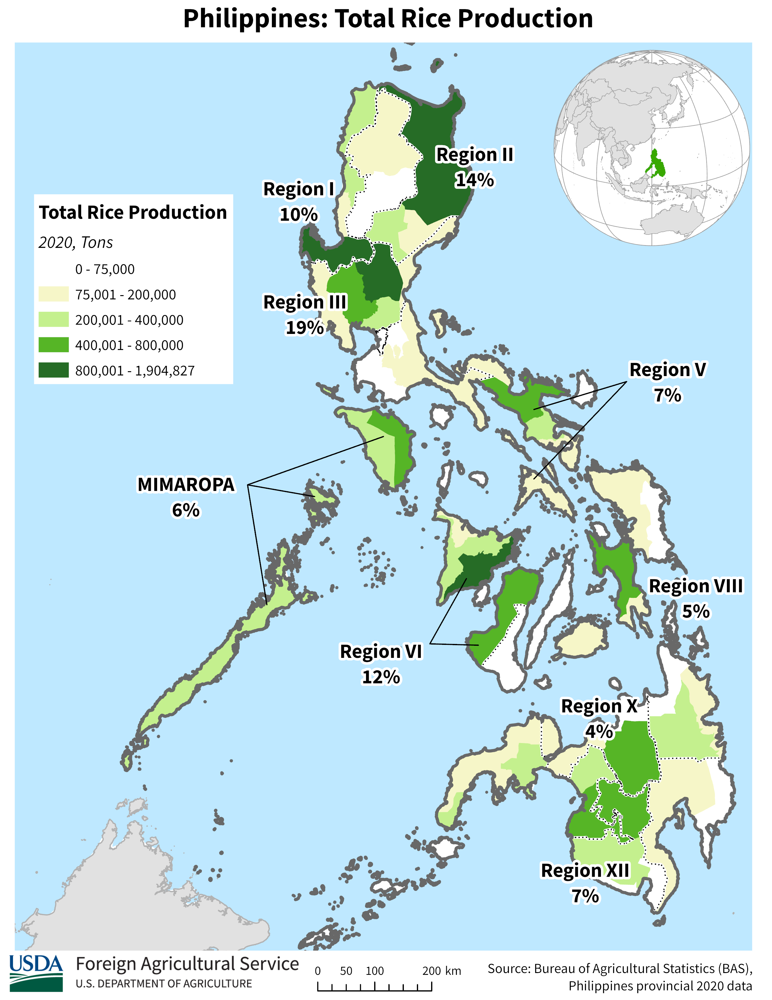
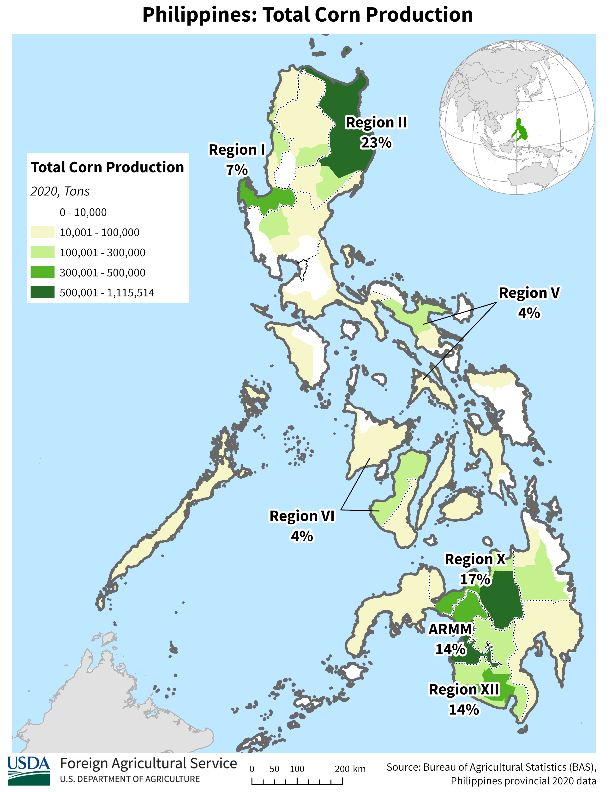
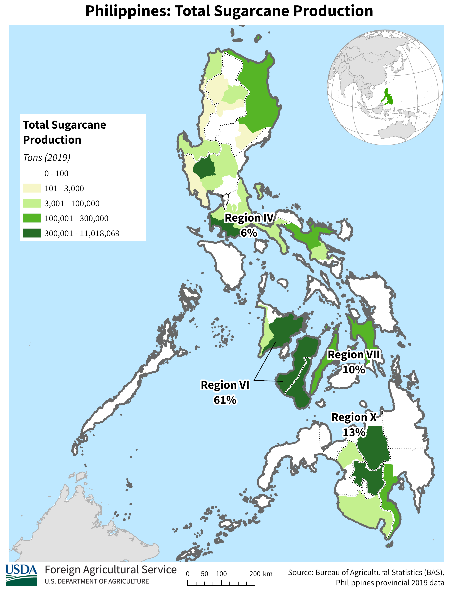

    <h2 class="section-title">{}</h2>
    <ul class="rule-list">
        <li>ドメインは.ph</li>
        <li>車は右側通行</li>
        <li>英語とフィリピン語が公用語</li>
        <li>家の屋根がトタン屋根っぽい{}</li>
        <li>フィリピンのファーストフードチェーン店大手のジョリビー（Jollibee）の看板がある</li>
        <li>トライシクルと呼ばれるバイクと荷台・椅子が合体した乗り物がタクシーとして使われる</li>
        <li>ジプニーとよばれる派手な色のバスが交通手段として使用される</li>
        <li>ジプニーなどの公共交通機関のナンバーは黄色・一般車は緑色が多い</li>
        <li class="no-evidence">アジアで赤白のシェブロンがあるならフィリピンと{}の可能性大</li>
        <li class="no-evidence">ローヤルクラウン・コーラが売られている</li>
        <li class="no-evidence">後ろに扉が無い乗り物を見たらほぼフィリピン</li>
    </ul>
    {}

{}
{}

{}
家の屋根がトタン屋根っぽいものが多い{}。インドネシアにもトタンの屋根は多いのでこれだけで即決してはいけない。
{}

<iframe src="https://www.google.com/maps/embed?pb=!4v1679378905858!6m8!1m7!1sBMNB6Ylb_A1xFaEfer57jg!2m2!1d14.16717986120659!2d121.1187169649861!3f199.0718818648779!4f1.6500290634349!5f2.601513026710907" width="295" height="295" style="border:0;" allowfullscreen="" loading="lazy" referrerpolicy="no-referrer-when-downgrade"></iframe>
<iframe src="https://www.google.com/maps/embed?pb=!4v1680250202954!6m8!1m7!1s6ZsrvkhrAUsc8NxpRYr6-Q!2m2!1d7.269869013438476!2d125.4470118037702!3f182.72804515039002!4f-2.164321473307922!5f1.4108827045451338" width="295" height="295" style="border:0;" allowfullscreen="" loading="lazy" referrerpolicy="no-referrer-when-downgrade"></iframe>

{}
路面がコンクリートの時が多い。体感でコンクリートが多いのはフィリピン・{}。稀に{}{}や{}の田舎{}。
{}

{}
トライシクルと呼ばれるバイクと荷台・椅子が合体した乗り物がタクシー代わりで使われる。バイクではなく自転車が合体したペディキャブという乗り物もある。またジプニーとよばれる派手な色のバスも主な交通手段として使用され、バスのような公共交通機関はナンバーが黄色。以下はトライシクル（右）とジプニー（左）。
{}

{}

By Christian Razukas from Honolulu, Hawaii - Flickr, <a href="https://creativecommons.org/licenses/by-sa/2.0/deed.ja">CC BY-SA 2.0</a>, <a href="https://commons.wikimedia.org/w/index.php?curid=1738757">Link(Wikimedia commons)</a>
{}

{}
一般乗用車は白色か薄い緑色のものが多い。右側通行・乗り物が独特・ナンバーが黄・白・薄緑ならフィリピン。
{}

{}

CC0画像を加工
{}

{}
フィリピンのファーストフードチェーン店大手のジョリビー（Jollibee）の看板がある。{}{}
{}

{}
{}
{}
赤茶色のポールや留め具が多い気がする
{}

<iframe src="https://www.google.com/maps/embed?pb=!4v1680101739474!6m8!1m7!1sTyeObkPyGj8YuX9dN0z38A!2m2!1d7.422406929066982!2d125.7903360325907!3f239.67141175517145!4f-1.3145434412512884!5f3.325193203789971" width="295" height="295" style="border:0;" allowfullscreen="" loading="lazy" referrerpolicy="no-referrer-when-downgrade"></iframe>
<iframe src="https://www.google.com/maps/embed?pb=!4v1680249781531!6m8!1m7!1sCgLuMD_CQVNlp_5GCdbQuw!2m2!1d8.6718633256141!2d125.8553665045728!3f168.42819800819322!4f-6.48711248298369!5f3.325193203789971" width="295" height="295" style="border:0;" allowfullscreen="" loading="lazy" referrerpolicy="no-referrer-when-downgrade"></iframe>

{}
アジアで赤と白のシェブロンが見られるのはフィリピンとスリランカだけかも
{}

<iframe src="https://www.google.com/maps/embed?pb=!4v1683170464065!6m8!1m7!1sxL0zZf0ZouIV1Q1ol6gClg!2m2!1d16.31629957181731!2d120.967650339569!3f36.532556860320405!4f-4.994132390042282!5f3.325193203789971" width="295" height="295" style="border:0;" allowfullscreen="" loading="lazy" referrerpolicy="no-referrer-when-downgrade"></iframe>

{}
{}

{}
ジプニーとよばれる派手な色のバスも主な交通手段として使用される。後ろの扉が無いことが多い気がする。
{}

<iframe src="https://www.google.com/maps/embed?pb=!4v1682995096232!6m8!1m7!1sHHe2LKmE_X5YxA3OyzVPeQ!2m2!1d14.56206716258762!2d121.0254233316108!3f102.31921952386864!4f-12.20461197764817!5f3.0970576775658447" width="295" height="295" style="border:0;" allowfullscreen="" loading="lazy" referrerpolicy="no-referrer-when-downgrade"></iframe>
<iframe src="https://www.google.com/maps/embed?pb=!4v1682995146362!6m8!1m7!1sjijVgDOnCrPSf0oUVSuAgg!2m2!1d10.31578039693279!2d123.9137359406412!3f9.69339182213827!4f-5.4011174881681825!5f3.325193203789971" width="295" height="295" style="border:0;" allowfullscreen="" loading="lazy" referrerpolicy="no-referrer-when-downgrade"></iframe>

{}
{}
{}
日本では滅多に見ない（買えない？）ローヤルクラウン・コーラが結構人気で売られている。フィリピンとアメリカのジョージア州で人気らしい。
{}

<iframe src="https://www.google.com/maps/embed?pb=!4v1682946461946!6m8!1m7!1smwZ8DwlYbRRabNGEpy0hLQ!2m2!1d14.68757148544302!2d121.0927406841877!3f332.1839963973208!4f9.602176566695576!5f2.779556903615186" width="295" height="295" style="border:0;" allowfullscreen="" loading="lazy" referrerpolicy="no-referrer-when-downgrade"></iframe>
<iframe src="https://www.google.com/maps/embed?pb=!4v1682946632647!6m8!1m7!1sw-y19-rOrEv8i5dry4zPNg!2m2!1d14.69027419123831!2d121.0857564704962!3f109.5246089345366!4f19.01978162440072!5f2.8627688974868883" width="295" height="295" style="border:0;" allowfullscreen="" loading="lazy" referrerpolicy="no-referrer-when-downgrade"></iframe>

{}
<a href="https://www.nikkei.com/article/DGXZQOUC144W90U1A610C2000000/">ヤクルト、フィリピンに新工場 生産能力7割増（日経新聞）</a>
{}

<iframe src="https://www.google.com/maps/embed?pb=!4v1682995366529!6m8!1m7!1s-gzdUXLqi4Atkf7YjxncUg!2m2!1d10.31816771884368!2d123.9095651656526!3f206.96585515461604!4f-21.44048400186341!5f3.325193203789971" width="295" height="295" style="border:0;" allowfullscreen="" loading="lazy" referrerpolicy="no-referrer-when-downgrade"></iframe>

{}
{}
{}
フィリピンの郊外には野犬がよくいるし水牛もいる
{}

<iframe src="https://www.google.com/maps/embed?pb=!4v1683170588612!6m8!1m7!1sR1HvCC1PofCtZcbM4izrkA!2m2!1d16.31433695443026!2d120.9650755225004!3f32.04945866177463!4f-16.639471984967372!5f3.178138283318091" width="295" height="295" style="border:0;" allowfullscreen="" loading="lazy" referrerpolicy="no-referrer-when-downgrade"></iframe>
<iframe src="https://www.google.com/maps/embed?pb=!4v1680249674643!6m8!1m7!1styPReco5CCf6mijnlw9zhw!2m2!1d8.667798044980291!2d125.8604272841918!3f43.368190812299964!4f-6.674662938576006!5f3.3022879075983824" width="295" height="295" style="border:0;" allowfullscreen="" loading="lazy" referrerpolicy="no-referrer-when-downgrade"></iframe>

{}
{}

<iframe src="https://www.google.com/maps/embed?pb=!4v1680101597984!6m8!1m7!1sob1T9Xf3nxM5M-uqUiNqXA!2m2!1d7.432173159783827!2d125.8181428566435!3f318.96844721474974!4f-5.298390129420483!5f2.9122508693376283" width="295" height="295" style="border:0;" allowfullscreen="" loading="lazy" referrerpolicy="no-referrer-when-downgrade"></iframe>
<iframe src="https://www.google.com/maps/embed?pb=!4v1686312852768!6m8!1m7!1sgcqUGOCmbLYI84Ztf7xUqg!2m2!1d7.191696996355934!2d125.4523221327875!3f325.7213129758706!4f-3.487704331270592!5f3.325193203789971" width="295" height="295" style="border:0;" allowfullscreen="" loading="lazy" referrerpolicy="no-referrer-when-downgrade"></iframe>

{}
{}

    <h2 class="section-title">{}</h2>
    <ul class="rule-list">
        <li>タガログ語はルソン島南部とマニラ周辺に話者が多い</li>
        <li>農作物の分布が地域ごとに異なる
            <ul>
                <li>データ提供元：<a href="https://ipad.fas.usda.gov/countrysummary/default.aspx?id=RP">U.S. Philippines Production Country Summary(U.S. Department of Agriculture)</a></li>
            </ul>
        </li>
        <li>市外局番でおよその地域が特定できる{}</li>
        <li class="no-evidence">トライシクルに都市名が書いてある場合がある、見た目による地域性もあるらしい。</li>
    </ul>

{}
{}

<iframe src="https://www.google.com/maps/embed?pb=!4v1684979157020!6m8!1m7!1sYUOAIn2vLry73pTz3Ido8A!2m2!1d6.621556822152089!2d124.0659036884216!3f170.08973009900976!4f2.3140351886677877!5f2.815832230270974" width="400" height="250" style="border:0;" allowfullscreen="" loading="lazy" referrerpolicy="no-referrer-when-downgrade"></iframe>

{}
{}

<iframe src="https://www.google.com/maps/embed?pb=!4v1684979247036!6m8!1m7!1soyuS4DwL0rkYlKqevHRoDQ!2m2!1d17.553618532952!2d121.7830887444396!3f356.5108621104542!4f-16.385164862101306!5f1.4009779281897492" width="400" height="250" style="border:0;" allowfullscreen="" loading="lazy" referrerpolicy="no-referrer-when-downgrade"></iframe>

{}
{}

{}
{}

{}
{}

By <a href="//commons.wikimedia.org/wiki/User:Howard_the_Duck" title="User:Howard the Duck">Howard the Duck</a> - Own work, <a href="http://creativecommons.org/licenses/by-sa/3.0/" title="Creative Commons Attribution-Share Alike 3.0">CC BY-SA 3.0</a>, <a href="https://commons.wikimedia.org/w/index.php?curid=3307884">Link</a>

{}
{}

    <h2 class="section-title">{}</h2>
    <ul class="rule-list">
        <li>フィリピンの大手銀行であるBDO Unibank・Bank of the Philippine Islands・MetrobankなどのATMの看板にはいつも町名や地域名が書いてある。</li>
    </ul>

{}
{}

<iframe src="https://www.google.com/maps/embed?pb=!4v1684613115605!6m8!1m7!1sgYhEbSkYtZglu0eGhSo_5w!2m2!1d9.651275028314991!2d124.3675177738041!3f22.109517723482682!4f15.679024661251503!5f3.325193203789971" width="295" height="295" style="border:0;" allowfullscreen="" loading="lazy" referrerpolicy="no-referrer-when-downgrade"></iframe>
<iframe src="https://www.google.com/maps/embed?pb=!4v1684613494892!6m8!1m7!1sGWIk8ge4a6kDWBBcqBZ12Q!2m2!1d7.448201417512792!2d125.8078175429974!3f352.9976618878443!4f27.00491909189968!5f3.325193203789971" width="295" height="295" style="border:0;" allowfullscreen="" loading="lazy" referrerpolicy="no-referrer-when-downgrade"></iframe>

{}
これ以外でも普通の店の看板に住所が書かれていることも結構多い気がする
{}
{}
{}