

    <h2 class="section-title">{}</h2>
    <ul class="rule-list">
        <li>ドメインは.ph</li>
        <li>車は右側通行</li>
        <li>英語とフィリピン語が公用語</li>
        <li>家の屋根がトタン屋根っぽい{}</li>
        <li>フィリピンのファーストフードチェーン店大手のジョリビー（Jollibee）の看板がある</li>
        <li>トライシクルと呼ばれるバイクと荷台・椅子が合体した乗り物がタクシーとして使われる</li>
        <li>ジプニーとよばれる派手な色のバスが交通手段として使用される</li>
        <li>ジプニーなどの公共交通機関のナンバーは黄色・一般車は緑色が多い</li>
        <li class="no-evidence">アジアで赤白のシェブロンがあるならフィリピンと{}の可能性大</li>
        <li class="no-evidence">ローヤルクラウン・コーラが売られている</li>
        <li class="no-evidence">後ろに扉が無い乗り物を見たらほぼフィリピン</li>
    </ul>
    {}

{}
{}

{}
英語で書かれた看板がある{}。
{}

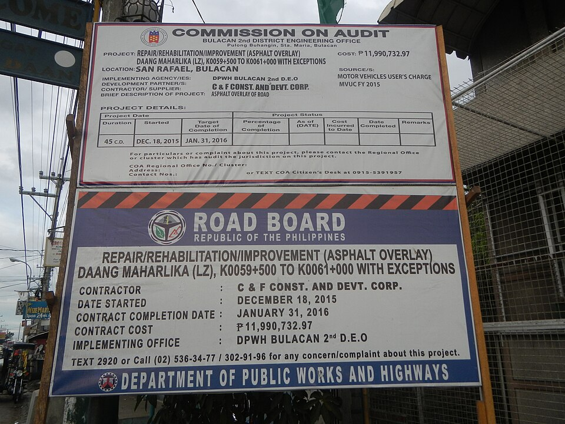

{}
路面がコンクリートの時が多い{}。
{}

{}
アジアでコンクリート道路が多いのは体感だとフィリピン・{}。その他では{}・稀に{}{}・{}{}・{}{}にもある。
{}

{}
トライシクルと呼ばれるバイクと荷台・椅子が合体した乗り物がタクシー代わりで使われる。バイクではなく自転車が合体したペディキャブという乗り物もある。またジプニーとよばれる派手な色のバスも主な交通手段として使用される{}。バスのような公共交通機関はナンバーが黄色。以下はトライシクル（右）とジプニー（左）。
{}

{}

By Christian Razukas from Honolulu, Hawaii - Flickr, <a href="https://creativecommons.org/licenses/by-sa/2.0/deed.ja">CC BY-SA 2.0</a>, <a href="https://commons.wikimedia.org/w/index.php?curid=1738757">Link(Wikimedia commons)</a>
{}

{}
一般乗用車は白色か薄い緑色のものが多い{}。右側通行・乗り物が独特・ナンバーが黄・白・薄緑ならフィリピン。
{}

{}

CC0画像を加工
{}

{}
フィリピンのファーストフードチェーン店大手のジョリビー（Jollibee）の看板がある。{}{}
{}

{}
アジアにおいて赤白のシェブロンはフィリピンと{}以外ではほとんど見かけないかも（確証なし）{}。
{}

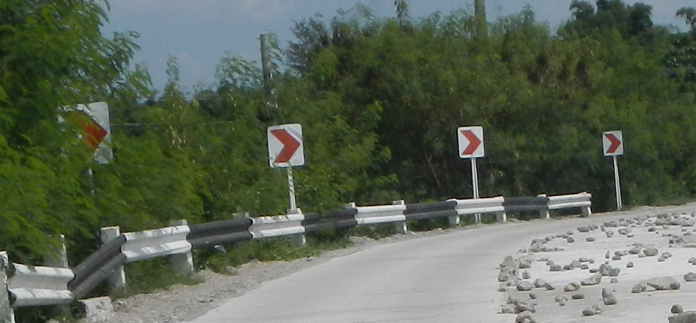

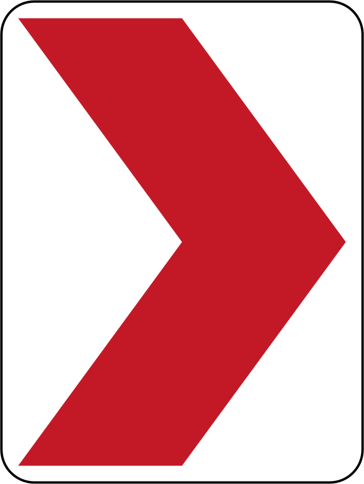

{}
{}
{}
赤茶色のポールや留め具が多い気がする
{}

<iframe src="https://www.google.com/maps/embed?pb=!4v1680101739474!6m8!1m7!1sTyeObkPyGj8YuX9dN0z38A!2m2!1d7.422406929066982!2d125.7903360325907!3f239.67141175517145!4f-1.3145434412512884!5f3.325193203789971" width="295" height="295" style="border:0;" allowfullscreen="" loading="lazy" referrerpolicy="no-referrer-when-downgrade"></iframe>
<iframe src="https://www.google.com/maps/embed?pb=!4v1680249781531!6m8!1m7!1sCgLuMD_CQVNlp_5GCdbQuw!2m2!1d8.6718633256141!2d125.8553665045728!3f168.42819800819322!4f-6.48711248298369!5f3.325193203789971" width="295" height="295" style="border:0;" allowfullscreen="" loading="lazy" referrerpolicy="no-referrer-when-downgrade"></iframe>

{}
アジアで赤と白のシェブロンが見られるのはフィリピンとスリランカだけかも
{}

<iframe src="https://www.google.com/maps/embed?pb=!4v1683170464065!6m8!1m7!1sxL0zZf0ZouIV1Q1ol6gClg!2m2!1d16.31629957181731!2d120.967650339569!3f36.532556860320405!4f-4.994132390042282!5f3.325193203789971" width="295" height="295" style="border:0;" allowfullscreen="" loading="lazy" referrerpolicy="no-referrer-when-downgrade"></iframe>

{}
{}

{}
ジプニーとよばれる派手な色のバスも主な交通手段として使用される。後ろの扉が無いことが多い気がする。
{}

<iframe src="https://www.google.com/maps/embed?pb=!4v1682995096232!6m8!1m7!1sHHe2LKmE_X5YxA3OyzVPeQ!2m2!1d14.56206716258762!2d121.0254233316108!3f102.31921952386864!4f-12.20461197764817!5f3.0970576775658447" width="295" height="295" style="border:0;" allowfullscreen="" loading="lazy" referrerpolicy="no-referrer-when-downgrade"></iframe>
<iframe src="https://www.google.com/maps/embed?pb=!4v1682995146362!6m8!1m7!1sjijVgDOnCrPSf0oUVSuAgg!2m2!1d10.31578039693279!2d123.9137359406412!3f9.69339182213827!4f-5.4011174881681825!5f3.325193203789971" width="295" height="295" style="border:0;" allowfullscreen="" loading="lazy" referrerpolicy="no-referrer-when-downgrade"></iframe>

{}
{}
{}
日本では滅多に見ない（買えない？）ローヤルクラウン・コーラが結構人気で売られている。フィリピンとアメリカのジョージア州で人気らしい。
{}

<iframe src="https://www.google.com/maps/embed?pb=!4v1682946461946!6m8!1m7!1smwZ8DwlYbRRabNGEpy0hLQ!2m2!1d14.68757148544302!2d121.0927406841877!3f332.1839963973208!4f9.602176566695576!5f2.779556903615186" width="295" height="295" style="border:0;" allowfullscreen="" loading="lazy" referrerpolicy="no-referrer-when-downgrade"></iframe>
<iframe src="https://www.google.com/maps/embed?pb=!4v1682946632647!6m8!1m7!1sw-y19-rOrEv8i5dry4zPNg!2m2!1d14.69027419123831!2d121.0857564704962!3f109.5246089345366!4f19.01978162440072!5f2.8627688974868883" width="295" height="295" style="border:0;" allowfullscreen="" loading="lazy" referrerpolicy="no-referrer-when-downgrade"></iframe>

{}
<a href="https://www.nikkei.com/article/DGXZQOUC144W90U1A610C2000000/">ヤクルト、フィリピンに新工場 生産能力7割増（日経新聞）</a>
{}

<iframe src="https://www.google.com/maps/embed?pb=!4v1682995366529!6m8!1m7!1s-gzdUXLqi4Atkf7YjxncUg!2m2!1d10.31816771884368!2d123.9095651656526!3f206.96585515461604!4f-21.44048400186341!5f3.325193203789971" width="295" height="295" style="border:0;" allowfullscreen="" loading="lazy" referrerpolicy="no-referrer-when-downgrade"></iframe>

{}
{}
{}
フィリピンの郊外には野犬がよくいるし水牛もいる
{}

<iframe src="https://www.google.com/maps/embed?pb=!4v1683170588612!6m8!1m7!1sR1HvCC1PofCtZcbM4izrkA!2m2!1d16.31433695443026!2d120.9650755225004!3f32.04945866177463!4f-16.639471984967372!5f3.178138283318091" width="295" height="295" style="border:0;" allowfullscreen="" loading="lazy" referrerpolicy="no-referrer-when-downgrade"></iframe>
<iframe src="https://www.google.com/maps/embed?pb=!4v1680249674643!6m8!1m7!1styPReco5CCf6mijnlw9zhw!2m2!1d8.667798044980291!2d125.8604272841918!3f43.368190812299964!4f-6.674662938576006!5f3.3022879075983824" width="295" height="295" style="border:0;" allowfullscreen="" loading="lazy" referrerpolicy="no-referrer-when-downgrade"></iframe>

{}
{}

<iframe src="https://www.google.com/maps/embed?pb=!4v1680101597984!6m8!1m7!1sob1T9Xf3nxM5M-uqUiNqXA!2m2!1d7.432173159783827!2d125.8181428566435!3f318.96844721474974!4f-5.298390129420483!5f2.9122508693376283" width="295" height="295" style="border:0;" allowfullscreen="" loading="lazy" referrerpolicy="no-referrer-when-downgrade"></iframe>
<iframe src="https://www.google.com/maps/embed?pb=!4v1686312852768!6m8!1m7!1sgcqUGOCmbLYI84Ztf7xUqg!2m2!1d7.191696996355934!2d125.4523221327875!3f325.7213129758706!4f-3.487704331270592!5f3.325193203789971" width="295" height="295" style="border:0;" allowfullscreen="" loading="lazy" referrerpolicy="no-referrer-when-downgrade"></iframe>

{}
{}

    <h2 class="section-title">{}</h2>
    <ul class="rule-list">
        <li>タガログ語はルソン島南部とマニラ周辺に話者が多い{{% ref "https://ja.wikipedia.org/wiki/%E3%82%BF%E3%82%AC%E3%83%AD%E3%82%B0%E8%AA%9E" "タガログ語" %}}</li>
        <li>市外局番でおよその地域が特定できる{}</li>
        <li class="no-evidence">新しめのバイクのナンバープレートの色を見れば地域がわかることも</li>
        <li class="no-evidence">北部のLuzon島の山岳地帯ではチリ電柱が見つかる</li>
    </ul>

{}
{}

{}
正確な分布は{{% goto "https://ja.wikipedia.org/wiki/%E3%82%BF%E3%82%AC%E3%83%AD%E3%82%B0%E8%AA%9E#/media/%E3%83%95%E3%82%A1%E3%82%A4%E3%83%AB:Katagalugan.png" "これ" %}}を参照。
{}

{}
{}

By <a href="//commons.wikimedia.org/wiki/User:Howard_the_Duck" title="User:Howard the Duck">Howard the Duck</a> - Own work, <a href="http://creativecommons.org/licenses/by-sa/3.0/" title="Creative Commons Attribution-Share Alike 3.0">CC BY-SA 3.0</a>, <a href="https://commons.wikimedia.org/w/index.php?curid=3307884">Link</a>

{}
{}

{}
おそらく2020年以降に撮影された地域でないとこのナンバープレートは発見できないのであまり重要ではない。どの色がどの地域に対応しているかは参考文献を参照してください{}。
{}

<iframe src="https://www.google.com/maps/embed?pb=!4v1695255302278!6m8!1m7!1si8ig9GkEKo-c1TZU72IreA!2m2!1d16.0455703930407!2d120.3433047965388!3f42.07442059423329!4f-24.316664187553883!5f3.325193203789971" width="500" height="300" style="border:0;" allowfullscreen="" loading="lazy" referrerpolicy="no-referrer-when-downgrade"></iframe>

{}
{}

{}
経験上８割くらいがBaguio周辺の山岳地帯だと思う。まれにLuzon島以外でも見つかる。
{}

<iframe src="https://www.google.com/maps/embed?pb=!4v1718905016085!6m8!1m7!1syK2mp6uhvixkYoVYrVBs2Q!2m2!1d16.45666534560502!2d120.7316623215857!3f239.11431077598633!4f-2.129470737598922!5f0.4000000000000002" width="600" height="450" style="border:0;" allowfullscreen="" loading="lazy" referrerpolicy="no-referrer-when-downgrade"></iframe>

{}
{}

    <h4 class="section-title">トライシクル</h4>
    <ul class="rule-list">
        <li>トライシクルの認可基準が市陸運事務所ごとに異なるため、地域ごとに異なる見た目のトライシクルが見られる{}
            <ul>
                <li>屋根に段差があると北部{}</li>
                <li>屋根がフラットだと南部{}</li>
                <li class="no-evidence">Motorelaはミンダナオ島北部に多い{}</li>
                <li>フラットな屋根のうち少し丸っこい感じで後ろに車っぽいライトがあるならPalawan</li>
                <li>ミンダナオ島北西部などのイスラム教徒が多い地域では女性の足が見えないようにする工夫がみられる{}</li>
            </ul>
        </li>
    </ul>

{}
{}

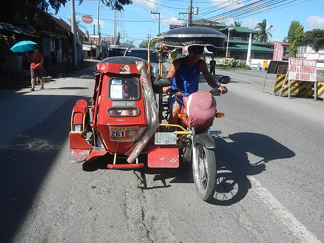
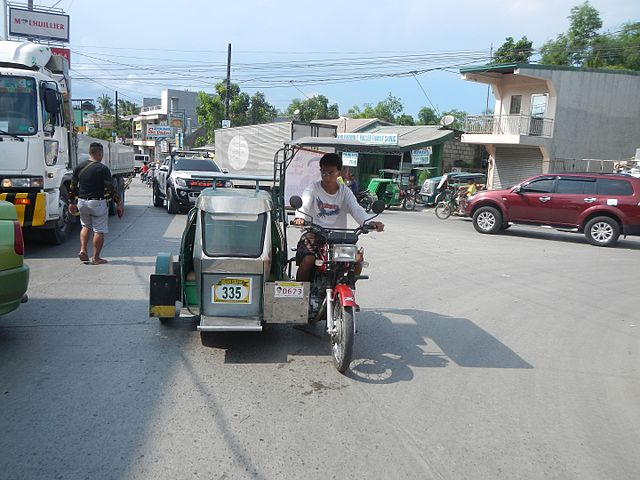

{}
屋根に段差がある。
{}

{}
{}

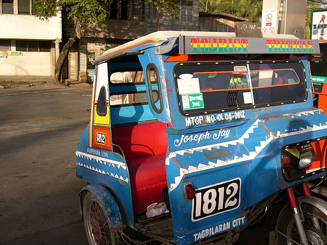
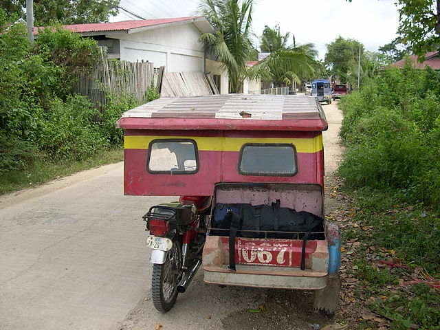
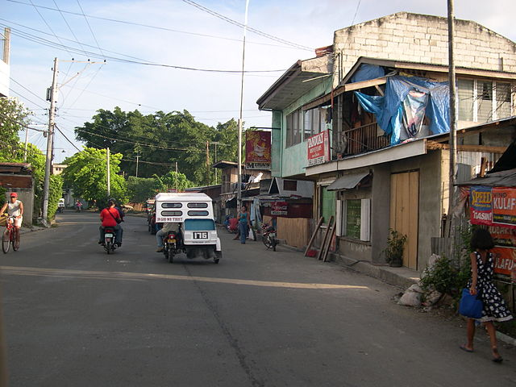

{}
屋根に段差が無い{}。完全にフラットな時もある。画像はPanglao IslandとTagbilaran{}のもの。
{}

{}
{}

{}
後ろに席があり普通のトライシクルと比較すると多くの客を乗せることができる{}{}。WikiによるとCagayan de OroとBukidnonに多いらしい。
{}

{}
{}

By Patrickroque01 - Taken using my own camera, <a href="https://creativecommons.org/licenses/by-sa/4.0" title="Creative Commons Attribution-Share Alike 4.0">CC BY-SA 4.0</a>, <a href="https://commons.wikimedia.org/w/index.php?curid=136810939">Link</a>

{}
個人的には屋根の部分が少し丸っこく{}、とりわけ黒い素材でできている{}ならばPalawanも考えてみることがある。
{}

{}
{}

<iframe src="https://www.google.com/maps/embed?pb=!4v1719509184357!6m8!1m7!1sdo2lFFBtf6CZcJrtqEI6Gg!2m2!1d7.826952757500014!2d123.4389683168012!3f62.054770497673786!4f-9.391465568482303!5f2.9568024351328237" width="600" height="400" style="border:0;" allowfullscreen="" loading="lazy" referrerpolicy="no-referrer-when-downgrade"></iframe>

{}
そもそもこういうタイプのトゥクトゥクが多い。後部座席に足元を隠すためのカバーも付いていることが多い{}。
{}

{}
{}

    <ul class="rule-list">
        <li>農作物の分布が地域ごとに異なる
            <ul>
                <li>アブラヤシは南の島に多い{}</li>
                <li>サトウキビは{}を中心に多く分布する{}</li>
                <li>データ提供元：<a href="https://ipad.fas.usda.gov/countrysummary/default.aspx?id=RP">U.S. Philippines Production Country Summary(U.S. Department of Agriculture)</a></li>
            </ul>
        </li>
    </ul>

{}
{}

{}
{}

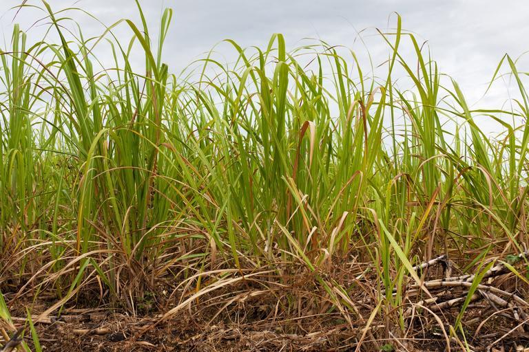

{}
{}

<iframe src="https://www.google.com/maps/embed?pb=!4v1684979247036!6m8!1m7!1soyuS4DwL0rkYlKqevHRoDQ!2m2!1d17.553618532952!2d121.7830887444396!3f356.5108621104542!4f-16.385164862101306!5f1.4009779281897492" width="400" height="250" style="border:0;" allowfullscreen="" loading="lazy" referrerpolicy="no-referrer-when-downgrade"></iframe>

{}
{}

{}
{}

    <h2 class="section-title">{}</h2>
    <ul class="rule-list">
        <li>地域と県名を覚えておくと場所の特定に役立つ{}</li>
        <li>工事中の看板がよくあり都市名が書かれていることが多い</li>
        <li>大手銀行のATMの看板にはいつも町名や地域名が書いてある{}</li>
    </ul>

{}
{}

By <a href="//commons.wikimedia.org/wiki/User:HueMan1" title="User:HueMan1">HueMan1</a> - Own work, based on <a href="//commons.wikimedia.org/wiki/User:Seav" title="User:Seav">seav</a>'s <a href="//commons.wikimedia.org/wiki/File:Ph_regions_and_provinces.png" title="File:Ph regions and provinces.png">Ph regions and provinces.png</a> and <a href="//commons.wikimedia.org/wiki/User:Felipe_Aira" title="User:Felipe Aira">Felipe Aira</a>'s <a href="//commons.wikimedia.org/wiki/File:PhlMapCit.svg" title="File:PhlMapCit.svg">File:PhlMapCit.svg</a>, <a href="http://www.gnu.org/copyleft/fdl.html" title="GNU Free Documentation License">GFDL</a>, <a href="https://commons.wikimedia.org/w/index.php?curid=80077790">Link</a>

{}
{}

{}
看板に都市名がそのまま書かれていることがよくある
{}

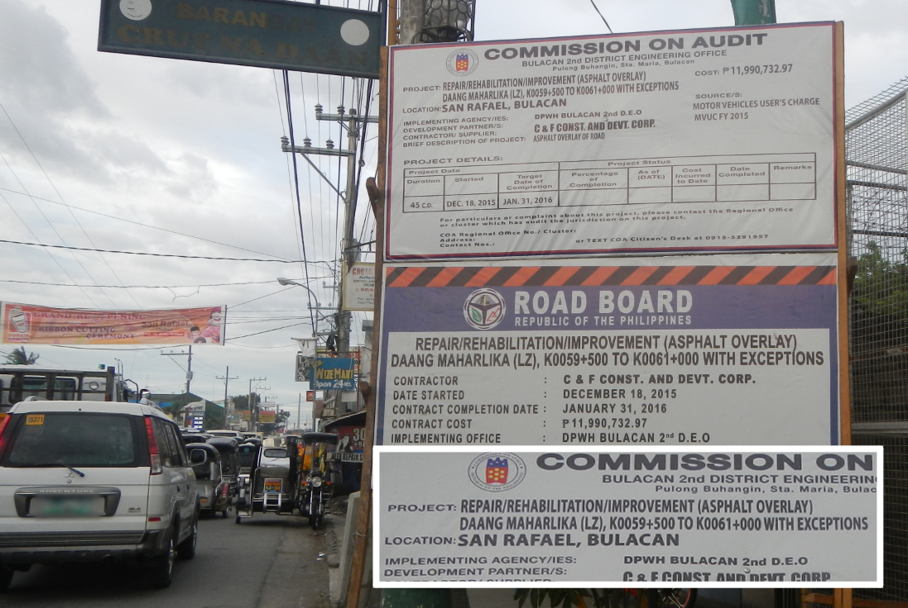

{}
{}
{}
フィリピンの大手銀行であるBDO Unibank・Bank of the Philippine Islands・Metrobankなどの看板に場所が書かれている{}。これ以外でも普通の店の看板に住所が書かれていることも結構多い。
{}

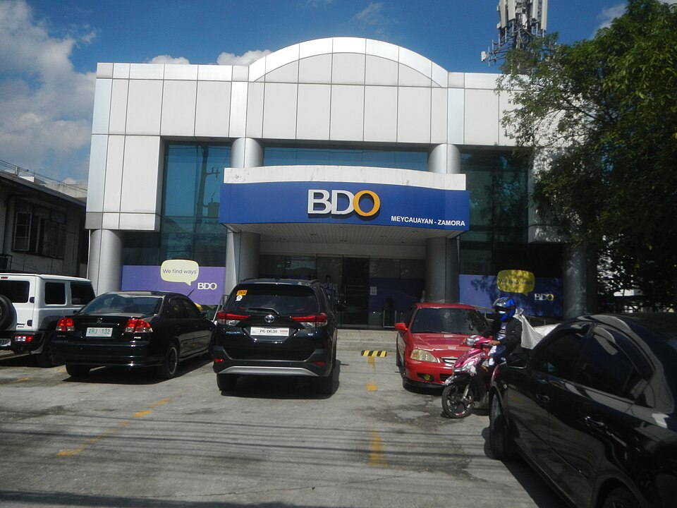

{}
{}

    <ul class="rule-list">
        <li>Sabtang島周辺では石造りの家がある{}{}</li>
        <li>コレヒドール島は第二次大戦中の兵舎やトンネルが廃墟として残っていている{}{{% ref "https://ja.wikipedia.org/wiki/%E3%82%B3%E3%83%AC%E3%83%92%E3%83%89%E3%83%BC%E3%83%AB%E5%B3%B6" "コレヒドール島" %}}。GoogleCarが見える。</li>
        <li>1991年に大噴火を起こしたピナトゥボ山への道がある{}{{% ref "https://ja.wikipedia.org/wiki/%E3%83%94%E3%83%8A%E3%83%88%E3%82%A5%E3%83%9C%E5%B1%B1" "ピナトゥボ山" %}}</li>
    </ul>

{}
{}
{}
本島と台湾の間の島{}。
{}

By <a href="//commons.wikimedia.org/w/index.php?title=User:Jeremy.alinea&amp;amp;action=edit&amp;amp;redlink=1" class="new" title="User:Jeremy.alinea (page does not exist)">Jeremy.alinea</a> - Own work, <a href="https://creativecommons.org/licenses/by-sa/4.0" title="Creative Commons Attribution-Share Alike 4.0">CC BY-SA 4.0</a>, <a href="https://commons.wikimedia.org/w/index.php?curid=78822611">Link</a>

{}
{}
{}
GoogleCarが見える{}。
{}

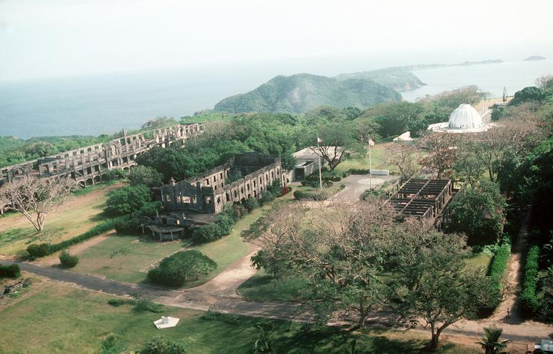

{}
{}
{}

{}

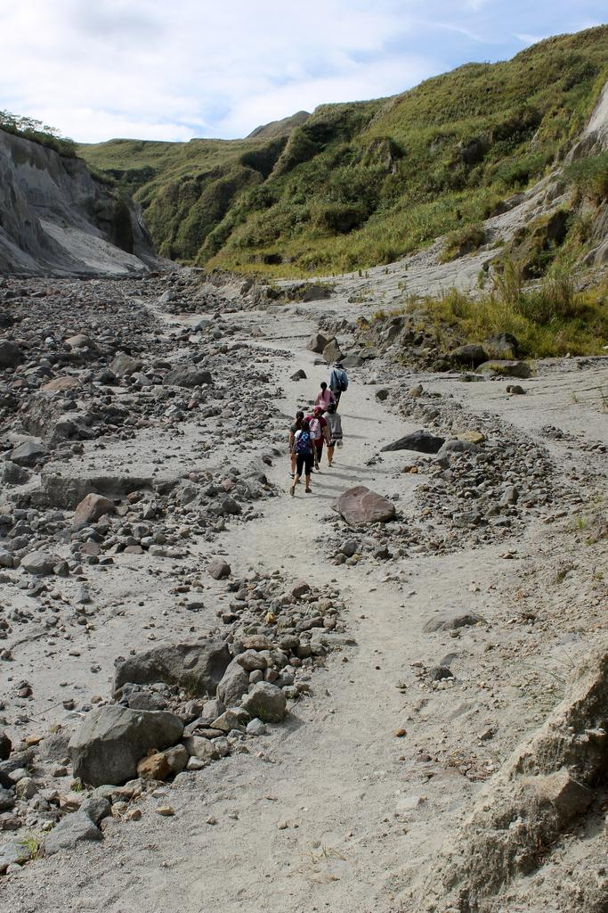

{}
{}
