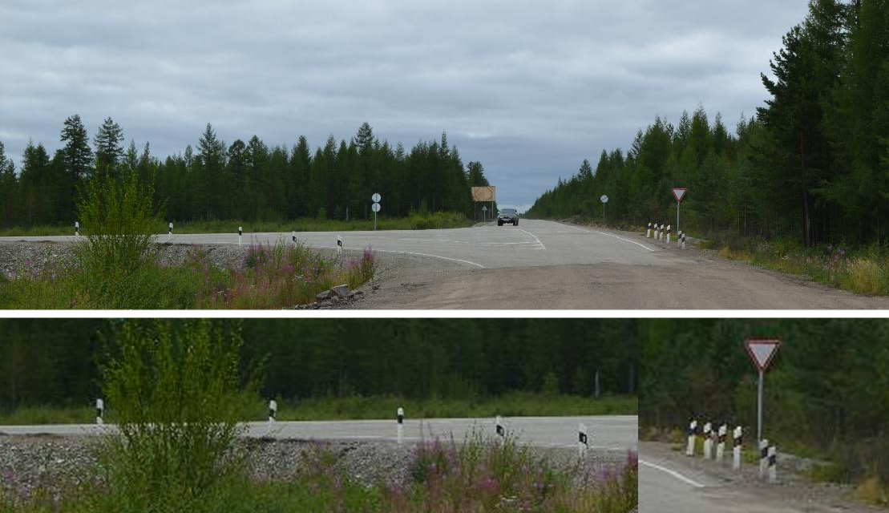
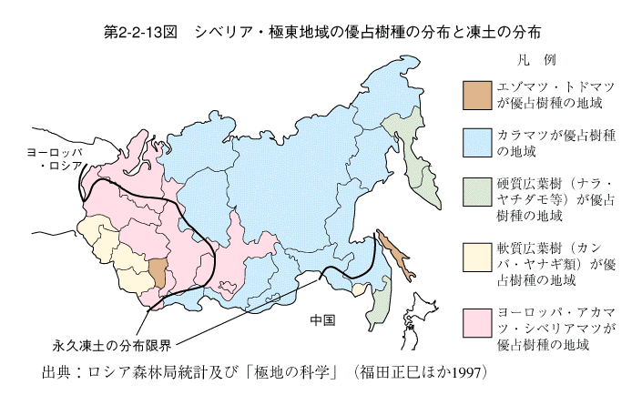
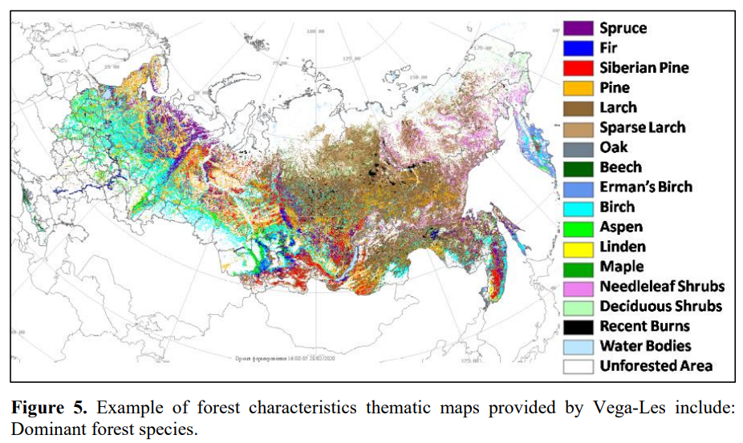
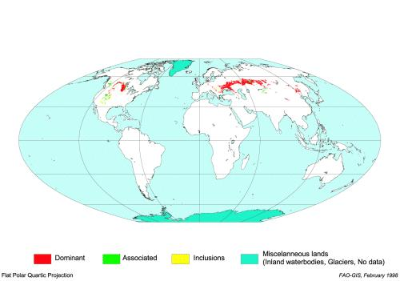

    <h2 class="section-title">{}</h2>
    <ul class="rule-list">
        <li>ドメインは.ru、.suを使うこともある（ソ連の国別コードトップレベルドメイン）</li>
        <li>横断歩道の標識の線は3本</li>
        <li>道路わきに数字が書かれた看板があり、数値は始点と終点の距離を表している</li>
        <li>『Ы』『Э』はロシア語・{}語にはあるが{}語にはない</li>
        <li>ロシア大手企業のガスプロム（Газпром）のガソリンスタンドや銀行がある</li>
        <li>壁や塀の上などにパイプが通っていることが多い{}</li>
        <li>交差点や道路の合流地点にボラードが沢山ある{}。</li>
        <li class="no-evidence">最終的には植生だけでなくGoogle Carのアンテナの分布も覚える必要がある</li>
    </ul>
    {}

{}
{}

{}
交差点や道路の合流地点にボラードが沢山ある{}{}。
{}

By <a href="//commons.wikimedia.org/w/index.php?title=User:A._L._(loading)&amp;amp;action=edit&amp;amp;redlink=1" class="new" title="User:A. L. (loading) (page does not exist)">A. L. (loading)</a> - Own work, <a href="https://creativecommons.org/licenses/by-sa/4.0" title="Creative Commons Attribution-Share Alike 4.0">CC BY-SA 4.0</a>, <a href="https://commons.wikimedia.org/w/index.php?curid=63893508">Link</a>, 加工あり

{}
ガスプロムは天然ガスの生産・供給において世界最大の企業であり、ロシアの国営企業。ノルドストリームもガスプロムが大株主となっている。{}にもガソリンスタンドがある。
{}

{}
横断歩道の線が３本、道端に距離が書かれた標識がある。標識に書かれた距離も結構長いことが多い。
{}

<iframe src="https://www.google.com/maps/embed?pb=!4v1679952008394!6m8!1m7!1sKN-3kAd_mxa5SqB13YgGug!2m2!1d54.58244420016089!2d100.3601711274949!3f131.58138593641155!4f-2.7641070240745194!5f3.294422798080353" width="295" height="295" style="border:0;" allowfullscreen="" loading="lazy" referrerpolicy="no-referrer-when-downgrade"></iframe>
<iframe src="https://www.google.com/maps/embed?pb=!4v1679574012765!6m8!1m7!1sR8-KOr_YgIRzPFz_zEBCAg!2m2!1d56.73993333236672!2d37.54780178613612!3f309.44431274604256!4f-0.27220425709052165!5f3.319031129903795" width="295" height="295" style="border:0;" allowfullscreen="" loading="lazy" referrerpolicy="no-referrer-when-downgrade"></iframe>

{}
{}
{}
{}

<iframe src="https://www.google.com/maps/embed?pb=!4v1679574031395!6m8!1m7!1skQtKcHHlJLO40HHPNKf8jw!2m2!1d56.73983042158815!2d37.54903639461046!3f115.84508252416973!4f0.909471290727339!5f3.325193203789971" width="295" height="295" style="border:0;" allowfullscreen="" loading="lazy" referrerpolicy="no-referrer-when-downgrade"></iframe>
<iframe src="https://www.google.com/maps/embed?pb=!4v1680355899521!6m8!1m7!1sN8-evwVMWCXiQEgo0CPUiw!2m2!1d47.5727822865945!2d141.9610109896992!3f172.30429118216085!4f-2.146055457107664!5f3.325193203789971" width="295" height="295" style="border:0;" allowfullscreen="" loading="lazy" referrerpolicy="no-referrer-when-downgrade"></iframe>

{}
{}
{}
塀に沿ったパイプ
{}

<iframe src="https://www.google.com/maps/embed?pb=!4v1680568075031!6m8!1m7!1sn0bvWbod7ABKSuhedfxguw!2m2!1d53.18501614053784!2d44.06404540436073!3f277.12844123573996!4f-5.65583935692743!5f2.746292577094953" width="295" height="295" style="border:0;" allowfullscreen="" loading="lazy" referrerpolicy="no-referrer-when-downgrade"></iframe>
<iframe src="https://www.google.com/maps/embed?pb=!4v1682205300283!6m8!1m7!1so7nnqQcYEGSdeiukb3SAmA!2m2!1d51.29802272219229!2d37.84326064984084!3f109.30759063511029!4f-6.209895713528667!5f3.325193203789971" width="295" height="295" style="border:0;" allowfullscreen="" loading="lazy" referrerpolicy="no-referrer-when-downgrade"></iframe>

{}
{}

<iframe src="https://www.google.com/maps/embed?pb=!4v1680355956674!6m8!1m7!1swCQyCCLu4h1HGAiEDuR3-A!2m2!1d47.57263938188323!2d141.9614530302049!3f334.5752388113423!4f-17.761464329133247!5f3.309016865185011" width="295" height="295" style="border:0;" allowfullscreen="" loading="lazy" referrerpolicy="no-referrer-when-downgrade"></iframe>

{}
{}

 

    <h2 class="section-title">{}</h2>
    <ul class="rule-list">
        <li>植物の分布・地域ごとの優占樹種を把握する必要がある</li>
        <li>樺太にはフキが生えていることが多い{}</li>
        <li>マガダンのあたりに葉っぱが針みたいな木が多い{}</li>
    </ul>

{}
{}

実際にはこの図ほど単純な分布ではなくグラデーションがあるので注意。（出典：『序章　国土空間からみた循環と共生の地域づくり』 環境省, <a href="https://www.env.go.jp/policy/hakusyo/h10/zuhyou_h10_2_1_1.html">出典リンク</a>, 2023年4月1日に利用）

Balashov, I., et al. "Vega-Les Information System. Actual Features and Future Evolution." IOP Conference Series: Earth and Environmental Science. Vol. 507. No. 1. IOP Publishing, 2020.

{}
{}
{}
カラマツ（下図の茶色の領域、Larch・Sparse Larch）の密度が場所により異なる
{}

<iframe src="https://www.google.com/maps/embed?pb=!4v1682592206635!6m8!1m7!1sSNYaH0zLrVUWR9gWdWq5Cw!2m2!1d57.36629026919018!2d124.9037643309379!3f74.04604514769301!4f0.2758095806179597!5f1.953991665472521" width="295" height="295" style="border:0;" allowfullscreen="" loading="lazy" referrerpolicy="no-referrer-when-downgrade"></iframe>
<iframe src="https://www.google.com/maps/embed?pb=!4v1682592292930!6m8!1m7!1seL2RbhSWmWcLcFZZwVrzZg!2m2!1d52.49489829964376!2d108.0354558955269!3f118.64959651132398!4f9.23832395533951!5f1.5999010019293483" width="295" height="295" style="border:0;" allowfullscreen="" loading="lazy" referrerpolicy="no-referrer-when-downgrade"></iframe>

{}
{}

{}
白樺・シラカンバは見て分かりやすいので重要なヒント。
{}

<iframe src="https://www.google.com/maps/embed?pb=!4v1682594848796!6m8!1m7!1sMZMY21mZeQiac3AOHJ66hA!2m2!1d56.16259741807207!2d44.50206519978866!3f34.04439384865009!4f1.5822195022115437!5f3.0936210580770207" width="295" height="295" style="border:0;" allowfullscreen="" loading="lazy" referrerpolicy="no-referrer-when-downgrade"></iframe>
<iframe src="https://www.google.com/maps/embed?pb=!4v1682594686946!6m8!1m7!1s-Dgq7K-lR94ahQchEFzurw!2m2!1d58.65181502640926!2d53.78317683309058!3f236.95848262068998!4f9.191659854609739!5f3.0997730227522577" width="295" height="295" style="border:0;" allowfullscreen="" loading="lazy" referrerpolicy="no-referrer-when-downgrade"></iframe>

{}
{}
{}
日本全体と樺太に生えている。
{}

<iframe src="https://www.google.com/maps/embed?pb=!4v1682594046159!6m8!1m7!1sTBzRHSzc6oL-MkueC5uNjA!2m2!1d46.80003013762702!2d142.3447914328627!3f231.67122236492588!4f-11.51948319389885!5f2.147977379602411" width="295" height="295" style="border:0;" allowfullscreen="" loading="lazy" referrerpolicy="no-referrer-when-downgrade"></iframe>
<iframe src="https://www.google.com/maps/embed?pb=!4v1682601849840!6m8!1m7!1sGK4jajuQrfSbHnyFAC53aQ!2m2!1d47.30874429663321!2d142.804683801699!3f267.3418463132926!4f-2.9183321921497196!5f0.8061760348812113" width="295" height="295" style="border:0;" allowfullscreen="" loading="lazy" referrerpolicy="no-referrer-when-downgrade"></iframe>

{}
{}
{}
トウヒ属が北西の山脈付近とその西に多い。
{}

<iframe src="https://www.google.com/maps/embed?pb=!4v1682595179051!6m8!1m7!1sSNeSjsJjaMrMx59gvyxxhA!2m2!1d58.54635104596401!2d59.07142926830635!3f124.64782626011696!4f19.27799105095616!5f2.8736602247007426" width="295" height="295" style="border:0;" allowfullscreen="" loading="lazy" referrerpolicy="no-referrer-when-downgrade"></iframe>

{}
{}

<iframe src="https://www.google.com/maps/embed?pb=!4v1682595467571!6m8!1m7!1ssIh3CNvCQ_rE3MOFs-UERg!2m2!1d51.17312579333208!2d95.00948268004689!3f47.65361480221784!4f10.777986690854647!5f3.325193203789971" width="295" height="295" style="border:0;" allowfullscreen="" loading="lazy" referrerpolicy="no-referrer-when-downgrade"></iframe>

{}
{}

{}
マガダンを中心にある程度広い範囲で葉っぱが針みたいな木が多いが正確な木の種類は不明。
{}

<iframe src="https://www.google.com/maps/embed?pb=!4v1682595589411!6m8!1m7!1sKhLxRXlHe_4iudNYEVLdGA!2m2!1d59.79274005124346!2d150.952737054086!3f265.52193994456815!4f11.745221259068671!5f3.325193203789971" width="295" height="295" style="border:0;" allowfullscreen="" loading="lazy" referrerpolicy="no-referrer-when-downgrade"></iframe>
<iframe src="https://www.google.com/maps/embed?pb=!4v1682595755523!6m8!1m7!1sscOmIl_TTF06pbU0Bh6SpQ!2m2!1d59.6857054558386!2d150.2522404951254!3f212.83042143001356!4f17.988853656241574!5f3.325193203789971" width="295" height="295" style="border:0;" allowfullscreen="" loading="lazy" referrerpolicy="no-referrer-when-downgrade"></iframe>

{}
{}

{}
ダケカンバはカムチャッカ半島に多いらしい。枝の色が白色ならばダケカンバ・黒っぽいなら白樺と見分けられるかも。左はカムチャッカ半島の木で右はシラカンバの木と思われるもの{}。
{}

<iframe src="https://www.google.com/maps/embed?pb=!4v1682672594123!6m8!1m7!1s2znEO9jGLNcA-zmrQEMeSA!2m2!1d55.13779347299879!2d159.0039405328214!3f325.9362387031334!4f-2.4417722653859926!5f3.213004958653771" width="295" height="295" style="border:0;" allowfullscreen="" loading="lazy" referrerpolicy="no-referrer-when-downgrade"></iframe>
<iframe src="https://www.google.com/maps/embed?pb=!4v1682672256628!6m8!1m7!1siZxhuDzLoPZuue_wYupEyw!2m2!1d56.16152087883435!2d44.50323908858864!3f108.38233349465402!4f28.37857336559904!5f3.3141713912466595" width="295" height="295" style="border:0;" allowfullscreen="" loading="lazy" referrerpolicy="no-referrer-when-downgrade"></iframe>

{}
{}

    <ul class="rule-list">
        <li>ウクライナからシベリア南部に向けて黒っぽい肥沃な土（チェルノーゼム）が存在していて穀物の生産が盛んだ</li>
        <li>ロシア中央北部の道沿いには砂が溜まっている{}</li>
        <li>アストラハンの土は特徴的 {}</li>
    </ul>

{}
{}
{}
赤色の領域にチェルノーゼムが分布する（画像は国連より、パブリック・ドメイン）。
{}

<iframe src="https://www.google.com/maps/embed?pb=!4v1682599246779!6m8!1m7!1sZ9wYlmD8TiG4dyEaGXB3bA!2m2!1d47.50763831878064!2d39.026931928816!3f15.043591366922273!4f-7.941320702121743!5f3.2243998610319777" width="295" height="295" style="border:0;" allowfullscreen="" loading="lazy" referrerpolicy="no-referrer-when-downgrade"></iframe>
<iframe src="https://www.google.com/maps/embed?pb=!4v1682599349703!6m8!1m7!1syt7XSrmU-8YTgZslCMYPdg!2m2!1d49.67767810712392!2d39.91601112386116!3f135.79474016511088!4f-9.159626853011702!5f1.7418997399758465" width="295" height="295" style="border:0;" allowfullscreen="" loading="lazy" referrerpolicy="no-referrer-when-downgrade"></iframe>

{}
{}

<iframe src="https://www.google.com/maps/embed?pb=!4v1682593135403!6m8!1m7!1sAXjiMjz0FuTfXpcgw9QSiA!2m2!1d61.32360648914798!2d73.5004540012826!3f314.6424471983432!4f-22.122936953565286!5f1.4287103789210138" width="295" height="295" style="border:0;" allowfullscreen="" loading="lazy" referrerpolicy="no-referrer-when-downgrade"></iframe>
<iframe src="https://www.google.com/maps/embed?pb=!4v1682593189315!6m8!1m7!1sLEOmOMDYwoh-dQfYJGkcIg!2m2!1d62.34034727413466!2d74.38948683224079!3f353.1659907439324!4f-22.317441934895115!5f3.325193203789971" width="295" height="295" style="border:0;" allowfullscreen="" loading="lazy" referrerpolicy="no-referrer-when-downgrade"></iframe>

{}
{}

{}
Astrakhanの周りは土が赤く植生もまばらなので判別は難しくない
{}

<iframe src="https://www.google.com/maps/embed?pb=!4v1682602690530!6m8!1m7!1s3Ghelp0Obz5R2KILeWJOrQ!2m2!1d47.04539027435337!2d47.28091762127052!3f210.63569510311004!4f-18.252173820748624!5f2.4471436518541623" width="295" height="295" style="border:0;" allowfullscreen="" loading="lazy" referrerpolicy="no-referrer-when-downgrade"></iframe>
<iframe src="https://www.google.com/maps/embed?pb=!4v1682602735979!6m8!1m7!1sT1oJCvrVmgxDK39qVsKF-Q!2m2!1d46.25236612969353!2d47.4939079399048!3f1.6490696925354915!4f-9.71037603651537!5f1.742747712528216" width="295" height="295" style="border:0;" allowfullscreen="" loading="lazy" referrerpolicy="no-referrer-when-downgrade"></iframe>

{}
{}

{}
黒っぽい気がしたけれども特徴があるがは不明
{}

<iframe src="https://www.google.com/maps/embed?pb=!4v1682603079486!6m8!1m7!1sjeXSLvEfoTC6zF3XbhjuyQ!2m2!1d69.16057861780814!2d32.4014418200074!3f14.367342223342263!4f-6.380612731051386!5f2.728986159949777" width="295" height="295" style="border:0;" allowfullscreen="" loading="lazy" referrerpolicy="no-referrer-when-downgrade"></iframe>
<iframe src="https://www.google.com/maps/embed?pb=!4v1682603240622!6m8!1m7!1s1l4EPjTHjcnbkPFN07FOpg!2m2!1d68.6829324166413!2d33.1853625197805!3f137.4523280167084!4f-13.290687199074199!5f3.325193203789971" width="295" height="295" style="border:0;" allowfullscreen="" loading="lazy" referrerpolicy="no-referrer-when-downgrade"></iframe>

{}
{}

    <ul class="rule-list">
        <li>カムチャッカ半島は火山が特徴的{}</li>
        <li>サハ共和国（Sakha Republic）では霧・煙のようなものが多い{}</li>
        <li>右ハンドルの日本車の割合が余りにも多いなら日本に近い地域かも{}？</li>
        <li>東の方はGoogleCarが白い。</li>
        <li>市外局番を見れば地域を絞り込むことができる、西から順番に先頭は4-8-3-4{}</li>
    </ul>

{}
{}

<iframe src="https://www.google.com/maps/embed?pb=!4v1682593816360!6m8!1m7!1s-MmIez1Y25qLaNxd-QLJ8w!2m2!1d53.18769947704592!2d158.4690557423137!3f45.49184001276254!4f4.614983605764024!5f2.822175297043872" width="295" height="295" style="border:0;" allowfullscreen="" loading="lazy" referrerpolicy="no-referrer-when-downgrade"></iframe>

{}
{}

{}
山火事の煙？
{}

<iframe src="https://www.google.com/maps/embed?pb=!4v1682593451775!6m8!1m7!1smvBAq_gq6ACgAET3AiXuTw!2m2!1d62.47217693763402!2d114.0850622327975!3f110.86056678755799!4f-1.1021088798863445!5f1.4289035379558852" width="295" height="295" style="border:0;" allowfullscreen="" loading="lazy" referrerpolicy="no-referrer-when-downgrade"></iframe>
<iframe src="https://www.google.com/maps/embed?pb=!4v1682593458825!6m8!1m7!1sAnR8gqxaiejy6tovHsYlkQ!2m2!1d62.34972187595334!2d115.138904607782!3f100.82414495778974!4f-5.064470755279899!5f0.7820865974627469" width="295" height="295" style="border:0;" allowfullscreen="" loading="lazy" referrerpolicy="no-referrer-when-downgrade"></iframe>

{}
{}

<iframe src="https://www.google.com/maps/embed?pb=!4v1682640169691!6m8!1m7!1sTVEP6_lqA8s6ypR4NDZZYA!2m2!1d43.12145160217951!2d131.9037337317685!3f31.835350079113184!4f-9.96351995774549!5f3.211570565155801" width="400" height="250" style="border:0;" allowfullscreen="" loading="lazy" referrerpolicy="no-referrer-when-downgrade"></iframe>

{}
{}

<iframe src="https://www.google.com/maps/embed?pb=!4v1682681113075!6m8!1m7!1souIIF4onvrkP1z580bc6HQ!2m2!1d51.84317873985413!2d107.5809184361163!3f61.89255685940866!4f13.82091494564385!5f3.325193203789971" width="295" height="295" style="border:0;" allowfullscreen="" loading="lazy" referrerpolicy="no-referrer-when-downgrade"></iframe>

{}
{}

    <h2 class="section-title">{}</h2>
    <ul class="rule-list">
        <li>『<a href="https://docs.google.com/document/d/1drp1udLAXFNOMDvU0V6pLS2wLakmXujMepTUlkIbc_k/edit#heading=h.xu6byjwpm9nv">A Learnable Russia: Supplementary Guide</a>』を読みつつ『<a href="https://www.geoguessr.com/maps/6447040b0517cbd5807a5145">A Learnable Russia</a>{}』を練習する</li>
    </ul>

{}
{}

<iframe width="560" height="315" src="https://www.youtube.com/embed/lqkY8gRcWKU" title="YouTube video player" frameborder="0" allow="accelerometer; autoplay; clipboard-write; encrypted-media; gyroscope; picture-in-picture; web-share" allowfullscreen></iframe>

{}
{}