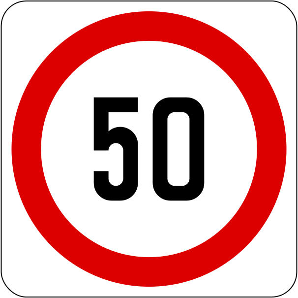

    <h2 class="section-title">{}</h2>
    <ul class="rule-list">
        <li>ドメインは.sg</li>
        <li>車は左側通行</li>
        <li>信号を支えるポールに穴が空いているものが多い</li>
        <li>公用語は英語・中国語・マレー語・タミル語で、看板などに4言語で表記されている</li>
        <li>標識の背景が四角い白地で固定されている{}</li>
        <li class="no-evidence">ゴミ箱に分別のルールとかが書かれた大き目のシールが張ってあることが多い</li>
    </ul>
    {}

{}
{}

{}
リサイクル可能なものを収集する青いゴミ箱に分別ルールが書かれた大き目のシールが張ってあることが多い。他の地域でこのような大きいシールが張ってあるものはあまり見ない気がする（<a href="https://www.nea.gov.sg/our-services/waste-management/3r-programmes-and-resources/waste-minimisation-and-recycling">参考</a>）。
{}

<iframe src="https://www.google.com/maps/embed?pb=!4v1680335960552!6m8!1m7!1s93pxEKwJdbwtfGLLGQsGNg!2m2!1d1.375154243025075!2d103.8320611068703!3f326.4073009331137!4f-11.355978997334716!5f3.325193203789971" width="295" height="295" style="border:0;" allowfullscreen="" loading="lazy" referrerpolicy="no-referrer-when-downgrade"></iframe>
<iframe src="https://www.google.com/maps/embed?pb=!4v1682378008819!6m8!1m7!1saepqeqIAvOiqD98oyhetww!2m2!1d1.352440642214918!2d103.7548165554232!3f342.29271663057074!4f-21.906047716257973!5f2.9847061137845445" width="295" height="295" style="border:0;" allowfullscreen="" loading="lazy" referrerpolicy="no-referrer-when-downgrade"></iframe>

{}
三角や丸の標識であっても白い四角い形のボードを使用している。
{}

{}
信号を支えるポールに穴が空いている{}。緑色の通り名の看板もよく見る。
{}

By <a href="https://en.wikipedia.org/wiki/User:Sengkang" class="extiw" title="en:User:Sengkang">User:Sengkang</a> - Own work, <a href="//commons.wikimedia.org/wiki/File:Shenton_Way_2,_Jan_06.JPG" title="Copyrighted free use">Copyrighted free use</a>, <a href="https://commons.wikimedia.org/w/index.php?curid=759583">Link</a>

{}
{}

<iframe src="https://www.google.com/maps/embed?pb=!4v1682378342550!6m8!1m7!1s1OLR5ZqZVol4jHLrP2jkEA!2m2!1d1.345581090275804!2d103.7574597762432!3f191.58225165366395!4f7.9921025053017445!5f2.2801984819872576" width="295" height="295" style="border:0;" allowfullscreen="" loading="lazy" referrerpolicy="no-referrer-when-downgrade"></iframe>
<iframe src="https://www.google.com/maps/embed?pb=!4v1679852616021!6m8!1m7!1sSAQ-IdU26DpyT3x8uPbghA!2m2!1d1.329655164651806!2d103.8183630017216!3f90.06643982622379!4f4.839235395122827!5f3.325193203789971" width="295" height="295" style="border:0;" allowfullscreen="" loading="lazy" referrerpolicy="no-referrer-when-downgrade"></iframe>

{}
{}

<iframe src="https://www.google.com/maps/embed?pb=!4v1680189398168!6m8!1m7!1sfORGL1VwUzXzc835FgqzhA!2m2!1d1.345239466604917!2d103.9411126585272!3f177.00259794232878!4f-6.762513167735037!5f3.2674791937915324" width="295" height="295" style="border:0;" allowfullscreen="" loading="lazy" referrerpolicy="no-referrer-when-downgrade"></iframe>

{}
{}
