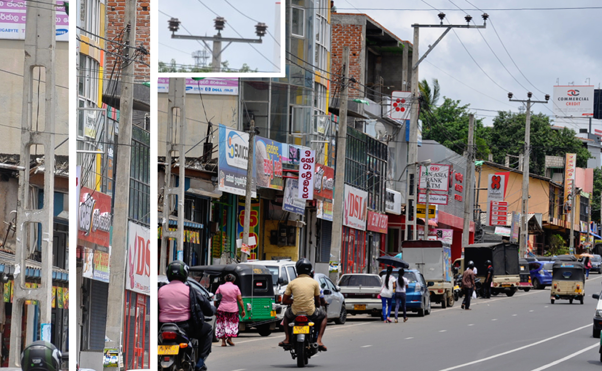
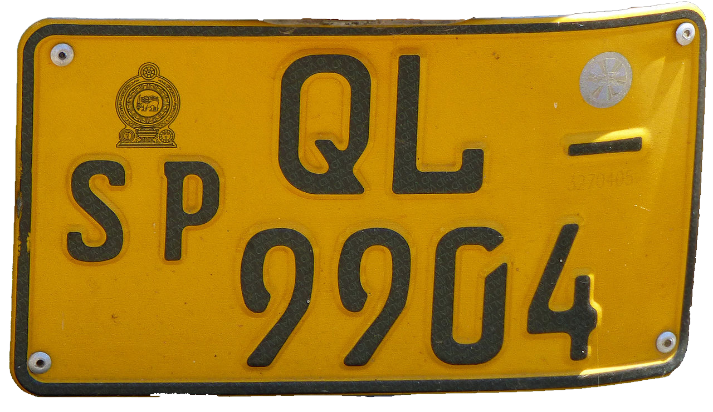
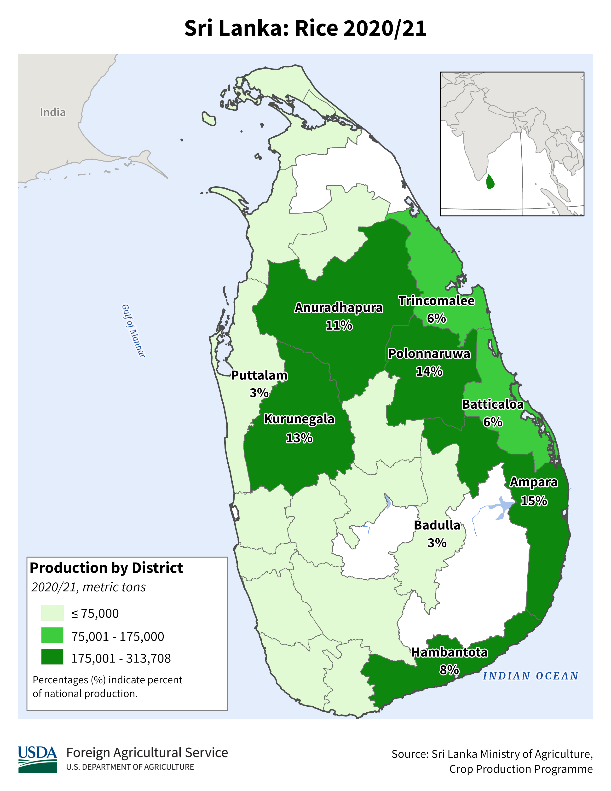

    <h2 class="section-title">{}</h2>
    <ul class="rule-list">
        <li>ドメインは.lk</li>
        <li>シンハラ語（සිංහල）とタミル語（தமிழ்）が使用される</li>
        <li>後ろのナンバープレートは黄色</li>
        <li>標識のポールは白黒のストライプのものが多い</li>
        <li>水路や交差点沿いに白黒のブロックがある{}</li>
        <li>一部で青・白・赤のGoogleCarが見られる{}{}</li>
        <li>電柱は四角いものや大きい穴が空いたものがありコイルが大きい</li>
    </ul>

{}
{}
{}
シンハラ語（සිංහල）{}とタミル語（தமிழ்）{}が公用語として使用されている。標識は白黒のストライプのものが多い。
{}

{}
水路や交差点沿いに白黒のブロックがある{}{}。写真左にあるボラードもよく見る{}。
{}

<a href="//commons.wikimedia.org/wiki/User:Eng.M.Bandara" title="User:Eng.M.Bandara">Eng.M.Bandara</a> - 投稿者自身による著作物, <a href="https://creativecommons.org/licenses/by-sa/4.0" title="Creative Commons Attribution-Share Alike 4.0">CC 表示-継承 4.0</a>, <a href="https://commons.wikimedia.org/w/index.php?curid=54602439">リンク</a>による

{}
電柱は大き目の穴が空いた電柱や{}のような四角い電柱などがある{}{}。かなり大きな電柱のコイルがある{}{}
{}

{}
車の後ろのナンバープレートは黄色{}。
{}

{}

By <a href="//commons.wikimedia.org/wiki/User:Ji-Elle" title="User:Ji-Elle">Ji-Elle</a> - Own work, <a href="https://creativecommons.org/licenses/by-sa/3.0" title="Creative Commons Attribution-Share Alike 3.0">CC BY-SA 3.0</a>, <a href="https://commons.wikimedia.org/w/index.php?curid=24443217">Link</a>
{}

{}
{}
{}
シンハラ語とタミル語が使用されている
{}

<table class="word-list">
<tr>
    <th>言語名</th> <th>表記</th>
</tr>
<tr><td>日本</td><td>日本料理レストラン</td></tr>
<tr><td>シンハラ</td><td>ජපන් අවන්හල</td></tr>
<tr><td>アッサム</td><td>জাপানীজ ৰেষ্টুৰেণ্ট</td></tr>
<tr><td>カンナダ</td><td>ಜಪಾನೀಸ್ ರೆಸ್ಟೋರೆಂಟ್</td></tr>
<tr><td>グジャラート</td><td>જાપાનીઝ રેસ્ટોરન્ટ</td></tr>
<tr><td>タミル</td><td>ஜப்பானிய உணவகம்</td></tr>
<tr><td>テルグ</td><td>జపనీస్ రెస్టారెంట్</td></tr>
<tr><td>ベンガル</td><td>জাপানি রেস্তোরা</td></tr>
<tr><td>ヒンディー</td><td>जापानी रेस्टोरेंट</td></tr>
<tr><td>クメール</td><td>ភោជនីយដ្ឋានជប៉ុន</td></tr>
<tr><td>ラオ</td><td>ຮ້ານອາຫານຍີ່ປຸ່ນ</td></tr>
<tr><td>タイ</td><td>ร้านอาหารญี่ปุ่น</td></tr>
</table>

{}
{}
{}かなり大きな電柱のコイルがある{}。
{}

<iframe src="https://www.google.com/maps/embed?pb=!4v1689693387172!6m8!1m7!1s5dTN9clLupvcUxciDG80hA!2m2!1d8.918141925114986!2d80.82820935152041!3f301.84932017712123!4f36.30017760225044!5f3.325193203789971" width="400" height="350" style="border:0;" allowfullscreen="" loading="lazy" referrerpolicy="no-referrer-when-downgrade"></iframe>

{}電柱は穴があるものと四角いものがある。四角だけを見てタイに行かないように。
{}

<iframe src="https://www.google.com/maps/embed?pb=!4v1689696319066!6m8!1m7!1sypMLkuKCeXAX74k_3MmosQ!2m2!1d8.657135222825307!2d80.68889865657874!3f253.81983536675153!4f-1.8165144304921625!5f1.6537555048095185"width="295" height="295" style="border:0;" allowfullscreen="" loading="lazy" referrerpolicy="no-referrer-when-downgrade"></iframe>
<iframe src="https://www.google.com/maps/embed?pb=!4v1689696400427!6m8!1m7!1sAR5Ea-BIRZd6le9GMdMVlg!2m2!1d8.918007600594635!2d80.82875374288504!3f68.8236013564671!4f-4.9122300085523705!5f3.325193203789971"width="295" height="295" style="border:0;" allowfullscreen="" loading="lazy" referrerpolicy="no-referrer-when-downgrade"></iframe>

{}
{}

<iframe src="https://www.google.com/maps/embed?pb=!4v1685558545219!6m8!1m7!1suYZVUguOqtLX3aqwH41Jzw!2m2!1d6.790834621766157!2d81.3302666882394!3f333.53313405477843!4f-34.961461072681836!5f2.9541794563692" width="295" height="295" style="border:0;" allowfullscreen="" loading="lazy" referrerpolicy="no-referrer-when-downgrade"></iframe>
<iframe src="https://www.google.com/maps/embed?pb=!4v1685558599916!6m8!1m7!1sj04lg2pP6meeFG5l-Uf-rQ!2m2!1d8.015481193317576!2d80.02533829118133!3f148.27437639995975!4f-30.12850269686998!5f2.0161286555061033" width="295" height="295" style="border:0;" allowfullscreen="" loading="lazy" referrerpolicy="no-referrer-when-downgrade"></iframe>

{}
{}

    <h2 class="section-title">{}</h2>
    <ul class="rule-list">
        <li>シンハラ語・タミル語の使われ方でおよその地域が分かるかも</li>
        <li class="no-evidence">農業の分布に偏りがある
            <ul>
                <li>田んぼ：南西に<b>少ない</b>{}</li>
                <li>ココヤシ：中央西部のKutunegalaが50%・残りもその付近の西の海岸沿いが多い{}</li>
                <li>お茶・ゴム：南西の海岸{}</li>
            </ul>
        </li>
    </ul>

{}
{}
{}お店の広告看板や電話番号付近の連絡先などが書かれた場所でタミル語・シンハラ語のどちらかしか書かれていない時（例<a href="https://goo.gl/maps/ArY7zHhPXyXmsjNu5" class="a-openmap" style="color:#ab1500">①タミル語/一番北部</a>・<a href="https://goo.gl/maps/47BE1r4MRMJFBihJ6" class="a-openmap" style="color:#7b36ff">②シンハラ語/一番南部</a>）、その言語がよく使われる地域の可能性がある。下の図の赤・黄がタミル語、紫がシンハラ語圏。
{}

<a href="http://creativecommons.org/publicdomain/zero/1.0/deed.en" title="Creative Commons Zero, Public Domain Dedication">CC0</a>, <a href="https://commons.wikimedia.org/w/index.php?curid=24581132">画像のソース(Link)</a>

<table class="word-list">
<tr><td>日本</td><td>日本料理レストラン</td></tr>
<tr><td>タミル</td><td>ஜப்பானிய உணவகம்</td></tr>
<tr><td>シンハラ</td><td>ජපන් අවන්හල</td></tr>
</table>

{}
{}

{}どちらかというと北東側に多いがやはり全域にあるので参考程度。
{}
{}
{}

{}木自体はまばらに全域にあるような気もするけれど、商業的なレベルでの生産のうちの半分は中央西部の特定から。図が雑ですいません。
{}
{}
{}

{}南西に多い、plonkitにも記載があったのと参考文献から確からしい。ゴムの木も似たような分布になっている。
{}
{}
{}

{}
<li>By Vincent van Zeijst - Own work, <a href="https://creativecommons.org/licenses/by-sa/3.0" title="Creative Commons Attribution-Share Alike 3.0">CC BY-SA 3.0</a>, <a href="https://commons.wikimedia.org/w/index.php?curid=45956971">Link</a>, 加工あり</li>
{}
