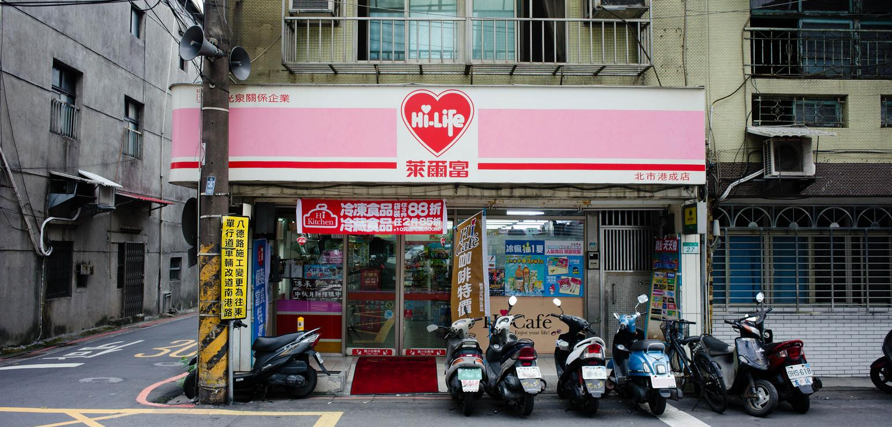
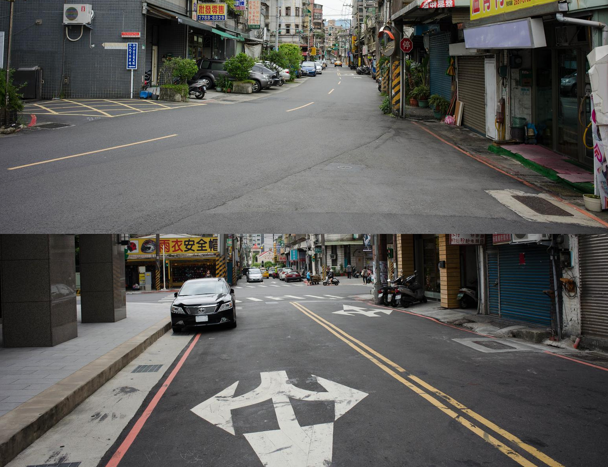
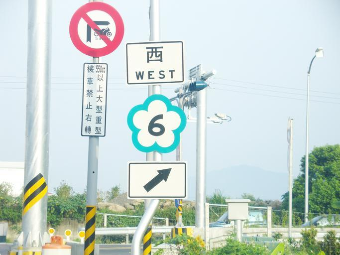
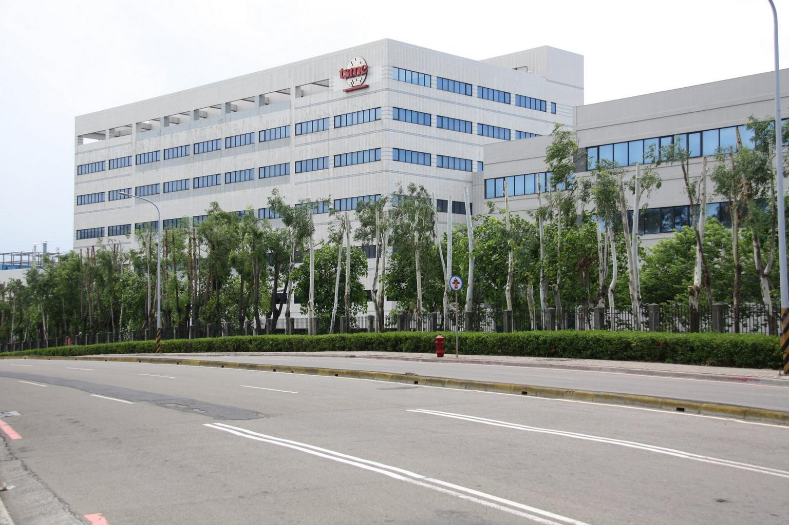


---
title: "Taiwan"
title_suffix: "(Taiwan)"
date: 2023-02-26
lastmod: 2023-04-19
weight: 2
draft: false
keywords: [""]
sections: [""]
bg: "bg/city.jpg"
flag: "TW.svg"
no_detaile_info: true
jetro_detail: false
import_jquery_36: true
plonkit: true
sc_title: "Commonly Confused Regions"
sc: [
    ["../hongkong/", "Hong Kong"],
    ["../macau/", "Macau"],
    ["../japan/", "Warm regions of Japan"],
    ]
map_title: "Related"
maps: [
    ["https://donation.yahoo.co.jp/promo/20240403.html", "Taiwan earthquake emergency donation"],
    ]
---

    <h2 class="section-title">{}</h2>
    <ul class="rule-list">
        <li>The domain is .tw</li>
        <li>Roadside bollards with red dots{}</li>
        <li>Major convenience stores like Hi-Life and OK Mart</li>
        <li>Red and <b>yellow</b> lines are used on roads</li>
        <li>Diagonal striped utility poles</li>
        <li>Concrete block walls and retaining walls are common</li>
    </ul>
    {}
    {}

{}
{}
{}
Roadside reflectors with red dots{}
{}

{}
Hi-Life and Family Mart often show store names in Japanese style{{% ref "https://ja.wikipedia.org/wiki/%E5%85%A8%E5%AE%B6%E4%BE%BF%E5%88%A9%E5%95%86%E5%BA%97" "FamilyMart Taiwan" %}}. Store names often include area and street names, which can narrow down locations{}. OK Mart is also a Taiwan clue.
{}

{}
Roads often use red or <b>yellow</b> lines{}. Like {}, utility poles use diagonal stripes{}.
{}

{}
Concrete block walls and retaining walls are common{}.
{}

By rheins, <a href="https://creativecommons.org/licenses/by/3.0" title="Creative Commons Attribution 3.0">CC BY 3.0</a>, <a href="https://commons.wikimedia.org/w/index.php?curid=59092839">Link</a>

{}
Distinctive road signs appear.
{}

{}
{}
{}
Very long, large buildings may be semiconductor factories{}.
{}

{}
{}
