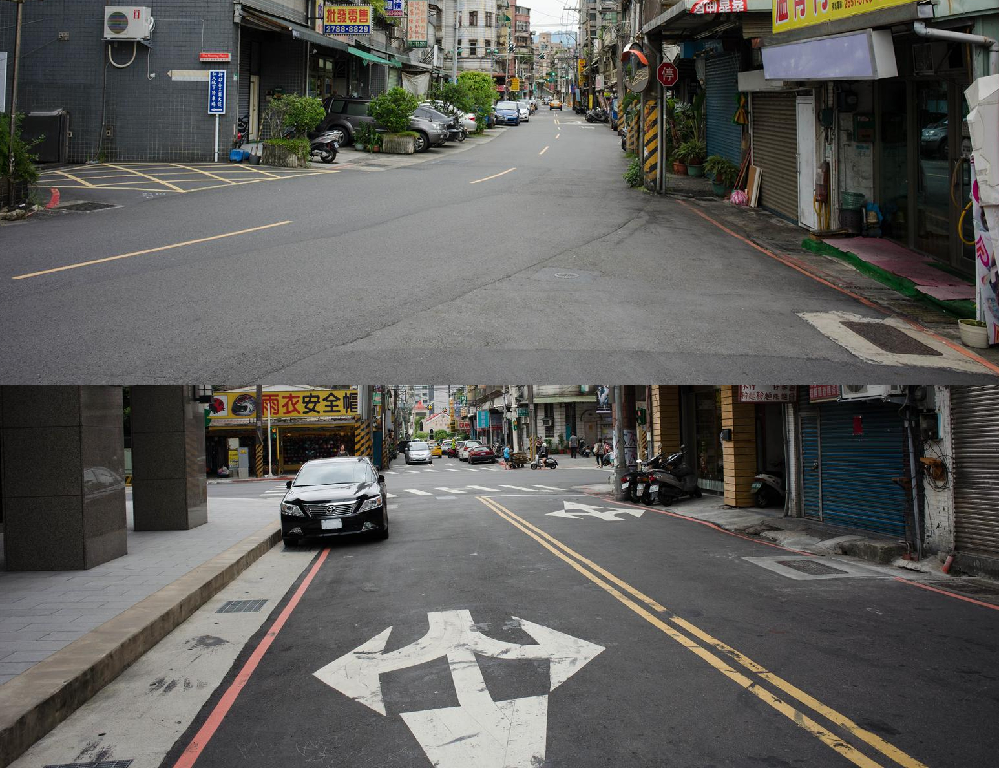

    <h2 class="section-title">{}</h2>
    <ul class="rule-list">
        <li>ドメインは.tw</li>
        <li>道端に赤い●のボラードがある{}</li>
        <li>大手コンビニの萊爾富便利商店（Hi-Life）・OK超商（台湾のサークルK）がある</li>
        <li>赤や<b>黄色</b>の線が道路で使用される</li>
        <li>斜めのストライプ柄の電柱がある</li>
        <li>コンクリートのブロックでできた壁や擁壁が見られる</li>
    </ul>
    {}

{}
{}
{}
道端に赤い●の反射板がある{}
{}

{}
台湾における四大コンビニの一角である萊爾富便利商店（Hi-Life）やFamily Martにも日本と同じように店名が書いてある{{% ref "https://ja.wikipedia.org/wiki/%E5%85%A8%E5%AE%B6%E4%BE%BF%E5%88%A9%E5%95%86%E5%BA%97" "全家便利商店" %}}。店名は地域名＋町名や地域名＋道路名の時があるので見つけたらかなり場所が絞れる時がある{}。同じく四大超商のひとつであるOK超商も台湾だと分かる。
{}

{}
赤や<b>黄色</b>の線が道路で使用される{}。{}と同じく斜めのストライプ柄の電柱を使う{}。
{}

{}
道端にコンクリートでできたブロック{}や壁{}が見られる。
{}

By rheins, <a href="https://creativecommons.org/licenses/by/3.0" title="Creative Commons Attribution 3.0">CC BY 3.0</a>, <a href="https://commons.wikimedia.org/w/index.php?curid=59092839">Link</a>

{}
{}

    <h2 class="section-title">{}</h2>
    <ul class="rule-list">
        <li>電柱に書かれた英語がAに近ければ北でWに近ければ南{}</li>
        <li>市外局番は北から南へのグラデーションになっている</li>
        <li>ヤシの木がたくさん生えている時は南部に行ってみる</li>
    </ul>

{}
{}
{}
プレート下部に書かれた英語の先頭の文字がAに近ければ北でWに近ければ南。左はB、右はW。
{}

<iframe src="https://www.google.com/maps/embed?pb=!4v1684977129315!6m8!1m7!1sF1asnkhfjT52Upac2PhN8w!2m2!1d25.28095634995292!2d121.6066368358743!3f251.24177456847417!4f0.18153726931252834!5f3.325193203789971" width="295" height="295" style="border:0;" allowfullscreen="" loading="lazy" referrerpolicy="no-referrer-when-downgrade"></iframe>
<iframe src="https://www.google.com/maps/embed?pb=!4v1684977319312!6m8!1m7!1s2hYGZ0cc2crw4Bjt_-pONQ!2m2!1d22.02566589452465!2d121.552108654172!3f341.08414540287384!4f3.172597637980317!5f3.325193203789971" width="295" height="295" style="border:0;" allowfullscreen="" loading="lazy" referrerpolicy="no-referrer-when-downgrade"></iframe>

{}
{}
{}
市外局番が南に行くほど大きくなる。（画像出典 By Postal zone of Taiwan.svg: Fizikanauk, Luuvathis file: Furfur - This file was derived from: Postal zone of Taiwan.svg, <a href="https://creativecommons.org/licenses/by-sa/4.0/deed.ja">CC BY-SA 4.0</a>, <a href="https://commons.wikimedia.org/w/index.php?curid=68299684">Wikimedia Commons</a>）
{}

<a title="Postal zone of Taiwan.svg: Fizikanauk, Luuva this file: Furfur, CC BY-SA 4.0 <https://creativecommons.org/licenses/by-sa/4.0>, via Wikimedia Commons" href="https://commons.wikimedia.org/wiki/File:Telephone_area_codes_in_Taiwan.svg"></a>

{}
{}
{}
とくに平地について南部ほど暑い雰囲気を感じる。山間部の道路はヤシの木がない場所も多いように思う。
{}

<iframe src="https://www.google.com/maps/embed?pb=!4v1689697922189!6m8!1m7!1sONJDgtB4wV8S1Ff1Isj_nA!2m2!1d22.50938169249134!2d120.5235623028968!3f299.86937850209415!4f3.234173459577633!5f0.7820865974627469"width="295" height="295" style="border:0;" allowfullscreen="" loading="lazy" referrerpolicy="no-referrer-when-downgrade"></iframe>
<iframe src="https://www.google.com/maps/embed?pb=!4v1689698013685!6m8!1m7!1sPKH_z3CLrft1BOgm6FkLGA!2m2!1d22.0114007653776!2d120.7419405719345!3f319.8328895100002!4f0.18349195170560506!5f0.7820865974627469"width="295" height="295" style="border:0;" allowfullscreen="" loading="lazy" referrerpolicy="no-referrer-when-downgrade"></iframe>

{}
{}
