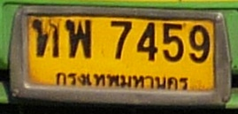
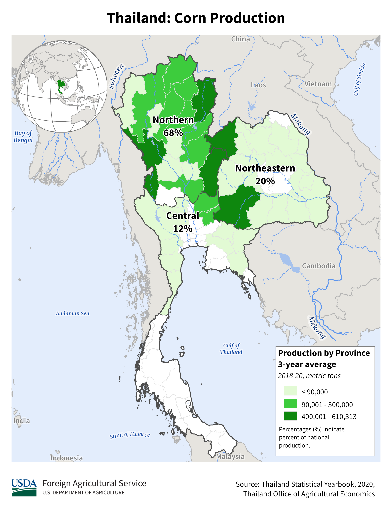

    <h2 class="section-title">{}</h2>
    <ul class="rule-list">
        <li>The domain is .th</li>
        <li>Car drives on the left side</li>
        <li>Thai (ภาษาไทยกลาง) is the official language</li>
        <li>Bollards are black and white and angular.{}</li>
        <li>The utility poles also look angular, but this alone should not be taken as a definite indication of Thailand.</li>
    </ul>
    {}

{}
{}

{}
Central Thai is the official language{}.
{}

By <a href="//commons.wikimedia.org/wiki/User:Adbar" title="User:Adbar">Adbar</a> - Own work, <a href="https://creativecommons.org/licenses/by-sa/3.0" title="Creative Commons Attribution-Share Alike 3.0">CC BY-SA 3.0</a>, <a href="https://commons.wikimedia.org/w/index.php?curid=31943283">Link</a>

{}
If the bollards{} and utility poles{} are angular, it may be Thailand. However, please note that similar angular bollards can be found in Laos, and you can find angular utility poles in {} and the {}. If the license plate is yellow, the coils on the utility poles are large, or there are holey poles, you may be thinking of Sri Lanka, and if your car has a greenish license plate number or a unique-shaped vehicle, you may be thinking of the Philippines.
{}

By <a href="//commons.wikimedia.org/wiki/User:Tournasol7" title="User:Tournasol7">Krzysztof Golik</a> - Own work, <a href="https://creativecommons.org/licenses/by-sa/4.0" title="Creative Commons Attribution-Share Alike 4.0">CC BY-SA 4.0</a>, <a href="https://commons.wikimedia.org/w/index.php?curid=99817864">Link</a>, 画像にパブリックドメイン画像を重ねています

{}
There are white bollards, which can also be used to narrow down the location{}.
{}

{}In Thailand, driving is on the left side of the road. Most ordinary passenger cars have white license plates, and cabs have yellow license plates. In Laos, standard cars are yellow and drive on the right side of the road.
{}

{}

Public Domain
{}

{}
As in the Philippines, many roads are made of concrete{}.
{}

By <a href="//commons.wikimedia.org/wiki/User:Tournasol7" title="User:Tournasol7">Krzysztof Golik</a> - Own work, <a href="https://creativecommons.org/licenses/by-sa/4.0" title="Creative Commons Attribution-Share Alike 4.0">CC BY-SA 4.0</a>, <a href="https://commons.wikimedia.org/w/index.php?curid=99828400">Link</a>

{}
{}
{}
Thai is the official language.
{}

<table class="word-list">
<tr>
    <th>Language</th> <th>Example</th>
</tr>
<tr><td>日本</td><td>日本料理レストラン</td></tr>
<tr><td>シンハラ</td><td>ජපන් අවන්හල</td></tr>
<tr><td>アッサム</td><td>জাপানীজ ৰেষ্টুৰেণ্ট</td></tr>
<tr><td>カンナダ</td><td>ಜಪಾನೀಸ್ ರೆಸ್ಟೋರೆಂಟ್</td></tr>
<tr><td>グジャラート</td><td>જાપાનીઝ રેસ્ટોરન્ટ</td></tr>
<tr><td>タミル</td><td>ஜப்பானிய உணவகம்</td></tr>
<tr><td>テルグ</td><td>జపనీస్ రెస్టారెంట్</td></tr>
<tr><td>ベンガル</td><td>জাপানি রেস্তোরা</td></tr>
<tr><td>ヒンディー</td><td>जापानी रेस्टोरेंट</td></tr>
<tr><td>クメール</td><td>ភោជនីយដ្ឋានជប៉ុន</td></tr>
<tr><td>ラオ</td><td>ຮ້ານອາຫານຍີ່ປຸ່ນ</td></tr>
<tr><td>タイ</td><td>ร้านอาหารญี่ปุ่น</td></tr>
</table>

{}
{}

    <ul class="rule-list-none">
        <li>{}</li>
    </ul>

{}
{}

    <h2 class="section-title">{}</h2>
    <ul class="rule-list">
        <li>Agriculture, vegetation type, and soil color vary from place to place
            <ul>
                <li>Crop Distribution Data Source.：<a href="https://ipad.fas.usda.gov/countrysummary/default.aspx?id=TH">U.S. DEPARTMENT OF AGRICULTUREUSDA(USDA)</a></li>
                <li>Soil distribution data：<a href="https://thailand.opendevelopmentmekong.net/layers/tha-soil-types/">OpenDevelopment Thailand - Dominant Soil Types</a></li>
            </ul>
        </li>
    </ul>

{}
{}

{}
As in the U.S. and other countries, corn and soybean production areas are almost the same area, and in the case of Thailand, soybeans are only produced in the northern part of the country.
{}
{}
{}

{}
If oil palm can be found, consider the lowlands to the south.
{}
{}
{}

{}
<a href="https://www.researchgate.net/figure/a-Map-of-rubberwood-plantation-in-Thailand-b-Provinces-in-South-of-Thailand-14_fig1_339636708">Wongsapai, Wongkot, et al. "Biomass supply chain for power generation in southern part of Thailand." Energy Reports 6 (2020): 221-227.</a>
{}
{}
{}

{}
Rice fields are mainly in the direction where Cambodia and Laos are located.
{}

<iframe src="https://www.google.com/maps/embed?pb=!4v1690214603213!6m8!1m7!1scjU-7iTKb1mcFGFejuRbsg!2m2!1d14.47294410737073!2d103.9361488515747!3f77.1541714660306!4f-6.558555970551055!5f0.4000000000000002" width="500" height="350" style="border:0;" allowfullscreen="" loading="lazy" referrerpolicy="no-referrer-when-downgrade"></iframe>

{}
{}
{}
Northwest/North
{}

<iframe src="https://www.google.com/maps/embed?pb=!4v1683736980120!6m8!1m7!1s0uI7PtWbSKIXVm0SmR3hoQ!2m2!1d18.96584434255833!2d98.4136358664289!3f38.68358628315347!4f-22.61383946173538!5f1.8128431045616762" width="295" height="295" style="border:0;" allowfullscreen="" loading="lazy" referrerpolicy="no-referrer-when-downgrade"></iframe>
<iframe src="https://www.google.com/maps/embed?pb=!4v1683737003008!6m8!1m7!1sKXTVzkdVkogKKyjFPu56Xg!2m2!1d19.0277826995688!2d100.9330277913495!3f297.06859487798755!4f-12.063548141441146!5f2.630705749529238" width="295" height="295" style="border:0;" allowfullscreen="" loading="lazy" referrerpolicy="no-referrer-when-downgrade"></iframe>

{}
Southeast (near facing Cambodia). A little more reddish than the north?
{}

<iframe src="https://www.google.com/maps/embed?pb=!4v1683737033448!6m8!1m7!1sFutVb3hy3MKzh5qmfXBVAA!2m2!1d14.5596041599467!2d105.1413081521637!3f14.369529567616242!4f-13.411584383112753!5f1.6739744810411215" width="295" height="295" style="border:0;" allowfullscreen="" loading="lazy" referrerpolicy="no-referrer-when-downgrade"></iframe>
<iframe src="https://www.google.com/maps/embed?pb=!4v1683737111353!6m8!1m7!1sTPxuoO-FBkaLrQPzeRxQoA!2m2!1d14.47837853907258!2d103.4759445852378!3f234.1305982641108!4f-15.010312687309948!5f1.7431718349436869" width="295" height="295" style="border:0;" allowfullscreen="" loading="lazy" referrerpolicy="no-referrer-when-downgrade"></iframe>

{}
Southern (peninsula and seacoast), oil palm is also scattered.
{}

<iframe src="https://www.google.com/maps/embed?pb=!4v1683737358400!6m8!1m7!1syY4fr47gzSEl5rLW2jxm2Q!2m2!1d9.175093746493182!2d99.55177279971238!3f170.30847121428818!4f-15.579228880848206!5f1.3324292804444646" width="295" height="295" style="border:0;" allowfullscreen="" loading="lazy" referrerpolicy="no-referrer-when-downgrade"></iframe>
<iframe src="https://www.google.com/maps/embed?pb=!4v1683737385159!6m8!1m7!1syeEFWQGZ0DMfcFfotWMDaQ!2m2!1d8.221852687148221!2d98.35473046739912!3f309.2738817047396!4f-15.069799819329035!5f2.942474199230258" width="295" height="295" style="border:0;" allowfullscreen="" loading="lazy" referrerpolicy="no-referrer-when-downgrade"></iframe>

{}
{}

    <ul class="rule-list">
        <li>You can narrow down the area by area-code.</li>
    </ul>

{}
{}

By <a href="//commons.wikimedia.org/wiki/User:Ponpan" title="User:Ponpan">Ponpan</a> - This <a href="https://en.wikipedia.org/wiki/vector_image" class="extiw" title="w:vector image">vector image</a> includes elements that have been taken or adapted from this file.

<a href="https://creativecommons.org/licenses/by-sa/4.0" title="Creative Commons Attribution-Share Alike 4.0">CC BY-SA 4.0</a>, <a href="https://commons.wikimedia.org/w/index.php?curid=79476331">Link</a>

{}
{}