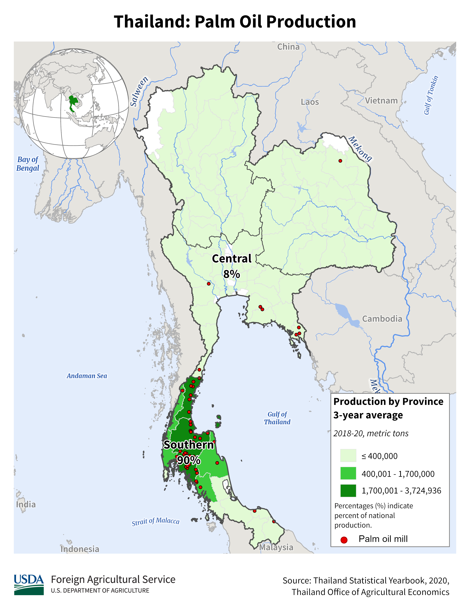

    <h2 class="section-title">{}</h2>
    <ul class="rule-list">
        <li>ドメインは.th</li>
        <li>車は左側通行</li>
        <li>タイ語（ภาษาไทยกลาง）が一般的に使用される</li>
        <li>ボラードが白黒の角ばった感じ {}</li>
        <li>電柱も角ばった感じ{}だがこれだけでタイを押してはいけない</li>
    </ul>
    {}

{}
{}

{}
中央タイ語が公用語となっている{}。
{}

By <a href="//commons.wikimedia.org/wiki/User:Adbar" title="User:Adbar">Adbar</a> - Own work, <a href="https://creativecommons.org/licenses/by-sa/3.0" title="Creative Commons Attribution-Share Alike 3.0">CC BY-SA 3.0</a>, <a href="https://commons.wikimedia.org/w/index.php?curid=31943283">Link</a>

{}ボラード{}と電柱{}が角ばっているので角ばりを感じたらタイかも。
{}

{}
似たような角張ったボラードが{}に、角ばった電柱が{}や{}にもあるので注意。車のナンバーが黄色・電柱のコイルが大きい・穴が開いた電柱があるなら{}、車のナンバーが緑っぽい・独特な形の乗り物があるならば{}を考えてみる。
{}

By <a href="//commons.wikimedia.org/wiki/User:Tournasol7" title="User:Tournasol7">Krzysztof Golik</a> - Own work, <a href="https://creativecommons.org/licenses/by-sa/4.0" title="Creative Commons Attribution-Share Alike 4.0">CC BY-SA 4.0</a>, <a href="https://commons.wikimedia.org/w/index.php?curid=99817864">Link</a>, 画像にパブリックドメイン画像を重ねています

{}
白いボラードがあり、これを使って場所も絞り込める{}{}。上のシンボルが黒塗りならばprovincial roadなのでマップ上の紺色のマークの道に行ってみる{}{}。
{}

{}左側通行で、一般乗用車は白色のナンバーが多く、タクシーのナンバープレートは黄色のものが多い。ラオスは一般の車が黄色かつ右側通行。
{}

{}

Public Domain
{}

{}
{}と同じくコンクリート製の道路が多い{}。
{}

By <a href="//commons.wikimedia.org/wiki/User:Tournasol7" title="User:Tournasol7">Krzysztof Golik</a> - Own work, <a href="https://creativecommons.org/licenses/by-sa/4.0" title="Creative Commons Attribution-Share Alike 4.0">CC BY-SA 4.0</a>, <a href="https://commons.wikimedia.org/w/index.php?curid=99828400">Link</a>

{}
街灯のポールに白とオレンジの反射板が付いている{}。
{}

{}
{}
{}
タイ語が公用語となっている
{}

<table class="word-list">
<tr>
    <th>言語名</th> <th>表記</th>
</tr>
<tr><td>日本</td><td>日本料理レストラン</td></tr>
<tr><td>シンハラ</td><td>ජපන් අවන්හල</td></tr>
<tr><td>アッサム</td><td>জাপানীজ ৰেষ্টুৰেণ্ট</td></tr>
<tr><td>カンナダ</td><td>ಜಪಾನೀಸ್ ರೆಸ್ಟೋರೆಂಟ್</td></tr>
<tr><td>グジャラート</td><td>જાપાનીઝ રેસ્ટોરન્ટ</td></tr>
<tr><td>タミル</td><td>ஜப்பானிய உணவகம்</td></tr>
<tr><td>テルグ</td><td>జపనీస్ రెస్టారెంట్</td></tr>
<tr><td>ベンガル</td><td>জাপানি রেস্তোরা</td></tr>
<tr><td>ヒンディー</td><td>जापानी रेस्टोरेंट</td></tr>
<tr><td>クメール</td><td>ភោជនីយដ្ឋានជប៉ុន</td></tr>
<tr><td>ラオ</td><td>ຮ້ານອາຫານຍີ່ປຸ່ນ</td></tr>
<tr><td>タイ</td><td>ร้านอาหารญี่ปุ่น</td></tr>
</table>

{}
{}
{}
北陸地方でよく見られる8番ラーメンは今タイで人気チェーンになりつつある{}。
{}

<iframe src="https://www.google.com/maps/embed?pb=!4v1689962335010!6m8!1m7!1sSkClzCE-6UtCLfD7L2PNjQ!2m2!1d13.7613527806081!2d100.4995412365237!3f212.95609704824895!4f1.5404108846140332!5f2.7203736392567532"width="295" height="295" style="border:0;" allowfullscreen="" loading="lazy" referrerpolicy="no-referrer-when-downgrade"></iframe>

{}
{}

    <ul class="rule-list-none">
        <li>{}</li>
    </ul>

{}
{}

    <h2 class="section-title">{}</h2>
    <ul class="rule-list">
        <li>農業・植生の種類・土の色が場所によって異なる
            <ul>
                <li>農作物の分布データ出典：<a href="https://ipad.fas.usda.gov/countrysummary/default.aspx?id=TH">U.S. DEPARTMENT OF AGRICULTUREUSDA(USDA)</a></li>
                <li>土壌の分布データ：<a href="https://thailand.opendevelopmentmekong.net/layers/tha-soil-types/">OpenDevelopment Thailand - Dominant Soil Types</a></li>
            </ul>
        </li>
    </ul>

{}
{}

{}
アメリカなどと同じくコーンと大豆の生産地は基本的にほぼ同じエリア、タイの場合も大豆は北の方のみ。
{}
{}
{}

{}
ヤシの木のようなアブラヤシがある場合は南の低地を考えてみる
{}
{}
{}

{}
ゴムの木は一般には南の半島側に多いが北にもバラバラに分布していて、100%南というわけではない{}。
{}
{}
{}

{}
田んぼはカンボジア・ラオスのある方向に多い
{}

<iframe src="https://www.google.com/maps/embed?pb=!4v1690214603213!6m8!1m7!1scjU-7iTKb1mcFGFejuRbsg!2m2!1d14.47294410737073!2d103.9361488515747!3f77.1541714660306!4f-6.558555970551055!5f0.4000000000000002" width="500" height="350" style="border:0;" allowfullscreen="" loading="lazy" referrerpolicy="no-referrer-when-downgrade"></iframe>

{}
{}
{}
北西部・北部
{}

<iframe src="https://www.google.com/maps/embed?pb=!4v1683736980120!6m8!1m7!1s0uI7PtWbSKIXVm0SmR3hoQ!2m2!1d18.96584434255833!2d98.4136358664289!3f38.68358628315347!4f-22.61383946173538!5f1.8128431045616762" width="295" height="295" style="border:0;" allowfullscreen="" loading="lazy" referrerpolicy="no-referrer-when-downgrade"></iframe>
<iframe src="https://www.google.com/maps/embed?pb=!4v1683737003008!6m8!1m7!1sKXTVzkdVkogKKyjFPu56Xg!2m2!1d19.0277826995688!2d100.9330277913495!3f297.06859487798755!4f-12.063548141441146!5f2.630705749529238" width="295" height="295" style="border:0;" allowfullscreen="" loading="lazy" referrerpolicy="no-referrer-when-downgrade"></iframe>

{}
南東（カンボジアに面する付近）。北部よりも少し赤みがかっている？
{}

<iframe src="https://www.google.com/maps/embed?pb=!4v1683737033448!6m8!1m7!1sFutVb3hy3MKzh5qmfXBVAA!2m2!1d14.5596041599467!2d105.1413081521637!3f14.369529567616242!4f-13.411584383112753!5f1.6739744810411215" width="295" height="295" style="border:0;" allowfullscreen="" loading="lazy" referrerpolicy="no-referrer-when-downgrade"></iframe>
<iframe src="https://www.google.com/maps/embed?pb=!4v1683737111353!6m8!1m7!1sTPxuoO-FBkaLrQPzeRxQoA!2m2!1d14.47837853907258!2d103.4759445852378!3f234.1305982641108!4f-15.010312687309948!5f1.7431718349436869" width="295" height="295" style="border:0;" allowfullscreen="" loading="lazy" referrerpolicy="no-referrer-when-downgrade"></iframe>

{}
南部（半島・海沿い）、アブラヤシも散見される。
{}

<iframe src="https://www.google.com/maps/embed?pb=!4v1683737358400!6m8!1m7!1syY4fr47gzSEl5rLW2jxm2Q!2m2!1d9.175093746493182!2d99.55177279971238!3f170.30847121428818!4f-15.579228880848206!5f1.3324292804444646" width="295" height="295" style="border:0;" allowfullscreen="" loading="lazy" referrerpolicy="no-referrer-when-downgrade"></iframe>
<iframe src="https://www.google.com/maps/embed?pb=!4v1683737385159!6m8!1m7!1syeEFWQGZ0DMfcFfotWMDaQ!2m2!1d8.221852687148221!2d98.35473046739912!3f309.2738817047396!4f-15.069799819329035!5f2.942474199230258" width="295" height="295" style="border:0;" allowfullscreen="" loading="lazy" referrerpolicy="no-referrer-when-downgrade"></iframe>

{}
{}

    <ul class="rule-list">
        <li>市外局番で地域がわかるかもしれない</li>
    </ul>

{}
{}

By <a href="//commons.wikimedia.org/wiki/User:Ponpan" title="User:Ponpan">Ponpan</a> - This <a href="https://en.wikipedia.org/wiki/vector_image" class="extiw" title="w:vector image">vector image</a> includes elements that have been taken or adapted from this file.

<a href="https://creativecommons.org/licenses/by-sa/4.0" title="Creative Commons Attribution-Share Alike 4.0">CC BY-SA 4.0</a>, <a href="https://commons.wikimedia.org/w/index.php?curid=79476331">Link</a>

{}
{}

    <h2 class="section-title">{}</h2>
    <ul class="rule-list">
        <li>Koh Samuiという離島がある</li>
        <li>Koh Lipeに徒歩のカバレッジがある</li>
    </ul>

{}
{}

{}
4169番道路が島を一周している{}。
{}

{}
{}

{}
観光地を歩いていて『Koh Lipe』と書かれている{}。スキューバ ダイビングやボートツアーが人気らしい。
{}

By <a rel="nofollow" class="external text" href="https://web.archive.org/web/20161102051955/http://www.panoramio.com/user/1429473?with_photo_id=124396350">::::=UT=::::</a> - <a rel="nofollow" class="external free" href="https://web.archive.org/web/20161102051949/http://www.panoramio.com/photo/124396350">https://web.archive.org/web/20161102051949/http://www.panoramio.com/photo/124396350</a>, <a href="https://creativecommons.org/licenses/by-sa/3.0" title="Creative Commons Attribution-Share Alike 3.0">CC BY-SA 3.0</a>, <a href="https://commons.wikimedia.org/w/index.php?curid=60162568">Link</a>

{}
{}
