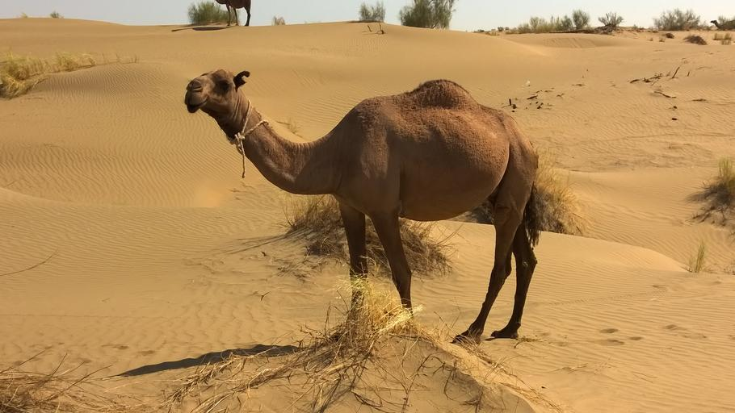
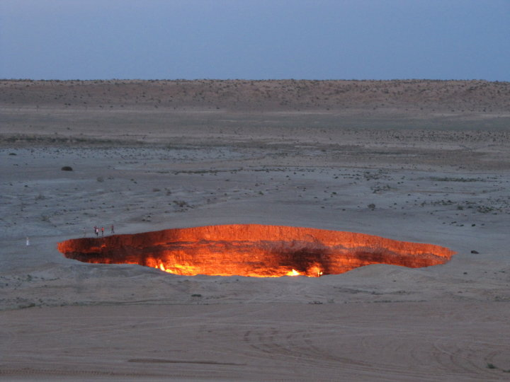

    <h2 class="section-title">{}</h2>
    <ul class="rule-list">
        <li>現在公式のストリートビューが無くGeoguessrでは出題されない</li>
        <li>ドメインは.tm</li>
        <li>永世中立国として国連総会にて承認されている</li>
    </ul>
    {}

{}
{}
{}
国土の7割がカラクム砂漠で占められている{}。
{}

{}
Darvaza gas craterがある{}。
{}

{}
{}